# 10x vs T3 Code

**7 September 2026. Audit only.** [Open the HTML report](2026-09-07-active-session-vs-t3-code.html).

10x has the stronger individual tool surfaces. T3 makes a whole turn easier to follow, interrupt, and review. Preserve 10x’s visual identity and repair session reliability before adding more workspace chrome.

Start with warm-session persistence and failed-open recovery, then Stop and send acknowledgement, then transcript order. Add a compact layer for turn status and changed files around the existing tool cards.

Audit only. 10x source is fixed at 59a4ae8; T3 captures came from t3@0.0.39 and source analysis from 569a8cd2. This is a comparison of those baselines, not a claim about every current provider or later build.

The lead 10x image is a current, read-only capture of the recovered Release process showing earlier turns. T3 images are historical captures from the prior audit. Other 10x images are reference renders of real view code with synthetic fixtures. None of those reference renders proves a live interaction.

## Six fixes before more workspace chrome

### P0 SAVE: New sessions created from a warm child are not persisted

**Evidence class:** Current runtime probe + current source trace; historical UI observation.

**Behavior:** Startup warms recent projects with noSession=true. The first new session that consumes a warm child sends new_session into an in-memory runtime. get_state has no sessionFile, so 10x substitutes a new:<project>:<uuid> path and presents an active chat without durable session storage. The cold path does not set this flag. This is not a claim that every new session is affected: it is the first checkout of each retained warm child. The primary is retained until used; the secondary expires after five minutes.

**Impact:** The user can do work in a chat that has no file-backed route back from the session library. Leaving the session or quitting can lose access to its transcript. P0 here means loss of newly created work in a supported path, not corruption of existing saved history.

**Proposed change:** Make the warm child persist-capable, or use a fresh persisting child for checkout. Do not rely on new_session or switch_session to promote an in-memory process. Reject placeholder session identities at the app boundary and make any failure visible. A file path alone is not proof the first turn reached disk.

**Acceptance criteria:** On the real runtime, start a new chat as the first action in a warmed disposable project, complete a turn, verify its JSONL and rail entry, leave and return, then quit/relaunch and recover the same content. Cover the cold path too. Update the startup spec’s promotion assumption and test fixture.

**Evidence limits:** verify-warm-persistence.output.txt: new-session cases. The runtime probe did not send a model prompt; the absence of a durable path and the in-memory runtime mode are freshly verified.

Sources: [10x / SessionProcessManager.swift:237](https://github.com/NextStep-AI-inc/10x/blob/59a4ae8faaea049bfc2ff540a4f021b3859080b6/OmpKit/Sources/OmpKit/SessionProcessManager.swift#L237), [10x / SessionProcessManager.swift:321](https://github.com/NextStep-AI-inc/10x/blob/59a4ae8faaea049bfc2ff540a4f021b3859080b6/OmpKit/Sources/OmpKit/SessionProcessManager.swift#L321), [10x / RpcClient.swift:44](https://github.com/NextStep-AI-inc/10x/blob/59a4ae8faaea049bfc2ff540a4f021b3859080b6/OmpKit/Sources/OmpKit/RpcClient.swift#L44), [10x / AppModel.swift:958](https://github.com/NextStep-AI-inc/10x/blob/59a4ae8faaea049bfc2ff540a4f021b3859080b6/App/Application/AppModel.swift#L958), [10x / 2026-08-25-startup-splash-preload-design.md:183](https://github.com/NextStep-AI-inc/10x/blob/59a4ae8faaea049bfc2ff540a4f021b3859080b6/docs/superpowers/specs/2026-08-25-startup-splash-preload-design.md#L183)

### P1 OPEN: Opening an existing session through a warm child fails

**Evidence class:** Current runtime probe; historical P0 claim corrected.

**Behavior:** The first existing-session open in a warm project checks out the same --no-session child and sends switch_session(path). In omp 18.1.10 that child uses MemorySessionStorage. It cannot read the existing disk file and returns File not found. The persisting control loads the identical fixture correctly and saves its rename.

**Impact:** An existing chat can fail to open through a startup optimization. 10x then routes the error into the unrendered failed state described below. The saved fixture remained byte-identical. The historical claim that the chat loads normally and silently stops saving later turns is rejected for the tested runtime.

**Proposed change:** Use the same persist-capable checkout correction as SAVE, or bypass warm checkout for existing sessions. Retry must reopen from retained project/session metadata rather than assuming a valid active handle already exists.

**Acceptance criteria:** Open an existing disposable session as the first action after launch; confirm prior messages load, append a turn, relaunch, and confirm both old and new content remain. Exercise a missing-file failure and recover without restarting the app.

**Evidence limits:** verify-warm-persistence.output.txt: switch-existing cases. The new result supersedes PERSIST-02’s historical severity and mechanism.

Sources: [10x / SessionProcessManager.swift:153](https://github.com/NextStep-AI-inc/10x/blob/59a4ae8faaea049bfc2ff540a4f021b3859080b6/OmpKit/Sources/OmpKit/SessionProcessManager.swift#L153), [10x / SessionProcessManager.swift:443](https://github.com/NextStep-AI-inc/10x/blob/59a4ae8faaea049bfc2ff540a4f021b3859080b6/OmpKit/Sources/OmpKit/SessionProcessManager.swift#L443), [10x / SessionController.swift:130](https://github.com/NextStep-AI-inc/10x/blob/59a4ae8faaea049bfc2ff540a4f021b3859080b6/App/Sessions/SessionController.swift#L130)

### P1 STOP: Stop disappears while the user prepares the next message

**Evidence class:** Current code trace + historical reference render; draft-state click not re-run.

**Behavior:** stoppableController requires a streaming session, no attachments, and a whitespace-only draft. Typing a character or adding an image replaces the only abort action with Send. The header has no Stop control and the app has no second abort call site. Clearing the staged input is the workaround.

**Impact:** The exact moment someone prepares a correction is also a moment they may need to stop the current run. Requiring them to clear that correction makes the two actions compete.

**Proposed change:** Keep a small independent Stop action while a turn is active and give it a dedicated shortcut such as Command-period. Preserve Send for Steer/Follow up. Do not casually map Escape to abort: Escape also dismisses the flyout and cancels approval requests.

**Acceptance criteria:** In a running turn, stage text, then an image, and stop from the visible control and shortcut without losing the draft. Verify the shortcut with a flyout and a pending approval. The run must actually settle, not merely change its button.

**Evidence limits:** 10x-composer-stop-control.png shows the reference empty-draft Stop state. It does not demonstrate Stop after typing. t3-turn-05.jpg shows T3’s running control.

Sources: [10x / ComposerView.swift:356](https://github.com/NextStep-AI-inc/10x/blob/59a4ae8faaea049bfc2ff540a4f021b3859080b6/App/Sessions/ComposerView.swift#L356), [10x / ComposerView.swift:400](https://github.com/NextStep-AI-inc/10x/blob/59a4ae8faaea049bfc2ff540a4f021b3859080b6/App/Sessions/ComposerView.swift#L400), [10x / ActiveSessionView.swift:10](https://github.com/NextStep-AI-inc/10x/blob/59a4ae8faaea049bfc2ff540a4f021b3859080b6/App/Sessions/ActiveSessionView.swift#L10), [10x / BrandActionsMenuView.swift:112](https://github.com/NextStep-AI-inc/10x/blob/59a4ae8faaea049bfc2ff540a4f021b3859080b6/App/Shell/BrandActionsMenuView.swift#L112), [10x / 2026-08-24-10x-omp-macos-gui-design.md:163](https://github.com/NextStep-AI-inc/10x/blob/59a4ae8faaea049bfc2ff540a4f021b3859080b6/docs/superpowers/specs/2026-08-24-10x-omp-macos-gui-design.md#L163)

### P1 ERROR: Some session failures disable the composer without a recovery surface

**Evidence class:** Current source trace; failing UI path not freshly driven.

**Behavior:** fail() stores .failed(message), while isComposerAvailable becomes false. ActiveSessionView presents the recovery card only for .stopped plus isRecoveryPresented. Open failures and rejected/timed-out prompt commands can therefore leave a disabled composer without displaying the failure payload. Process exits are different: they use the existing stopped/recovery path.

**Impact:** The user cannot tell whether the app is waiting, disconnected, or unable to open the session. Prompt text can be restored by the catch path, but it is not actionable while the composer stays disabled.

**Proposed change:** Render failed state explicitly with a plain explanation, a context-appropriate retry, and diagnostic details behind an action. Retain project/session metadata for failures before a handle or sessionPath exists. A generic Restart button would be a no-op in those cases. Keep the existing process-exit card.

**Acceptance criteria:** Drive failed existing open, failed new open, prompt rejection, and child exit separately. Each must show the cause and a working recovery action while preserving text. Verify a retry actually reconnects and accepts another message.

**Evidence limits:** 10x-runtime-recovery.png illustrates the separate stopped-state design; it is not evidence that failed state is handled. t3-thread-claude-auth-failed.jpg is a historical provider-error capture.

Sources: [10x / SessionController.swift:121](https://github.com/NextStep-AI-inc/10x/blob/59a4ae8faaea049bfc2ff540a4f021b3859080b6/App/Sessions/SessionController.swift#L121), [10x / SessionController.swift:289](https://github.com/NextStep-AI-inc/10x/blob/59a4ae8faaea049bfc2ff540a4f021b3859080b6/App/Sessions/SessionController.swift#L289), [10x / SessionController.swift:344](https://github.com/NextStep-AI-inc/10x/blob/59a4ae8faaea049bfc2ff540a4f021b3859080b6/App/Sessions/SessionController.swift#L344), [10x / SessionController.swift:903](https://github.com/NextStep-AI-inc/10x/blob/59a4ae8faaea049bfc2ff540a4f021b3859080b6/App/Sessions/SessionController.swift#L903), [10x / ActiveSessionView.swift:16](https://github.com/NextStep-AI-inc/10x/blob/59a4ae8faaea049bfc2ff540a4f021b3859080b6/App/Sessions/ActiveSessionView.swift#L16), [10x / AppModelNavigationTests.swift:393](https://github.com/NextStep-AI-inc/10x/blob/59a4ae8faaea049bfc2ff540a4f021b3859080b6/Tests/TenXAppTests/AppModelNavigationTests.swift#L393), [t3 / ThreadErrorBanner.tsx:1](https://github.com/pingdotgg/t3code/blob/569a8cd2c3303f55fd869687eb31359b5658cc78/apps/web/src/components/chat/ThreadErrorBanner.tsx#L1)

### P1 ORDER: Cursor-shaped turns lose the order between prose and tools

**Evidence class:** Current code/AX inspection + historical source analysis; provider-specific priority.

**Behavior:** A single assistant message can contain text, toolCall, text, toolCall, and more text. 10x’s content document joins the text blocks; the reducer and history mapper append separate tool items after the message. Cursor can put a whole agent turn into this shape, so narration about later work appears above the cards for earlier work. Providers that produce one message per model step are not shown to have the same problem.

**Impact:** All content can be present yet the transcript tells the wrong sequence. This is P1 for the tested Cursor workflow and a provider-parity priority judgment for other configurations. It is not evidence of unordered tool start events or data loss.

**Proposed change:** Project contiguous text segments and the existing tool IDs into content-part order in both live and reopened history. Preserve the original message identity used by reconciliation. Sorting tools by timestamp will not fix an already-flattened prose item. Show response metadata once at the appropriate turn boundary, not for every projected segment.

**Acceptance criteria:** Use a deterministic text/tool/text/tool/text fixture and a real Cursor turn; inspect live streaming, completion, and reopen. The same sequence must survive all three. Cover parallel tool completions and repeated snapshots without duplicated cards or broken reconciliation.

**Evidence limits:** t3-turn1-worked-expanded.jpg shows prose/work/prose grouping. The current 10x accessibility tree still contains the earlier narration as one prose item followed by tool items. No new model turn was run.

Sources: [10x / TranscriptMessage.swift:157](https://github.com/NextStep-AI-inc/10x/blob/59a4ae8faaea049bfc2ff540a4f021b3859080b6/App/Sessions/TranscriptMessage.swift#L157), [10x / TranscriptReducer.swift:44](https://github.com/NextStep-AI-inc/10x/blob/59a4ae8faaea049bfc2ff540a4f021b3859080b6/App/Sessions/TranscriptReducer.swift#L44), [10x / TranscriptReducer.swift:133](https://github.com/NextStep-AI-inc/10x/blob/59a4ae8faaea049bfc2ff540a4f021b3859080b6/App/Sessions/TranscriptReducer.swift#L133), [10x / TranscriptReducer.swift:205](https://github.com/NextStep-AI-inc/10x/blob/59a4ae8faaea049bfc2ff540a4f021b3859080b6/App/Sessions/TranscriptReducer.swift#L205), [10x / TranscriptHistoryMapper.swift:62](https://github.com/NextStep-AI-inc/10x/blob/59a4ae8faaea049bfc2ff540a4f021b3859080b6/App/Sessions/TranscriptHistoryMapper.swift#L62), [t3 / MessagesTimeline.logic.ts:1035](https://github.com/pingdotgg/t3code/blob/569a8cd2c3303f55fd869687eb31359b5658cc78/apps/web/src/components/chat/MessagesTimeline.logic.ts#L1035)

### P1 QUEUE: A mid-turn follow-up has no reliable visible acknowledgement

**Evidence class:** Current code trace + historical observation; queue operation not freshly exercised.

**Behavior:** Sending clears the composer and calls prompt with the chosen streaming behavior. queuedMessageCount is assigned only when applyState runs at opening or a model refresh; sending and consuming queued messages do not refresh it. The existing N queued label can stay absent, or stale if it was previously populated. This does not establish that the runtime lost the message.

**Impact:** The user may resend a follow-up because its draft disappeared without a visible accepted/queued state. Steer and Follow up are useful distinct actions, but their consequences need to be legible.

**Proposed change:** Show an acknowledgement tied to the accepted message and reconcile against authoritative queue state after acceptance and consumption. Preserve text on rejection. Avoid incrementing a local count without a decrement/refresh path, and avoid duplicate transcript echoes when the runtime later emits the message.

**Acceptance criteria:** Send one and then multiple follow-ups during a tool run. Verify each appears once, an accurate count rises and returns to zero, and the correct next turn consumes it. Test immediate steering and rejected sends separately.

**Evidence limits:** The stale counter is a source-confirmed wiring issue. The earlier follow-up observation had no saved live frame; the report does not call it a fresh visual reproduction.

Sources: [10x / ComposerView.swift:446](https://github.com/NextStep-AI-inc/10x/blob/59a4ae8faaea049bfc2ff540a4f021b3859080b6/App/Sessions/ComposerView.swift#L446), [10x / SessionController.swift:289](https://github.com/NextStep-AI-inc/10x/blob/59a4ae8faaea049bfc2ff540a4f021b3859080b6/App/Sessions/SessionController.swift#L289), [10x / SessionController.swift:751](https://github.com/NextStep-AI-inc/10x/blob/59a4ae8faaea049bfc2ff540a4f021b3859080b6/App/Sessions/SessionController.swift#L751), [10x / SessionController.swift:789](https://github.com/NextStep-AI-inc/10x/blob/59a4ae8faaea049bfc2ff540a4f021b3859080b6/App/Sessions/SessionController.swift#L789), [t3 / ChatView.logic.ts:1010](https://github.com/pingdotgg/t3code/blob/569a8cd2c3303f55fd869687eb31359b5658cc78/apps/web/src/components/ChatView.logic.ts#L1010)

## Product improvements

### P1 SIGNALS: Make a session’s state visible beyond its open transcript

**Evidence class:** Source-derived improvement; see verification limits.

**Behavior:** 10x reports only provider-level generation counts to its activity registry. Historical/source evidence shows no live rail state for working, waiting for input, approval, failure, or unread completion. T3’s captured sidebar makes Working and Failed visible; its source prioritizes approval and input above routine activity.

**Proposed change:** Use one session-level status model for the rail, header/turn status, and composer. Show waiting for the user before generic working state. Preserve 10x’s quiet rail; a short label or attention marker can carry the state without adopting T3’s entire sidebar. Pending approvals must remain reachable when the transcript is scrolled up or another session is selected.

**Acceptance criteria:** Run two sessions, put one into a pending request, switch away, and return from the visible attention cue. Verify working, failed, completed/unread, and cancelled states do not overlap misleadingly. Request notification permission only when offering notifications.

Sources: [10x / SessionActivityRegistry.swift:7](https://github.com/NextStep-AI-inc/10x/blob/59a4ae8faaea049bfc2ff540a4f021b3859080b6/App/Sessions/SessionActivityRegistry.swift#L7), [10x / SessionController.swift:939](https://github.com/NextStep-AI-inc/10x/blob/59a4ae8faaea049bfc2ff540a4f021b3859080b6/App/Sessions/SessionController.swift#L939), [10x / FloatingRailView.swift:186](https://github.com/NextStep-AI-inc/10x/blob/59a4ae8faaea049bfc2ff540a4f021b3859080b6/App/Shell/FloatingRailView.swift#L186), [t3 / Sidebar.logic.ts:488](https://github.com/pingdotgg/t3code/blob/569a8cd2c3303f55fd869687eb31359b5658cc78/apps/web/src/components/Sidebar.logic.ts#L488)

### P1 REVIEW: Give every completed turn a scoped view of what changed

**Evidence class:** Source-derived improvement; see verification limits.

**Behavior:** 10x has strong per-edit diff views, including line numbers and context folding, but the user must find and inspect separate cards. T3’s historical working-tree panel provides a review surface; its source additionally has a per-turn changed-file tree. The V1 exclusion of a file explorer does not explicitly exclude a changed-file summary.

**Proposed change:** Start with a compact changed-file index linking to existing edit details. Clearly label its scope and completeness. Tool-derived changes can miss shell writes and must not be described as the entire working tree; repeated edits can double-count naive addition/deletion totals. A later git-backed review pane should distinguish turn changes from pre-existing and concurrent work.

**Acceptance criteria:** Complete a multi-file turn containing both an edit tool and a shell-generated file, with pre-existing changes in the repo. Verify the summary states what it covers and does not attribute unrelated work to the agent. Open each linked diff without losing the reading position.

Sources: [10x / ToolContentExtractor.swift:972](https://github.com/NextStep-AI-inc/10x/blob/59a4ae8faaea049bfc2ff540a4f021b3859080b6/App/Tools/ToolContentExtractor.swift#L972), [10x / DiffView.swift:30](https://github.com/NextStep-AI-inc/10x/blob/59a4ae8faaea049bfc2ff540a4f021b3859080b6/App/Tools/DiffView.swift#L30), [10x / ToolCardRegistry.swift:58](https://github.com/NextStep-AI-inc/10x/blob/59a4ae8faaea049bfc2ff540a4f021b3859080b6/App/Tools/ToolCardRegistry.swift#L58), [10x / 2026-08-24-10x-omp-macos-gui-design.md:50](https://github.com/NextStep-AI-inc/10x/blob/59a4ae8faaea049bfc2ff540a4f021b3859080b6/docs/superpowers/specs/2026-08-24-10x-omp-macos-gui-design.md#L50), [t3 / DiffPanel.tsx:216](https://github.com/pingdotgg/t3code/blob/569a8cd2c3303f55fd869687eb31359b5658cc78/apps/web/src/components/DiffPanel.tsx#L216), [t3 / ChangedFilesTree.tsx:25](https://github.com/pingdotgg/t3code/blob/569a8cd2c3303f55fd869687eb31359b5658cc78/apps/web/src/components/chat/ChangedFilesTree.tsx#L25)

### P2 TURNS: Keep detailed cards but let readers scan a whole turn

**Evidence class:** Source-derived improvement; see verification limits.

**Behavior:** T3’s Worked for disclosure and generated work summaries reduce repeated tool chrome. 10x favors one card per operation and often expands completed edits. Its waiting indicator inspects the last item, which is an unreliable proxy for activity when a single message continues updating above trailing tools.

**Proposed change:** Add a stable turn boundary, elapsed time, completion state, and optional disclosure over routine activity. Keep exceptional results and errors easy to find. Derive working state from the active turn and tools rather than the last rendered item. Use truthful Working wording; T3’s literal Thinking label is reference evidence, not a required copy choice.

**Acceptance criteria:** Inspect a long turn with quiet waiting, streaming text, parallel tools, edits, errors, and completion. The activity signal remains truthful, the final answer is easy to locate, and expanded details survive updates.

Sources: [10x / TurnActivityView.swift:15](https://github.com/NextStep-AI-inc/10x/blob/59a4ae8faaea049bfc2ff540a4f021b3859080b6/App/Sessions/TurnActivityView.swift#L15), [10x / ResponseMetadataView.swift:56](https://github.com/NextStep-AI-inc/10x/blob/59a4ae8faaea049bfc2ff540a4f021b3859080b6/App/Sessions/ResponseMetadataView.swift#L56), [t3 / MessagesTimeline.logic.ts:1200](https://github.com/pingdotgg/t3code/blob/569a8cd2c3303f55fd869687eb31359b5658cc78/apps/web/src/components/chat/MessagesTimeline.logic.ts#L1200), [t3 / MessagesTimeline.tsx:1721](https://github.com/pingdotgg/t3code/blob/569a8cd2c3303f55fd869687eb31359b5658cc78/apps/web/src/components/chat/MessagesTimeline.tsx#L1721)

### P2 CONTEXT: Expose context usage and an honest compaction action

**Evidence class:** Source-derived improvement; see verification limits.

**Behavior:** 10x parses contextPercentage but no view reads it. Its state-refresh path also leaves usage stale after a turn. The header spec requests context percentage; T3 places its meter and compaction entry in the composer instead. That is a placement choice, not proof 10x should duplicate all composer controls in the header.

**Proposed change:** Add a small usage display with used/limit details and refresh it at authoritative state boundaries. Wire compaction only when the runtime supports it and explain unavailable states. Reconcile the header spec with the chosen placement before adding duplicate model and effort controls.

**Acceptance criteria:** Observe usage changing across turns and after compaction. Verify unknown usage, provider limitations, and a failed compaction. Keep provider account quota visibly distinct from session context usage.

Sources: [10x / SessionController.swift:35](https://github.com/NextStep-AI-inc/10x/blob/59a4ae8faaea049bfc2ff540a4f021b3859080b6/App/Sessions/SessionController.swift#L35), [10x / SessionController.swift:751](https://github.com/NextStep-AI-inc/10x/blob/59a4ae8faaea049bfc2ff540a4f021b3859080b6/App/Sessions/SessionController.swift#L751), [10x / SessionController.swift:789](https://github.com/NextStep-AI-inc/10x/blob/59a4ae8faaea049bfc2ff540a4f021b3859080b6/App/Sessions/SessionController.swift#L789), [t3 / ContextWindowMeter.tsx:18](https://github.com/pingdotgg/t3code/blob/569a8cd2c3303f55fd869687eb31359b5658cc78/apps/web/src/components/chat/ContextWindowMeter.tsx#L18), [t3 / composer.md:109](https://github.com/pingdotgg/t3code/blob/569a8cd2c3303f55fd869687eb31359b5658cc78/docs/user/composer.md#L109)

### P2 TITLES: Make sessions identifiable and easy to return to

**Evidence class:** Source-derived improvement; see verification limits.

**Behavior:** The current capture still says New session after earlier completed turns. RpcClient always adds --no-title, and the app exposes no rename action even though the protocol supports one. The rail/search are a useful base, but source analysis also found no last-open-session restoration and only a small created-order list per project.

**Proposed change:** Provide a reliable initial title and an explicit rename action; choose whether automatic naming or a first-prompt fallback is appropriate. Refresh git metadata after relevant changes. Remember the last valid session route after persistence is corrected. Add session navigation shortcuts before a large rail redesign.

**Acceptance criteria:** Create, rename, leave, search for, and reopen a session; relaunch and return to the right chat. Verify duplicate titles, a missing project, and changed branch metadata without changing the underlying checkout.

Sources: [10x / RpcClient.swift:44](https://github.com/NextStep-AI-inc/10x/blob/59a4ae8faaea049bfc2ff540a4f021b3859080b6/OmpKit/Sources/OmpKit/RpcClient.swift#L44), [10x / SessionHeaderView.swift:6](https://github.com/NextStep-AI-inc/10x/blob/59a4ae8faaea049bfc2ff540a4f021b3859080b6/App/Sessions/SessionHeaderView.swift#L6), [10x / RecentProjectStore.swift:25](https://github.com/NextStep-AI-inc/10x/blob/59a4ae8faaea049bfc2ff540a4f021b3859080b6/App/Startup/RecentProjectStore.swift#L25), [t3 / thread-sidebar.md:1](https://github.com/pingdotgg/t3code/blob/569a8cd2c3303f55fd869687eb31359b5658cc78/docs/user/thread-sidebar.md#L1)

### P1 PERMISSIONS: Separate permission visibility from permission scope

**Evidence class:** Source-derived improvement; see verification limits.

**Behavior:** 10x already has wire-shaped confirm/select cards and input/editor sheets. It lacks an active-session mode control and the V1 Always Allow action. The documented RPC union has no per-session approval-mode command; a confirm response is a boolean. T3’s captured menu lists four runtime modes, but their behavior depends on the provider.

**Proposed change:** First make a pending decision visible and explain the current effective policy. Validate whether configuration changes affect running children and what scope the runtime can enforce before offering a mode switch or Always Allow. A global config write must not masquerade as a per-session choice. Keep timed-out decisions traceable, and examine multiple requests and modal input separately.

**Acceptance criteria:** Exercise confirm, select, input, cancellation, timeout, and multiple pending requests. Check where focus lands while typing, whether Return could approve unintentionally, and how to reach Stop. These are open interaction questions, not confirmed accidental-approval bugs.

Sources: [10x / ApprovalCardView.swift:1](https://github.com/NextStep-AI-inc/10x/blob/59a4ae8faaea049bfc2ff540a4f021b3859080b6/App/ExtensionUI/ApprovalCardView.swift#L1), [10x / ActiveSessionView.swift:44](https://github.com/NextStep-AI-inc/10x/blob/59a4ae8faaea049bfc2ff540a4f021b3859080b6/App/Sessions/ActiveSessionView.swift#L44), [10x / rpc-wire-contract.md:29](https://github.com/NextStep-AI-inc/10x/blob/59a4ae8faaea049bfc2ff540a4f021b3859080b6/docs/contracts/rpc-wire-contract.md#L29), [10x / 2026-08-24-10x-omp-macos-gui-design.md:184](https://github.com/NextStep-AI-inc/10x/blob/59a4ae8faaea049bfc2ff540a4f021b3859080b6/docs/superpowers/specs/2026-08-24-10x-omp-macos-gui-design.md#L184), [t3 / permission-modes.md:1](https://github.com/pingdotgg/t3code/blob/569a8cd2c3303f55fd869687eb31359b5658cc78/docs/user/permission-modes.md#L1)

### P2 INPUT: Preserve input and make context insertion deliberate

**Evidence class:** Source-derived improvement; see verification limits.

**Behavior:** 10x’s explicit Steer/Follow up choice and single model/effort/Fast flyout are worth keeping. Source analysis found drafts/attachments only in controller memory, no slash-command discovery or @file insertion UI, image-only attachment selection, and attachment warnings sharing a one-line error slot with model errors. T3 documents command/skill insertion, prompt recall/stash, and broader file attachments.

**Proposed change:** Prioritize recoverable drafts and clear accepted/rejected input. Add command/file insertion using the existing runtime capabilities where available. Keep attachment and model errors independently visible. Adopt limits only when the actual transport requires them; do not copy T3’s arbitrary product limits into 10x.

**Acceptance criteria:** Switch sessions and relaunch with an unsent draft and image. Test an invalid image, multiple warnings, a failed model change, a long path, and a command/file inserted while typing. Verify CJK composition before changing Return behavior.

Sources: [10x / ComposerView.swift:121](https://github.com/NextStep-AI-inc/10x/blob/59a4ae8faaea049bfc2ff540a4f021b3859080b6/App/Sessions/ComposerView.swift#L121), [10x / ComposerAttachment.swift:44](https://github.com/NextStep-AI-inc/10x/blob/59a4ae8faaea049bfc2ff540a4f021b3859080b6/App/Sessions/ComposerAttachment.swift#L44), [10x / ComposerControlsModel.swift:155](https://github.com/NextStep-AI-inc/10x/blob/59a4ae8faaea049bfc2ff540a4f021b3859080b6/App/Sessions/ComposerControlsModel.swift#L155), [t3 / composer.md:1](https://github.com/pingdotgg/t3code/blob/569a8cd2c3303f55fd869687eb31359b5658cc78/docs/user/composer.md#L1)

### P2 DETAILS: Address focused tool and reading issues after the core flow

**Evidence class:** Source-derived improvement; see verification limits.

**Behavior:** The recovered source review found running durations that only change on events, console previews that favor old output, diff Open file behavior inconsistent with IDE preference, missing child-session links/recent tools in subagent cards, and no explicit own-send follow while scrolled up. These remain source-derived candidates, not freshly exercised bugs.

**Proposed change:** Give running operations a current tail and elapsed time, route file opens through the shared preference, and expose known child links. Preserve user-controlled scroll position while defining a deliberate own-send policy. Add copy feedback, user-message actions, and remembered wrap preference only after the larger reading flow works.

**Acceptance criteria:** Use a long-running command with continuously appended output, a multi-file relative diff, and a real subagent. Send while scrolled up and confirm the chosen follow policy. Check collapsed and expanded states, long labels, small windows, and keyboard access.

Sources: [10x / ToolEventReducer.swift:12](https://github.com/NextStep-AI-inc/10x/blob/59a4ae8faaea049bfc2ff540a4f021b3859080b6/App/Tools/ToolEventReducer.swift#L12), [10x / DiffView.swift:30](https://github.com/NextStep-AI-inc/10x/blob/59a4ae8faaea049bfc2ff540a4f021b3859080b6/App/Tools/DiffView.swift#L30), [10x / TranscriptView.swift:1](https://github.com/NextStep-AI-inc/10x/blob/59a4ae8faaea049bfc2ff540a4f021b3859080b6/App/Sessions/TranscriptView.swift#L1)

## Comparison

| Area | 10x | T3 Code | Assessment |
| --- | --- | --- | --- |
| Session continuity | Warm new-session checkout remains ephemeral; warm existing-session checkout fails in the tested runtime. | Historical thread rows persist in the UI; source uses durable orchestration events and projections. | Repair 10x first. No fresh T3 restart test. |
| Reading a turn | Cursor messages can gather all prose into one item and put the tool cards after it. | Captured prose alternates with compact work summaries under a Worked for disclosure. | Preserve content-part order; add optional turn grouping. |
| Tool inspection | Dedicated source, console, structured diff, media, progress, and data views. | Compact transcript work rows; larger inspection surfaces live in panels. | Keep 10x’s tool depth and improve navigation around it. |
| Working state | Working row is conditional; no finished-turn duration or per-session live rail indicator. | Captured elapsed turn label and Working/Failed sidebar states. | Make the active turn and background attention visible. |
| Interruption | The only Stop button becomes Send when a draft or attachment is staged. | A Stop control is visible in the historical running capture. Draft-state details are source-derived. | Keep an independent Stop action in 10x. |
| Follow-ups | Explicit Steer/Follow up is useful; the queue count has no send/consume refresh path. | The captured/source desktop flow uses mid-turn steering and projected user-message acknowledgement. | Keep 10x’s distinction; acknowledge accepted input. |
| Context and title | Title plus git metadata in the header; context usage is parsed but unrendered; no rename action. | Breadcrumb title and composer controls; context meter/compaction are documented and source-derived. | Choose placement deliberately; supply missing information. |
| Reviewing changes | Detailed diffs live inside separate edit cards; no aggregate changed-file index. | Historical working-tree Diff panel; source also has per-turn changed-file trees. | Add a scoped changed-file summary before a full explorer. |
| Approvals | Inline confirm/select cards and input sheets; no active-session mode or attention indicator. | Captured Runtime mode menu; source has a pinned pending-request surface and sidebar priority. | Expose attention first; validate runtime scope before mode controls. |
| Composer context | Model/effort/Fast share one flyout; image attachments and raw dropped file paths. | Provider picker; documented commands, mentions, prompt recall, stash, and broader attachments. | Prioritize draft recovery and deliberate file/command insertion. |
| Workspace surfaces | One centered canvas, provider usage dock, searchable session library. | Sidebar, optional right panel, terminal drawer, editor/git entry points. | Adopt only the surfaces that reduce a demonstrated context switch. |

## What to keep

### Tool content has purpose-built structure

10x’s reference renders show old/new diff gutters, folded context, progress, collections, media, and tool-specific output. T3’s separate Diff panel is capable too; the advantage here is the richness inside the transcript, not superiority over every T3 review surface.

### The visual identity is coherent

The current native frame and reference renders share a centered canvas, restrained mono labels, cyan/red signals, near-black user messages, and open corner marks. Improve information hierarchy within that system instead of copying T3’s rounded composer and panel chrome.

### Steer and Follow up express different intentions

Users can distinguish changing the running task from queuing later work. Preserve the choice and supply acknowledgement, accurate queue state, and an independent interruption action.

### The compact controls already have useful depth

Model, effort, and Fast share one anchored flyout. Provider usage rings and session search provide useful entry points with little chrome. Their live interaction quality is not inferred from the reference images.

### Recovery and approvals have reusable foundations

The stopped-process card and confirm/select/input plumbing already exist. Extend truthful state handling and navigation around those components rather than inventing a separate system for every failure.

### Native session storage keeps the toolchain connected

Using omp’s session files lets the app share history with the runtime. The warm-client defect violates that premise, which is why correcting it is more valuable than adding another session-management layer.

## Product scope choices

### A. Keep the single canvas and add turn-level structure (recommended)

A compact status row, grouped routine activity, and scoped changed-file links solve the largest reading problems while retaining the existing design. Large reviews still require expanding cards or an external editor.

### B. Add a focused review pane after the core fixes

A git-backed Diff surface reduces context switching for multi-file work, but introduces selection, scope, concurrency, and layout behavior that needs its own plan.

### C. Adopt a broad workspace with terminal/files/agents panes

This offers more of T3’s all-in-one workflow and substantially expands 10x’s scope. A file explorer and persistent source preview were explicitly excluded from V1; that exclusion needs a product decision first.

## Corrected claims

### PERSIST-02: existing sessions silently lose later turns

Rejected for omp 18.1.10. A fresh switch_session probe fails before loading the fixture because the child uses in-memory storage. Existing bytes are unchanged; the normal control succeeds. Recast as OPEN, P1.

### All composer-created sessions are ephemeral

Narrowed to the session that consumes a retained warm child. Subsequent cold opens do not set --no-session. The two recent projects and warm expiry rules matter.

### Tool cards are non-chronological

Unsupported. Tool items enter in start-event order, and parallel completion can differ. The retained defect is loss of text/tool content-part order for Cursor-shaped messages.

### Every transport error has no recovery

Too broad. Unexpected process exits have a stopped-state recovery path. Retain unrendered failed-open and rejected/timed-out-command cases; a later terminal event can also clear some mid-turn failures.

### Context must be in the header to match T3

Incorrect comparison. T3 places these controls in the composer. 10x has a spec discrepancy and missing usage data, not a requirement to duplicate model/effort controls.

### The named approval-pending screenshots prove approvals worked

Rejected. They show a running/completed turn or an Ask-mode reply, not a pending approval panel. The 10x approval image is a synthetic reference render.

### The second edit error is an application defect

The prior test used one working directory for both agents. Their edits contaminated each other’s starting state. Use only the visible error presentation, not edit success, model quality, or timing, as comparison evidence.

### The recovered report was verified, published, and cleaned up

It was a stub with a failed synthesis. No completed synthesis, fresh app test, public publication, or historical cleanup is implied by that draft text.

## Deferred scope

- A terminal and a project-level Open in editor action solve different needs. Start with the cheaper external-editor entry point if tool output inspection remains adequate; choose an embedded terminal only for an observed workflow.
- Session branching/revert, per-session worktrees, PR/publish flows, a files browser, and broad agent dashboards should not be smuggled into fixes for transcript order or status. Some are V1 exclusions; others require runtime capabilities and a separate design.
- Provider favorites/tabs/number shortcuts, prompt stash, customizable keymaps, source split views, and collapsed-on-scroll composer are lower-priority parity choices. The audit makes no claim that copying all of them would improve this product.

## Visual evidence

### A whole turn and its individual events

T3’s captured turn alternates prose with compact work summaries. The current 10x frame shows the separate tool-card tail of its earlier turn and a header still named New session. Different scroll positions and window sizes prevent pixel-level comparison; this pair illustrates hierarchy, not performance or equivalent starting state.

| T3 · historical app capture | 10x · current capture of recovered Release process |
| --- | --- |
| 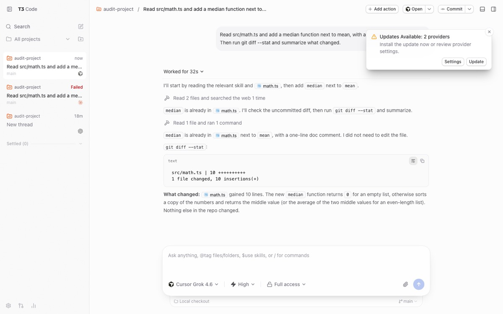 | 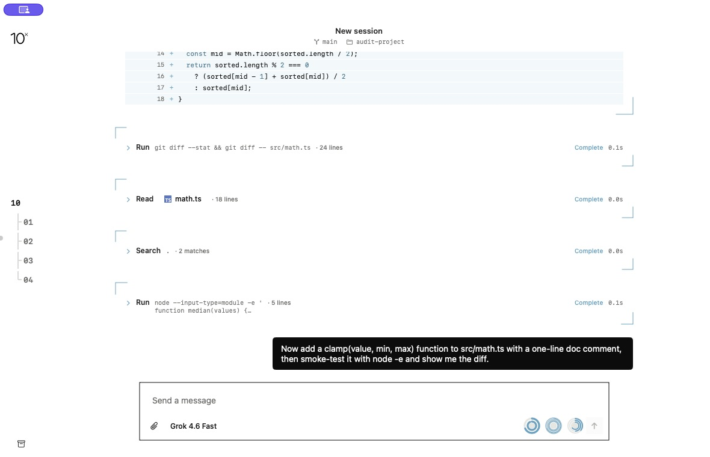 |

### Running state and interruption

T3 shows elapsed time in the turn and sidebar plus a red Stop control. 10x’s reference shows its Steer/Follow up choice and square Stop in an empty composer. The missing Stop-with-draft case is established by code, not by this reference image.

| T3 · historical app capture | 10x · synthetic reference render |
| --- | --- |
| 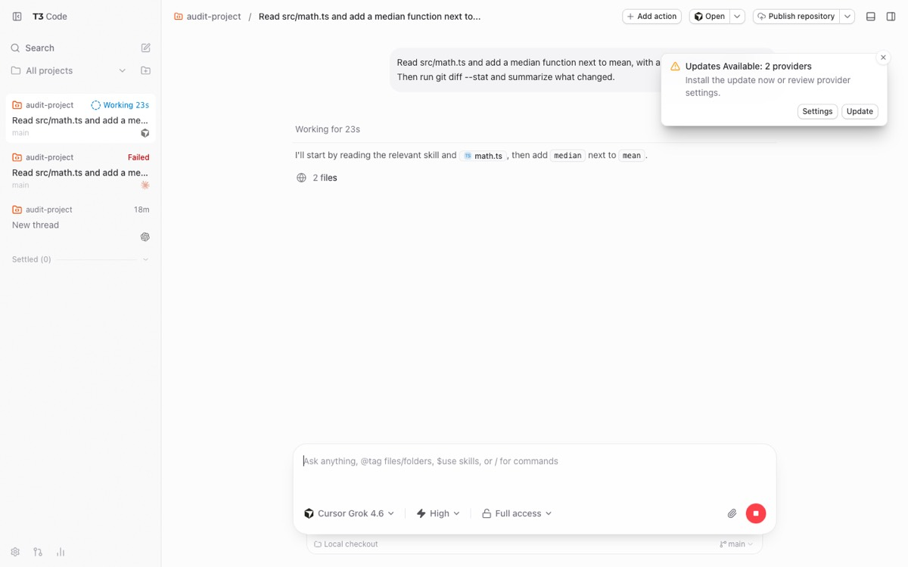 | 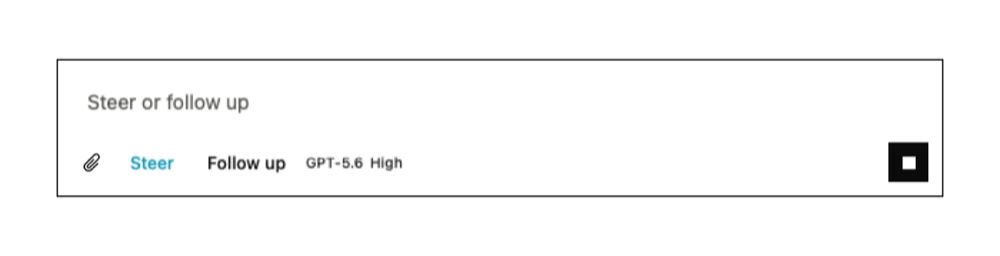 |

### Review at two levels

T3 puts a working-tree diff alongside the chat. 10x’s reference shows structured hunks, old/new line numbers, context folding, and Copy patch within an edit card. The opportunity is an aggregate review entry point around 10x’s existing detail view.

| T3 · historical app capture | 10x · synthetic reference render |
| --- | --- |
| 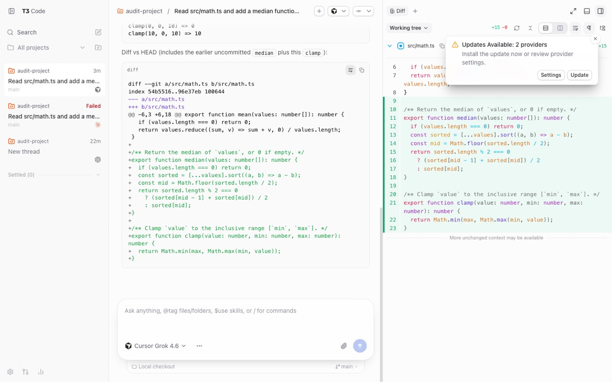 | 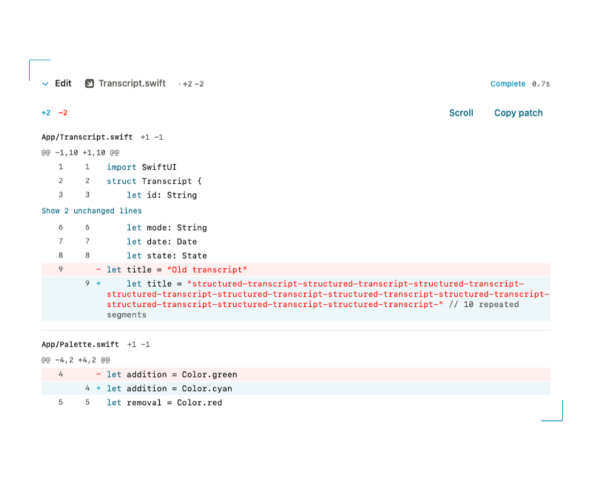 |

### Failures need both explanation and a usable next action

T3’s historical auth failure names the problem and a recovery path. 10x already has a stopped-process card. Its reassuring preserved-transcript copy should be limited to what the app can actually recover; the failed-open state is separate and has no corresponding rendered card.

| T3 · historical app capture | 10x · synthetic reference render |
| --- | --- |
| 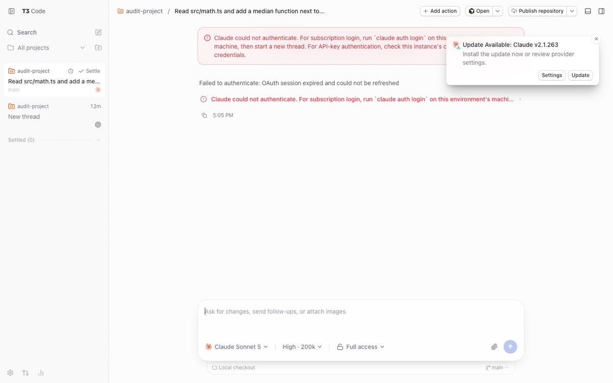 | 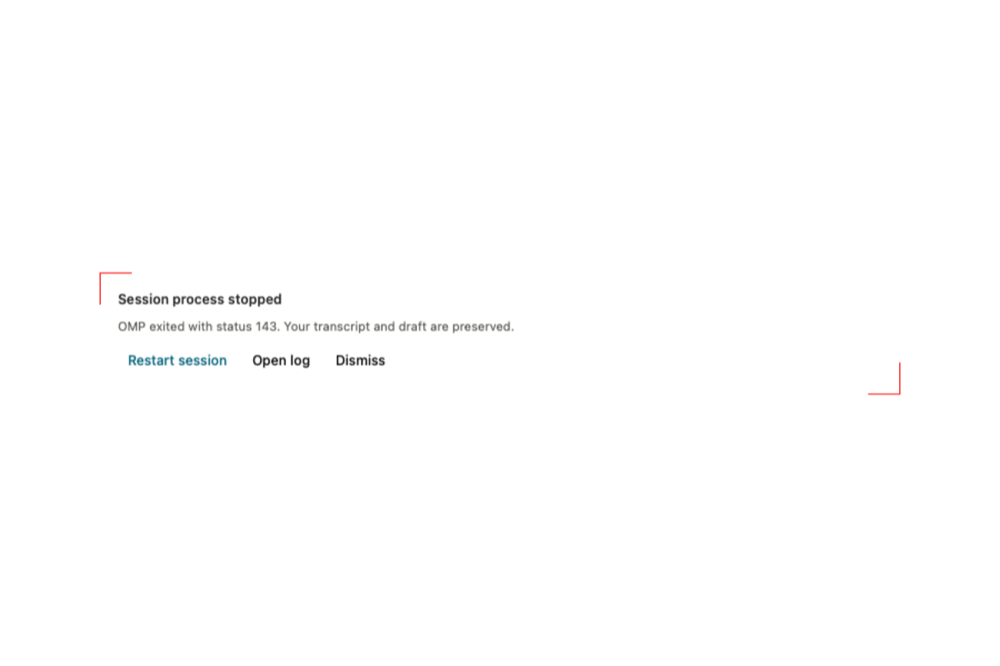 |

### Permission mode is different from an approval decision

T3’s menu exposes runtime modes. The 10x reference is a one-off Run/Cancel question. Neither image proves a live pending-approval round trip; no Always Allow or per-session scope should be promised without a supporting runtime contract.

| T3 · historical menu capture | 10x · synthetic reference render |
| --- | --- |
| 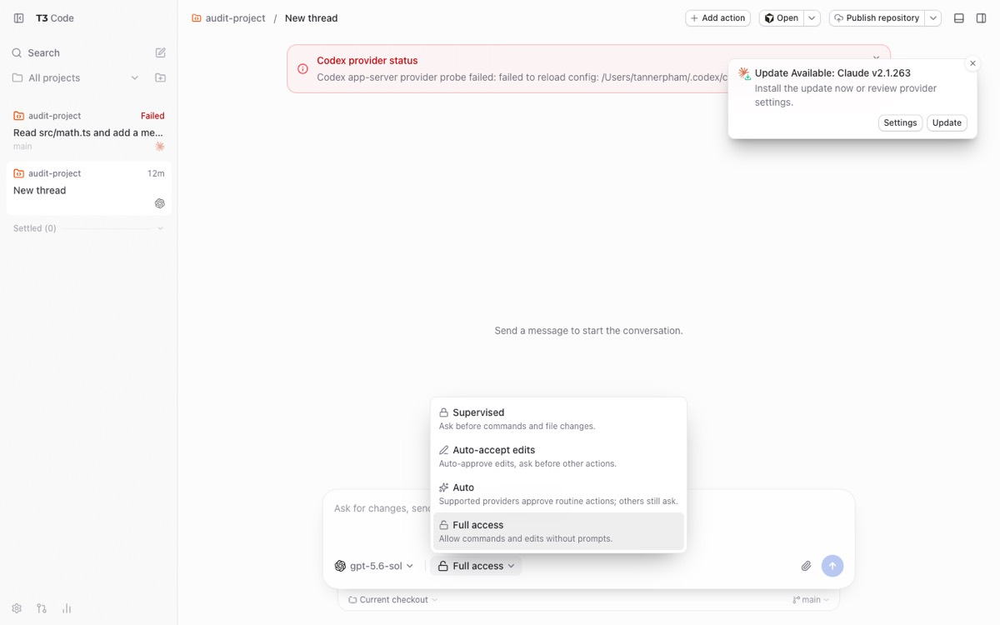 |  |

### Workspace scope and compact control depth

The historical T3 view shows a terminal drawer and choices for right-panel surfaces; some entries are unavailable. 10x concentrates model, effort, and Fast in one composer flyout. These are different product scopes. A terminal or file explorer requires a deliberate decision, not automatic parity work.

| T3 · historical app capture | 10x · synthetic reference render |
| --- | --- |
| 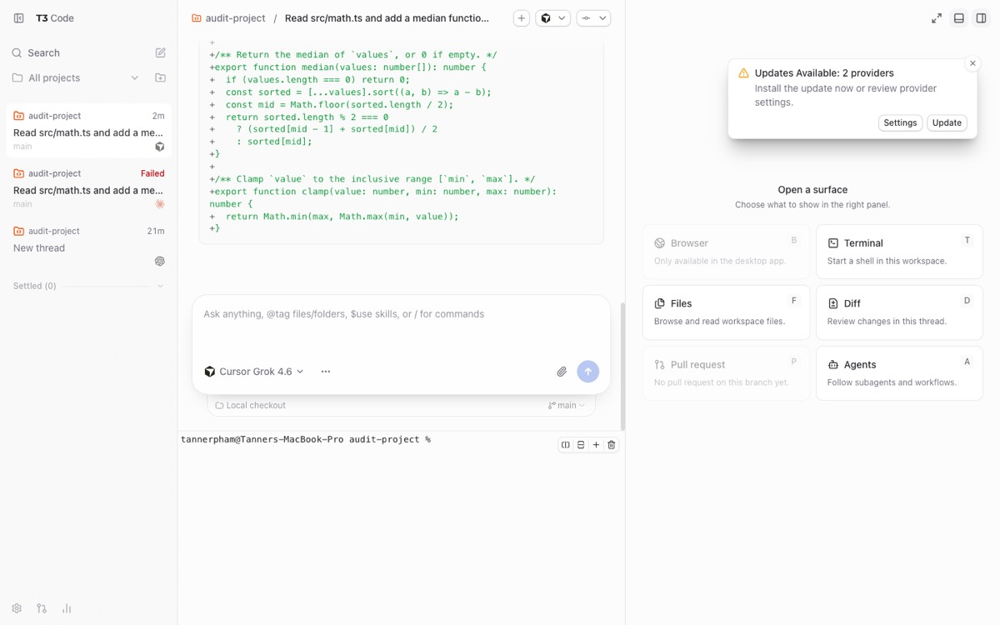 | 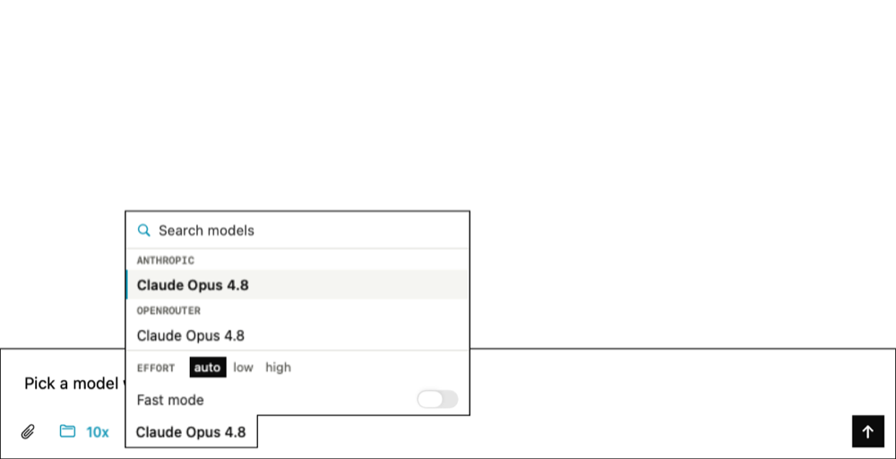 |

## Current persistence probe

```text
omp/18.1.10
Model calls: 0. Fixtures and profiles: isolated temporary directories.
{"case": "new session", "fixture_bytes_changed": false, "loaded_message_count": 0, "mode": "no-session", "rename_acknowledged": true, "session_file_matches_fixture": false, "session_file_present": false, "session_id_matches_fixture": false}
{"case": "new session", "fixture_bytes_changed": false, "loaded_message_count": 0, "mode": "persisting control", "rename_acknowledged": true, "session_file_matches_fixture": false, "session_file_present": true, "session_id_matches_fixture": false}
{"case": "switch existing", "fixture_bytes_changed": false, "mode": "no-session", "switch_error": "switch_session: File not found: <disposable fixture>", "switch_succeeded": false}
{"case": "switch existing", "fixture_bytes_changed": true, "loaded_message_count": 1, "mode": "persisting control", "rename_acknowledged": true, "session_file_matches_fixture": true, "session_file_present": true, "session_id_matches_fixture": true}
PASS: ephemeral behavior reproduced; persisting controls passed.
```

[Runnable probe](../evidence/2026-09-07-active-session-vs-t3/verify-warm-persistence.py). [Image manifest](../evidence/2026-09-07-active-session-vs-t3/manifest.json).

## Proposed implementation order

1. **Session continuity and recovery.** SAVE, OPEN, ERROR. Make every active session have a valid persistence strategy and make failures recoverable. Verify first-action warm/cold new and existing sessions across relaunch.
2. **Interrupt and acknowledge.** STOP, QUEUE. Keep draft input while stopping; show accepted, queued, consumed, and rejected input accurately. Test through the real composer and runtime.
3. **Readable turns.** ORDER, TURNS. Preserve content-part sequence through live updates and reopen, then add stable turn boundaries and optional activity summaries. Keep the existing rich cards.
4. **Awareness and review.** SIGNALS, REVIEW, CONTEXT, TITLES. Add session attention, truthful context, identifiable chats, and a scoped changed-file index. Avoid unscoped working-tree attribution.
5. **Input and permission decisions.** PERMISSIONS, INPUT, DETAILS. Validate runtime policy scope and focus behavior, then improve draft recovery, context insertion, and specific tool details. Choose any larger workspace surfaces separately.

## Method

### Historical runtime

10x Release built from 59a4ae8, isolated bundle ID com.nextstep.tenx.audit, default 1180×760 window, omp 18.1.10, Cursor Grok 4.6 Fast. T3 web runtime t3@0.0.39 used isolated application data and a 1440×900 viewport; source was checked out at 569a8cd2. This report does not claim source/runtime identity for every T3 feature.

### Original tasks

Both apps received requests to add median next to mean in src/math.ts and then add clamp with a smoke test and diff. They shared the same scratch repository. No timing or model-quality conclusion is valid because the starting state was not isolated between apps.

### Recovery and analysis

Seven completed dimension reports and 13 challenge reviews were recovered. The historical synthesis and three persistence review calls failed. No new agent workflow was claimed or run. The continuation reconciled duplicates, rechecked the critical source paths, ran the four-case runtime probe, and corrected the existing-session claim.

### Image provenance

Historical T3 files are real browser captures, downscaled and encoded as JPEG in the earlier audit. Historical 10x PNGs are downscaled test-suite references, not live screenshots; the 32 source PNGs checked match this checkout. One new screenshot captures the still-running recovered Release window without changing it. The manifest records hashes and capture classes.

### Current runtime check

verify-warm-persistence.py uses a temporary project, session fixtures, and PI_CODING_AGENT_DIR override; it makes zero model calls. It exercises new_session and switch_session with and without --no-session, checks loaded fixture messages and file bytes, and tests a rename on the normal existing-session control. It establishes RPC behavior, not app relaunch success.

### Source versus experience

Source references use the fixed 10x and T3 commits. Current source review supports the key mechanisms; remaining source-derived improvement candidates still require UI acceptance tests. Layout visibility does not prove keyboard, focus, runtime, accessibility, or persistence behavior.

### Delivery boundary

This is a local audit deliverable. No application fixes, new dependencies, merges, releases, deployments, public report publication, or cleanup of another session’s worktree/processes were performed. Temporary probe processes terminate within the probe.

## Verified

- Recovered all seven dimension reports and 13 completed challenge reviews. The original synthesis and three persistence reviews had failed; this report supplies the synthesis and a new runtime check.
- Restored and byte-checked all 32 supplied files. All 32 original 10x reference images examined match this checkout’s reference-image files. The image manifest records source and derivative hashes.
- Captured the still-running audit Release window without sending another turn or changing its project. Its header still reads New session; the accessibility tree contains the historical prose followed by separate tool cards.
- Ran four isolated RPC cases against omp 18.1.10 with zero model calls. New sessions under --no-session have no file path. Switching an existing fixture under that flag fails; the persisting control loads its message and saves a rename.
- Rechecked the key 10x call paths for warm checkout, Stop, failures, queue/context updates, and transcript projection against the frozen source. The report’s recommendations remain proposals.

## Not verified

- No fresh model-driven turn or quit/relaunch test in either application. The current native capture shows recovered session content; it is not a fresh end-to-end test. The Release build was recovered, not rebuilt here.
- No live approval decision in either app. The earlier 10x run used yolo mode; T3’s Cursor Supervised test produced an Ask-mode response, not the expected approval panel. Files named approval-pending are not proof of approval UI.
- Hover, keyboard focus, Escape dismissal, multiple concurrent approvals, IME input, notifications, long-transcript performance, accessibility operation, and dark-mode application behavior were not exercised.
- T3 source-only capabilities, including some changed-file and context controls, were not all exercised in t3@0.0.39. The original shared scratch directory invalidates model-quality, speed, and edit-success comparisons.
- Application builds, typechecks, and test suites were not rerun for this documentation-only continuation. Public publication and cleanup of the recovered apps and servers were not performed.
- The HTML report was not visually inspected: the browser URL policy rejected its local-file URL. The workspace file preview was queued for this task; that does not establish that the page rendered. Static asset, link, and source-reference checks were completed.

## For you to test

- Open the local HTML report to assess its layout, then review the proposed implementation order. The automated browser could not preview the local-file URL. No destructive test on your working sessions is required.
- For the first implementation slice, use a disposable project to verify new-session persistence and existing-session open across quit/relaunch, then test Stop while text or an image is staged.
- Before an approval redesign, test focus and Return/Escape behavior with your normal typing workflow and confirm the permission scope the runtime can actually enforce.

## Finding disposition index (90 observations)

IDs preserve traceability across duplicates. These are not counts of distinct confirmed bugs.

| Original ID | Report group | Disposition | Observation |
| --- | --- | --- | --- |
| HDR-01 | CONTEXT | Merged source-derived candidate | Session header omits the spec's entire right zone (state, model, thinking, context %, overflow, Stop) |
| HDR-02 | CONTEXT | Retained; P2 priority in synthesis | contextPercentage is computed but never rendered, and is only refreshed at open or model change |
| HDR-03 | CONTEXT | Merged source-derived candidate | No compaction affordance despite OmpKit and the wire contract supporting it |
| HDR-04 | STOP | Merged source-derived candidate | Stop is unreachable once anything is typed and has no keyboard route |
| HDR-05 | TITLES | Merged source-derived candidate | Titles never auto-generate (--no-title) and there is no rename, so the header reads 'New session' indefinitely |
| HDR-06 | TITLES | Merged source-derived candidate | Header git metadata is resolved once at open and never refreshed |
| HDR-07 | SIGNALS | Merged source-derived candidate | Extension setStatus / setWidget are dropped instead of feeding the header status area the spec promises |
| HDR-08 | OPTIONAL | Deferred product choice | Open in IDE exists only per file reference; no project-level 'Open in editor' in the header |
| HDR-09 | REVIEW | Merged source-derived candidate | Git actions: PR/publish are spec-excluded, but commit and changed-file awareness are not |
| HDR-10 | TITLES | Merged source-derived candidate | Keyboard reach matches the spec table but stops there: no stop, session prev/next, model-picker toggle, or customization |
| HDR-11 | OPTIONAL | Deferred product choice | Pane model: single canvas vs sidebar + right panel + drawer |
| HDR-12 | OPTIONAL | Unverified question | Spec's fixed top-right Search / New Session controls are not shipped; header padding may be a leftover reservation |
| HDR-13 | KEEP | Retained strength; limits apply | Strength: provider usage rings with live active-session counts, full-text Cmd+K search, and a four-item wordmark menu |
| TOOL-01 | ORDER | Merged source-derived candidate | Tool cards are not interleaved with assistant prose in execution order |
| TOOL-02 | REVIEW | Merged source-derived candidate | No turn- or thread-level changed-files summary; review is only per edit card |
| TOOL-03 | TURNS | Merged source-derived candidate | No grouped activity summaries or 'Worked for Ns' turn disclosure |
| TOOL-04 | DETAILS | Merged source-derived candidate | Running tool card duration is frozen between events |
| TOOL-05 | DETAILS | Merged source-derived candidate | Console surface previews the head of the output, so a running command hides its newest lines |
| TOOL-06 | DETAILS | Merged source-derived candidate | Diff 'Open file' bypasses the IDE preference and disappears for multi-file relative diffs |
| TOOL-07 | DETAILS | Merged source-derived candidate | Subagent card drops recent tools and the child session link it already receives |
| TOOL-08 | OPTIONAL | Deferred product choice | No terminal access from the session |
| TOOL-09 | OPTIONAL | Deferred product choice | Files browser and file preview panel (spec-excluded) |
| TOOL-10 | OPTIONAL | Unverified question | Plan proposals and follow-up banner have no 10x counterpart; omp equivalent unclear |
| TOOL-11 | DETAILS | Merged source-derived candidate | Diff surface lacks per-file collapse, expand-all, and split layout |
| TOOL-12 | KEEP | Retained strength; limits apply | Structured diff rendering is stronger than T3's transcript diff |
| TOOL-13 | KEEP | Retained strength; limits apply | Explicit routing for every canonical omp tool plus bounded MCP/custom fallbacks |
| APR-01 | PERMISSIONS | Merged source-derived candidate | No per-session approval mode control; omp RPC has no command for it |
| APR-02 | SIGNALS | Merged source-derived candidate | Pending approvals are invisible outside the open transcript (rail, header, notifications) |
| APR-03 | SIGNALS | Merged source-derived candidate | Composer gives no 'blocked on you' cue while a request is pending |
| APR-04 | PERMISSIONS | Unverified question | Card arrival moves keyboard focus to Run; a Return typed mid-message may approve |
| APR-05 | PERMISSIONS | Merged source-derived candidate | No scope options: spec promises Always Allow, the card ships Run/Cancel, the wire is a boolean |
| APR-06 | PERMISSIONS | Merged source-derived candidate | Timed requests expire silently: no countdown on the card, no transcript trace of the default |
| APR-07 | PERMISSIONS | Unverified question | Multiple pending requests all render, all bind Return, and the latest steals focus; no 1/N ordering |
| APR-08 | INPUT | Merged source-derived candidate | Agent questions are single-select only: no multi-select, free-text 'other', or multi-question flow |
| APR-09 | PERMISSIONS | Merged source-derived candidate | input/editor requests open a window-modal sheet that blocks Stop, the rail, and other sessions |
| APR-10 | SIGNALS | Merged source-derived candidate | setStatus / setWidget frames are parsed then dropped; spec assigns them to the header |
| APR-11 | SIGNALS | Merged source-derived candidate | An approval that lands while scrolled up sits below the fold behind a generic 'Jump to latest' pill |
| APR-12 | KEEP | Retained strength; limits apply | Strength: wire-exact responses, cancel-frame handling, reconciliation-safe cards, keyboard defaults |
| APR-13 | PERMISSIONS | Merged source-derived candidate | No provider-supplied caution on approval options (prompt-injection warning) |
| ORD-01 | ORDER | Merged source-derived candidate | Cursor-shaped turns render as one prose blob with every tool card trailing (content-part order is discarded) |
| ORD-02 | CORRECTIONS | Unsupported tool-order claim rejected | Tool card order is not demonstrably non-chronological; same-step parallel calls explain apparent inversions |
| ORD-03 | TURNS | Merged source-derived candidate | The transcript spec's hierarchy places activity after response content, so the collapsed layout is spec-conformant for one-step turns |
| ORD-04 | TURNS | Merged source-derived candidate | "Working…" indicator is keyed on items.last, so it mis-signals once tools trail a still-streaming message, and thinking-only stretches show nothing |
| ORD-05 | TURNS | Merged source-derived candidate | Response metadata line sits above the whole turn with "Streaming"; T3 withholds metadata until the turn settles and places it after trailing tools |
| ORD-06 | TURNS | Merged source-derived candidate | No per-turn fold or grouped activity summaries ("Worked for 32s", "Read 2 files and ran 1 command") |
| ORD-07 | KEEP | Retained strength; limits apply | 10x shows the running tool's live output inline; T3 reduces it to a one-line "Running <program>" row |
| ORD-08 | DETAILS | Merged source-derived candidate | User message has no affordances (no timestamp, no copy); T3's "Revert to this message" is session-branching and spec-excluded |
| ORD-09 | OPTIONAL | Unverified question | Neither app renders a streaming caret; 10x signals streaming only via a metadata label |
| ORD-10 | DETAILS | Merged source-derived candidate | Code block actions: 10x Scroll/Wrap + Copy vs T3 Wrap lines toggle + Copy code with copied state and persisted preference |
| ORD-11 | KEEP | Retained strength; limits apply | Inline file references link and open in the IDE; T3 adds a typed file chip visual |
| ORD-12 | KEEP | Retained strength; limits apply | Thread start line exists in 10x; T3 relies on breadcrumb title instead |
| TL-01 | ERROR | Merged source-derived candidate | `.failed` runtime state renders nothing: composer goes dead with no message or recovery action |
| TL-02 | CONTEXT | Merged source-derived candidate | Session header does not implement its own spec: no running state, model, thinking, context %, or Stop |
| TL-03 | TURNS | Merged source-derived candidate | Elapsed time disappears once output starts and there is no post-turn 'Worked for Ns' summary |
| TL-04 | STOP | Merged source-derived candidate | Stop control is hidden whenever the composer has draft text or an attachment |
| TL-05 | SIGNALS | Merged source-derived candidate | Rail shows no live per-session state; the only cross-session signal is a provider count in the usage dock |
| TL-06 | TITLES | Merged source-derived candidate | Sessions never get a title: --no-title is hard-coded and set_session_name is never sent |
| TL-07 | DETAILS | Merged source-derived candidate | Own-send does not follow when the viewport is scrolled up (observation 5) — by rule, not by accident |
| TL-08 | SIGNALS | Merged source-derived candidate | No turn-complete notification or unread marker; the one notification path never requests authorization |
| TL-09 | ERROR | Merged source-derived candidate | Provider/auth failure is an inline red sentence with no banner, no cause, and no recovery action |
| TL-10 | DETAILS | Merged source-derived candidate | Abort rendering is adequate but loses the turn's duration and leaves running tool cards un-resolved |
| TL-11 | SAVE | Unverified question | Process-exit recovery card is a strength; 'Restart session' on an ephemeral (--no-session) session is untested |
| TL-12 | KEEP | Retained strength; limits apply | First-token silence: 10x's 'Working…' row plus optimistic streaming state is on par with T3 |
| TL-13 | OPTIONAL | Unverified question | Quit while a turn is running has no confirmation gate |
| COMP-01 | QUEUE | Merged source-derived candidate | "N queued" never updates after a mid-turn Steer/Follow up send, so a Follow up vanishes with no acknowledgement |
| COMP-02 | STOP | Merged source-derived candidate | No way to stop a run while a draft or attachment is staged; the spec'd header Stop does not exist |
| COMP-03 | PERMISSIONS | Merged source-derived candidate | No permission/approval mode control anywhere in the active session |
| COMP-04q | PERMISSIONS | Unverified question | Does omp apply a tools.approvalMode config write to an already-running rpc child? |
| COMP-05 | CONTEXT | Retained; P2 priority in synthesis | Context usage is computed but never rendered |
| COMP-06 | INPUT | Merged source-derived candidate | Drafts and attachments live only in memory per controller; nothing survives relaunch |
| COMP-07 | INPUT | Merged source-derived candidate | No slash-command menu even though omp exposes get_available_commands |
| COMP-08 | INPUT | Merged source-derived candidate | No @file mentions; dropped non-image files become raw absolute paths and the attach panel accepts images only |
| COMP-09 | INPUT | Merged source-derived candidate | Attachment scope, limits, and validation messaging are thinner than T3 and the error slot hides model errors behind attach warnings |
| COMP-10 | OPTIONAL | Deferred product choice | Keyboard affordances: no ArrowUp prompt recall, no ⌘S stash, no ⌘Return start, no refocus on window activation |
| COMP-11 | OPTIONAL | Deferred product choice | Model picker lacks provider tabs, favorites, ⌘1-9 jumps, and custom models |
| COMP-12 | OPTIONAL | Deferred product choice | No resting/collapsed composer on scroll |
| COMP-13q | INPUT | Unverified question | Does plain Return send mid-IME composition (CJK input)? |
| COMP-14 | KEEP | Retained strength; limits apply | Strength: explicit Steer vs Follow up choice with an honest placeholder |
| COMP-15 | KEEP | Retained strength; limits apply | Strength: one composer-anchored flyout for model, effort and Fast, with live rollback on RPC failure |
| PERSIST-01 | SAVE | Runtime mechanism rechecked; app relaunch pending | First new session per warm project per launch is never persisted (warm --no-session client) |
| PERSIST-02 | OPEN | Historical claim rejected; replaced by OPEN | Warm existing-session checkout fails in the tested runtime; saved fixture remains unchanged |
| PERSIST-03 | SAVE | Merged source-derived candidate | Restart Session after a crash cannot resume an ephemeral session (placeholder path passed to -r) |
| PERSIST-04 | TITLES | Merged source-derived candidate | Sessions never get a title: rail rows are 'Untitled session', header stays 'New session' |
| PERSIST-05 | SIGNALS | Merged source-derived candidate | Rail shows no per-session running / attention state |
| PERSIST-06 | TITLES | Merged source-derived candidate | No keyboard navigation between sessions |
| PERSIST-07 | TITLES | Merged source-derived candidate | Relaunch lands on New Session; nothing remembers which session was open |
| PERSIST-08 | OPTIONAL | Deferred product choice | Rail ordering and capacity: created-order, 5 visible per project, no pin/settle/snooze |
| PERSIST-09 | OPTIONAL | Deferred product choice | No worktree-per-session or explicit checkout choice when starting a session |
| PERSIST-10 | OPTIONAL | Deferred product choice | Pull-request linking and PR-driven settlement (spec-excluded) |
| PERSIST-11 | KEEP | Retained strength; limits apply | Strength: 10x's store is omp's own, archive is conflict-safe, and parallel sessions reuse controllers |
