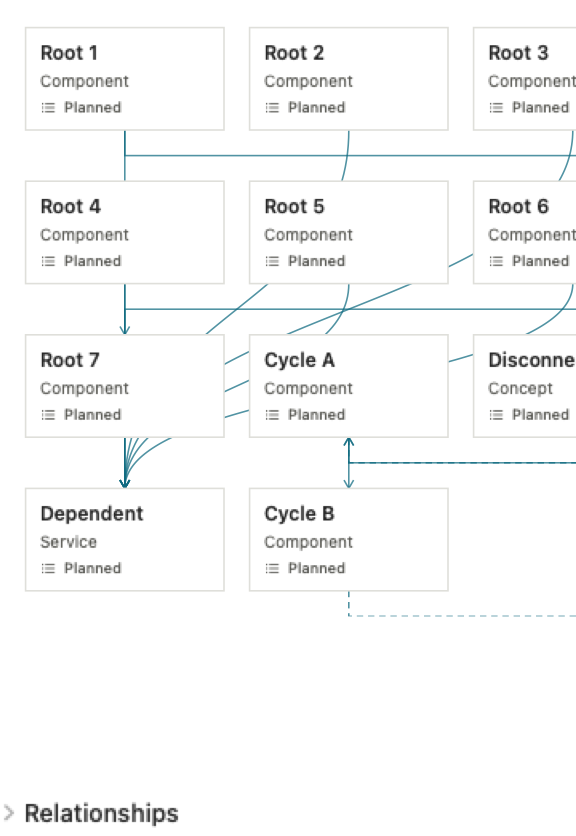

# Native checker and current-writer gate

Status: **In progress.** Release and live transport passed, but the initial current-writer corpus failed the content gate. A missing writer grammar is being corrected before the native workflow check.

## Reviewed checker behavior

Source implementation: `dd5622bb617e2bab30bf72d8797f781ef89db51c`. Reviewed correction: `9fb3d3a01035c6bc2c57e42fac0631e792cd30aa`.

The generator shares a three-call maximum between writing, repair, image checking, and the single allowed rewrite. Tests cover a valid writer followed by checker issues and a rewrite; a repaired writer with no rewrite budget left; malformed or failed checks; and an invalid rewrite retaining the first valid map. Off and status-only updates make zero render calls. Changes to edge endpoints, edge kind/label, or node geometry still trigger checking.

The checker accepts the five specified issue types and bounds output to 12 issues with 240-character descriptions. Deterministic geometry diagnostics take priority over model feedback. Stale requests cannot proceed from rendering to another model call or publish after checking. A configured checker that could not run reports unavailable. Final rewritten output is explicitly unchecked.

Final focused verification after the reviewed correction: **19 non-live functions passed, one live function intentionally skipped, 27 parameterized runs passed**, in 0.079 seconds. Log: `/tmp/10x-f59a-session-map-task10-fix1-final-affected-neighbor-2.log`. The earlier identical test run passed before Xcode failed to save diagnostics because the disk was full; its log remains available. The fresh scoped review found all five Important findings and the renderer-observer Minor addressed, with no new breakage.

## Native graph rendering

The checker renders the production `SessionMapGraphView` through `NSHostingView` at the actual inner pane width, using persisted first-seen order and frozen focus/activity/motion. PNG encoding runs off the main actor. Its bounded viewport supports claims about the visible graph region only.

Root inspected both the original width-mismatch candidate and the corrected 576×836 PNG, which represents a 320-point pane with the shared 16-point inset on each side. The corrected native-render test passed 1/1 in 0.044 seconds. SHA-256: `695aae0aff18bd55232e7489deabf0a65eb538e36e01a1be97787dc59037aefb`. The first checker fix did not change this renderer. This is native-view rendering evidence; actual Release-button checks remain pending.

## Full app gate

At `9fb3d3a`, `/tmp/10x-f59a-session-map-task10-full.xcresult` records **1,475 passed, 8 failed, 1 intentionally skipped**, including four XCTest methods. Swift Testing reports 1,480 tests across 34 suites in 74.806 seconds.

Six failures are the previously documented disclosure snapshot mismatches; no reference was promoted. The remaining failures were the existing slash-command lifecycle timing assertion and this branch's RPC timeout assertion under load. The first isolated rerun failed while copying test resources because the disk was full, so it executed no tests. Those failures prompted the focused correction and check below.

The resulting correction, `5445b4617d69617d8f32d45b2a63f1082910c432`, normalizes errors caused by this RPC's own expired deadline during startup or request submission, in addition to event consumption. Errors before expiry retain their original meaning. Six focused functions/eight runs passed in 1.718 seconds, including startup timeout, cancellation, EOF, provider errors, malformed/terminal output, child reaping, and the existing slash lifecycle case. Log: `/tmp/10x-f59a-session-map-task10-gate-final-after-space.log`. The fresh scoped review found the issue addressed with no new breakage.

The full suite at `5445b46` confirms the RPC cases pass under load, but remains red: **1,473 passed, 11 failed, 1 intentionally skipped** in `/tmp/10x-f59a-session-map-task10-full-after-rpc.xcresult`. Alongside the six known disclosure mismatches, four other snapshots and `closingDuringAnOpeningTaskPublishesUnavailable()` failed. Those five cases passed together in the one isolated follow-up, **5/5 in 0.400 seconds**, at `/tmp/10x-f59a-session-map-task10-unrelated-isolated.log`. This isolated result does not turn the full suite green. No unrelated source or snapshot reference changed. The snapshot harness removed its transient actual PNGs after the isolated match, so their original pixel differences were not inspected; the full failure log and result bundle remain.

Repeated disk exhaustion interrupted two gate attempts before tests. All source and evidence WIP was patch-backed up; cleanup removed only this task's rebuildable caches and old Release product. Free space subsequently recovered to 28 GB, allowing the larger gate to resume.

## Initial current-writer result

The exact Release build at `5445b46` passed. Log: `/tmp/10x-f59a-session-map-task10-release.log`. The uniquely named QA artifact has executable SHA-256 `1214ca7094ebfa73628831f214ca23bb455d3dbe47f33c69e02d6657a8ea910f`. It has not yet been used for the native button gate.

The opt-in runner executed four actual synthetic generations using `cursor/composer-2.5-fast`, checker Off, on 2026-09-09 at about 01:50 UTC. Each made one completion call. The test process exited successfully, but the observed content **failed the gate**:

| Case | Calls | Time | Retained graph | Observation |
| --- | ---: | ---: | --- | --- |
| Planning | 1 | 15.598 s | 3 nodes, 1 edge | 58 validation diagnostics; most supporting content dropped |
| Incremental | 1 | 12.875 s | 1 node, 0 edges | 0 of 3 prior IDs retained; 40 diagnostics |
| Wide/cyclic | 1 | 24.643 s | 0 nodes, 0 edges | 74 diagnostics; architecture was lost |
| Failure/catch-up | 1 | 15.484 s | 0 nodes, 0 edges | 11 diagnostics; status-bearing graph was lost |

The writer prompt supplied element names and graph required-field names, but omitted accepted enum values and supporting-block grammar. The diagnostics show required fields and child structures being rejected. The existing limits did not cause this loss; no cap change or parser relaxation is planned.

[The initial result files](corpus-initial-5445b46/summary.json), the read-only preflight, and both native before/after images are preserved in `corpus-initial-5445b46/`. Root inspected those images: the three-node planning map collapsed to a lone Checker card after the incremental update. The stored XML is the validated canonical output; raw rejected model attributes were not captured. This limits retrospective diagnosis of the exact invalid values.

One prompt-contract correction and one fresh four-case run at its new source SHA are planned. The initial results remain intact. This is a correction of the observed failed flow, with no model shopping or repeated benchmarking.

## Remaining gate

- Exact corrected Release build and native Regenerate interaction, with draft, attachment, and chat-model preservation.
- One corrected generation for each of the four synthetic current-writer cases, retaining per-case XML, diagnostics, call counts, timing, identity and native before/after images.
- One bounded native generation with an explicitly enabled image checker in isolated preferences, separate from the checker-Off Regenerate case.

The preflight resolved `smol` to `cursor/composer-2.5-fast`, advertising text/image input and no thinking-effort metadata. The four completed calls establish authenticated text generation for this run. Image-input checking remains unverified until the native checker case. The corrected gate will recheck current configuration and preserve its results without repeat benchmarking.
