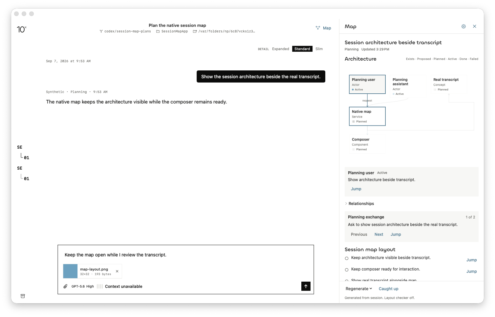
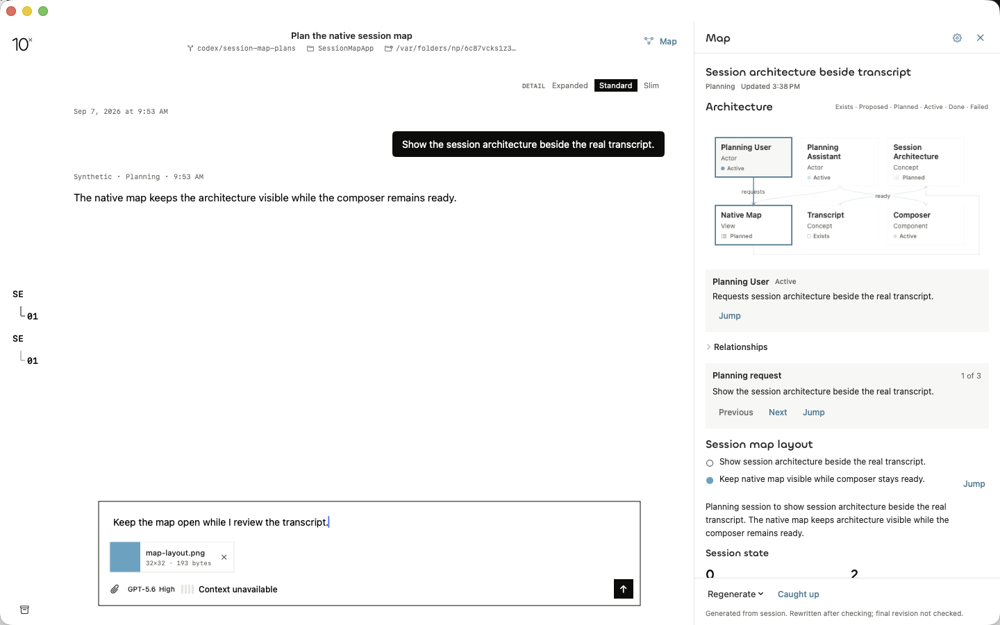

# Native generation gate (Task 10)

The two native generation cases pass in the real Release app at the task HEAD. Both drove the actual UI (AX button presses, no focus theft) against the `map-writer-live` fixture, which records every writer/checker RPC to a call file.

## Provenance

- Branch: `codex/session-map-plans`; draft PR [#30](https://github.com/NextStep-AI-inc/10x/pull/30).
- HEAD under test: `19727127d3c1decbf1140769dee8ea72865700a6`.
- Release build: `xcodebuild -configuration Release`, pristine HEAD, app at `/tmp/10x-f59a-session-map-release/Build/Products/Release/10x.app`.
- Fixture: `TENX_UI_FIXTURE=map-writer-live`, `TENX_UI_FIXTURE_SHA=19727127d3c1decbf1140769dee8ea72865700a6`, light appearance. The fixture stubs only the writer/checker RPC transport and counts calls; the model catalog and roles come from the real `omp` installation.

## Verified

**Case 1 — writer only (checker off).** Fresh generation from the session map pane: `writerCalls=1 checkerCalls=0`. Map rendered `.ready` (3 nodes: 2 done + 1 planned, 2-step walkthrough), attribution "Layout checker off." Composer preserved the draft "Keep the map open while I review the transcript.", the `map-layout.png` attachment, and the "Grok 4.6 Fast" chat model.

**Case 2 — writer + image checker.** Checker selection `{"model":{"id":"cursor/claude-opus-4-8-xhigh"}}` written to the fixture's isolated `UserDefaults` suite before launch. Result: `writerCalls=1 checkerCalls=1` ([call file](native-writer-checker-calls.txt)), `.ready` map with 6 nodes and edges ([record](native-writer-checker-map.json)), attribution names the checker model "Cursor/claude-opus-4-8-xhigh · Writer cursor/composer-2.5-fast". Draft and attachment preserved.

An instrumented Debug run (temporary `TenXTrace` logging, since reverted) confirms the in-app chain end to end: pane `.writing` → catalog load (307 models) → writer RPC `cursor/composer-2.5-fast` → checker RPC `cursor/claude-opus-4-8-xhigh` → `.ready` ([excerpt](native-debug-trace-excerpt.txt)).

## The earlier "hang" was a test artifact, not an app bug

The reproducible freeze reported during earlier attempts was caused by coordinate-based synthetic clicks (`cliclick`) landing on the wrong window — the fixture window cascades to a new position each launch, so stale coordinates hit unrelated UI. Driving the app through accessibility presses by button label is reliable and never steals focus. With correct input delivery, generation completes in ~30 s with no hang. lldb breakpoints do not fire in this app on macOS 25.5 (verified with a discriminator breakpoint on the button action); `TenXTrace` file logging was used instead.

## Environment note (not an app defect)

The first case-2 attempt used checker selection `{"role":{"_0":"vision"}}`. The `vision` role resolves to `anthropic/claude-opus-4-8:xhigh`, but this machine's `omp` catalog contains no `anthropic` provider (only amazon-bedrock, bedrock-mantle, cursor, nextstep, openai-codex), so role resolution correctly returned nil and the checker stayed off. A direct model selection against a catalog member resolved and ran. Role-based checker selection works only when the role's provider is available; the resolver's nil path behaved as designed.

## Not verified

- Checker verdict quality: the fixture checker returns a canned accept, so layout-correction behavior on a real checker rejection is covered only by the earlier corpus checks.
- Generation against a long real session transcript (the fixture session is short).
- Tasks 11–13 (completion scheduling, accepted-send coverage, catch-up producer) remain open.

## For you to test

Optional: open the session map in your daily-driver build and regenerate against a real session to judge map quality. No functional gaps are expected from this gate.
