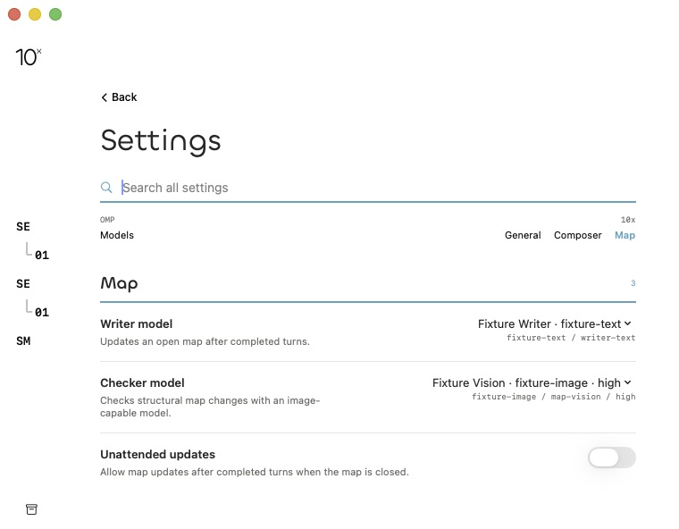
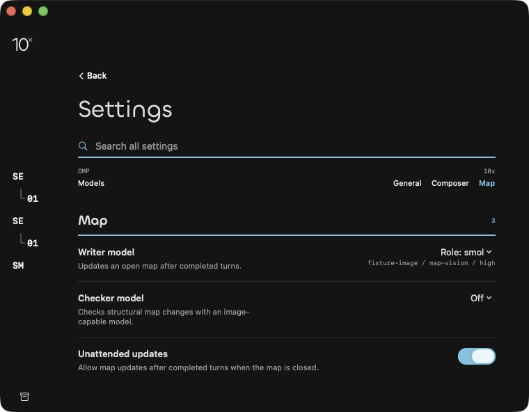
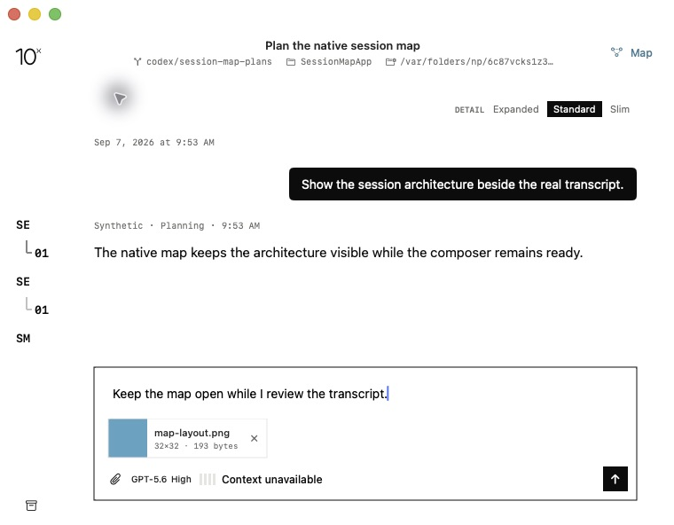

# Map settings native evidence

Status: **Verified with manual accessibility cells remaining.** The initial native matrix and the affected check on the reviewed correction have separate provenance below. These observations do not establish generated-map behavior.

## Provenance

- Source: `452c9f34db5643a9dce6b05387501fe6ac33032d`.
- Executable SHA-256: `932060e11aadc41960210407b936742d95e792e8cd75c351d45183dbf94ea151`.
- Native window: `10x | settings-map | 452c9f34db56`; actual Settings and session views, inert catalog/config, isolated preferences and synthetic session data.
- QA-only bundle ID: `com.nextstep.tenx.sessionmap.f59a`; temporary display name `10x Flyer QA`. Local build overrides use ad-hoc signing and `ENABLE_HARDENED_RUNTIME=NO`; repository product signing/name were not changed.
- Focused Debug arm64 run: 20 passed, 0 failed, 0 skipped, 0.260 seconds. Confirmed from `/tmp/10x-f59a-session-map-task8-green-final.log` and its xcresult summary. Existing App Intents/XPC environment messages remain in the log; no Task 8 source or actor-isolation warnings remained.

```sh
xcodebuild build -project 10x.xcodeproj -scheme 10x -configuration Release \
  -destination 'platform=macOS,arch=arm64' \
  -derivedDataPath /tmp/10x-f59a-session-map-release \
  PRODUCT_BUNDLE_IDENTIFIER=com.nextstep.tenx.sessionmap.f59a \
  CODE_SIGN_IDENTITY=- ENABLE_HARDENED_RUNTIME=NO
```

Release log: `/tmp/10x-f59a-session-map-task8-release.log`, `BUILD SUCCEEDED`. Both launches used `TENX_UI_FIXTURE=settings-map`, the full source SHA, and fixture appearance `light`/`dark`. Only this QA executable was stopped afterward; no development server or model call was used.

## Observed behavior

| Check | Result and evidence |
| --- | --- |
| Initial Map deep link | The actual Settings view opened with Map selected, writer `Role: smol` resolved to `fixture-image / map-vision / high`, checker Off, unattended On. [Initial AX](settings-initial.ax.txt). |
| Writer menu | Click opened the native menu; End/Return chose Fixture Writer, displaying `fixture-text / writer-text`. Reopening, moving with Home, then Escape preserved that selection. Home/Return subsequently restored smol. |
| Checker capability and keyboard selection | [Menu AX](settings-checker-menu.ax.txt) contained Off and image-capable roles/models/efforts only; Fixture Writer was absent. End/Return selected the high-effort image model; Home/Return restored Off. |
| Unattended preference | Actual toggle changed On → Off → On. [Resolved controls](settings-resolved-wide.ax.txt), [restored defaults](settings-restored-minimum.ax.txt). |
| Minimum layout | Captured JPEG dimensions are exactly 760×592, including window chrome. Labels, model details, toggles and navigation remain readable in [light](settings-resolved-minimum.jpg) and [dark](settings-dark-minimum.jpg). |
| Search and scrolling | `checker` found Map; `Command-Enter` found [Composer](settings-search-composer.ax.txt); `preferred IDE` found [General](settings-search-ide.ax.txt). General and Composer navigation also worked. At minimum height, scrolling exposed the entire lower search result. [Scrolled dark view](settings-dark-search-scrolled.jpg). |
| Session preservation | Back returned to the same session with draft `Keep the map open while I review the transcript.`, `map-layout.png` (32×32, 193 bytes), and `GPT-5.6 High`. Compare [before AX](settings-session-before.ax.txt) and [after AX](settings-session-after.ax.txt). Nothing was sent. |







## Reviewed correction and affected native check

`666f5b82abbaa634ea307ea33bca3b1cdba32e15` corrects the retained catalog lifecycle. Shutdown invalidates the snapshot, and per-load generation checks reject old results. Two focused regressions failed with four expected issues before correction; the affected nine tests then passed, followed by 24 Task 8 selectors passing in 0.274 seconds with no failures or skips. Logs: `/tmp/10x-f59a-session-map-task8-fix1-{red,green-focused,green-final}.log`. The same five references passed unchanged. Explicit unsupported-schema and occupied-canonical migration cases now cover those store branches; redundant persisted `sourceLineage` was removed. Scoped re-review found all three findings addressed, with no new Critical/Important breakage.

The exact corrected Release build passed (`/tmp/10x-f59a-session-map-task8-fix1-release.log`), executable SHA-256 `76e2d964c2cba62b9d95388f689230932a3f5984987eeaa3bcf5f701f245d771`. In its actual `settings-map` fixture, keyboard menu selection chose Fixture Writer. Back closed Settings; Command-comma reopened it; selecting Map resolved the same saved writer with checker Off and unattended On. [Reopened controls](settings-fix1-reopened.jpg), [AX evidence](settings-fix1-reopened.ax.txt). The session draft, attachment and chat model were also present after Back. The constant fixture catalog establishes the native reload flow; the changed-catalog and late-output behaviors are established by the deterministic regressions. Only this QA process was stopped afterward.

## Not verified

- Full Tab traversal: Tab stayed in the search field under the current system navigation setting. Native menu selection and Escape are verified; system keyboard settings were not changed. Spoken VoiceOver remains unobserved.
- Unavailable writer was checked with the inspected native snapshot and deterministic resolver tests, not a separate running unavailable fixture. Missing-model generation/Settings action belongs to Task 9.
- Current-provider authentication/generation and the full app suite are not covered by this settings gate.
