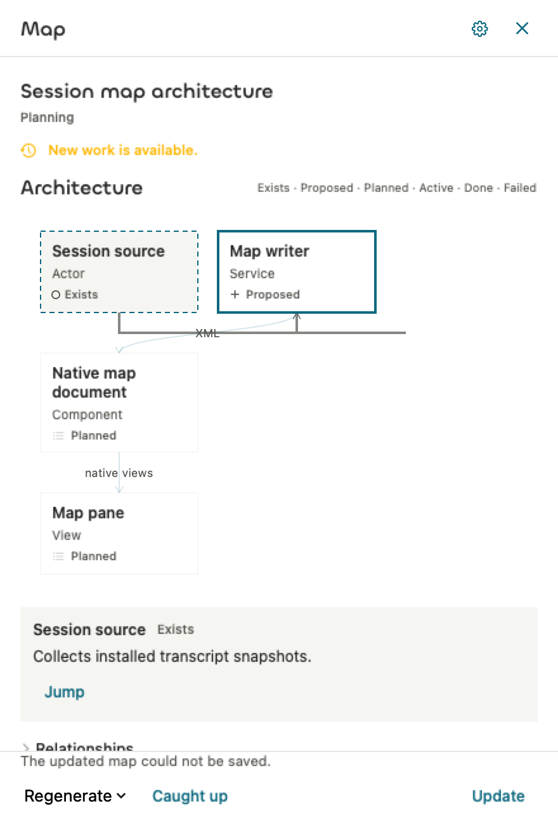

# Isolated writer checks

The deterministic writer checks pass. Native button driving, the optional image checker, and real-model generation remain the next slice gate. This page does not claim a successful model call.

## Provenance

- Branch: `codex/session-map-plans`; draft PR [#30](https://github.com/NextStep-AI-inc/10x/pull/30).
- Initial implementation: `5422d59d114ca58f4efe42456beb724a82d532d2`.
- First correction: `e4f8ca4b68f4c46077d29b8699812980cf54b6f5`.
- Race correction: `be152bf7cd6572926119b6540fda8c419be998f9`.
- Both scoped fix reviews are complete: all findings are addressed, with no new Critical/Important breakage. No Release build or live writer was run for this task; those checks belong to Task 10.

## Verified

The final focused Debug arm64 run passed **28 Swift Testing functions in 1.131 seconds**. Log: `/tmp/task9-fix2-final-focused.log`. Coverage includes terminal-only RPC output, exact timeout/EOF/provider errors and child reaping, one repair, stable cache identity, bounded readable prompt escaping, canonical XML limits, identity-preserving persistence, project-specific model catalogs, and the actual AppModel generation callback.

Two race regressions failed before the correction with four expected assertions, then both passed in 0.006 seconds. An older invalidation can no longer obsolete a registered newer request, and an older failed save cannot change the newer pane. Logs: `/tmp/task9-fix2-behavioral-red.log` and `/tmp/task9-fix2-affected-green.log`. The focused reproduction command was:

```sh
xcodebuild test -project 10x.xcodeproj -scheme 10x \
  -configuration Debug -destination 'platform=macOS,arch=arm64' \
  -derivedDataPath /tmp/10x-f59a-session-map-derived \
  '-only-testing:TenXAppTests/sessionMapOlderInvalidationCannotObsoleteNewerRequest()' \
  '-only-testing:TenXAppTests/obsoleteAppModelSaveFailureCannotChangeNewerWritingState()'
```

The controller inspected the real `SessionMapPaneView` rendered through `NSHostingView` at 440 × 640 points. The save-error sentence is fully visible above the footer, and the map remains available. This is native view-rendering evidence; interaction with a running Release app remains the next gate. No snapshot reference was promoted.



## Not verified

- Real writer/checker authentication, output quality, latency and call counts.
- Release-native Generate/Regenerate, current-model corpus, and the next full app suite.
- Automatic completion scheduling, accepted-send coverage, transcript/composer actions and the catch-up producer; these remain Tasks 11–13.
- Later-base harness compatibility remains blocked by the already documented denied main synchronization.

## For you to test

No additional manual writer check is requested before the planned Task 10 native gate. Existing manual accessibility and flyer-motion gaps remain listed in the [evidence index](README.md).
