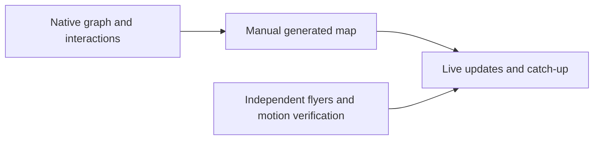

# Session Map and system flyers planning handoff

**Status: DONE (planning only).** Product implementation and native/model verification have not started.

**Branch:** `codex/session-map-plans` → `main`

**Draft PR:** [Plan the Session Map and system flyers #30](https://github.com/NextStep-AI-inc/10x/pull/30)

**Plan base:** `7b23badf779cd8b6fc8849e6434c1930ef5afde0`

**Design commit:** `410a478c0648d13b19c413382043a89ca802f272`

**Implementation-plan commit:** `595d7314c2c1b6f1d85fb8a826f2d858d64fed73`

## Deliverables

- [x] [Session Map design](../specs/2026-09-07-session-map-design.md): diagram-first planning/implementation companion; XML; stable identities; catch-up as a mode; writer model/role; checker Off by default; visual and accessibility contracts.
- [x] [Session Map implementation plan](2026-09-07-session-map.md): 13 concrete tasks in three independently verifiable slices, with file ownership, interfaces, runnable test examples, current integration points and acceptance gates.
- [x] [System flyers design](../specs/2026-09-07-system-flyers-design.md): one-line translucent composer overlay, primary motion references, overflow return-scroll and real native animation criteria.
- [x] [System flyers implementation plan](2026-09-07-system-flyers.md): four independent tasks; real catch-up producer attaches in Map Task 13.
- [x] Check compatibility boundaries with [harness notices #29](https://github.com/NextStep-AI-inc/10x/pull/29) and [settings editors #28](https://github.com/NextStep-AI-inc/10x/pull/28). Their implementation and shared-file merges remain owned separately.
- [x] Preserve the approved direction and label exact limits/timings as implementation defaults.
- [x] Keep this branch documentation-only and leave the PR draft.

## Next execution step

Read both specs and the chosen plan, then execute **Session Map Task 1** through the **Slice 1 native fixture gate**. It proves parsing, layout, highlights, walkthrough and visual hierarchy before any model wiring. The flyer component can be implemented independently through its motion gate. Native graph and flyer work share shell/fixture integration files and must serialize those edits.



Execution must start from the then-current main in its own worktree/draft PR. Re-read current source around controller snapshots, transcript search, settings ownership and composer integration; the plans name the verified base but those files have active owners. No implementation, merge, release, deployment, dependency change or cleanup permission is created by this handoff.

## Implementation choices made while writing

- Start the documentation branch from current remote main, keeping unrelated unmerged code out of the planning diff.
- Retain the latest design's 440 pt pane and three-slice order; keep exact graph caps, geometry, motion timing and thresholds centralized and tunable from native evidence.
- Use an entry-only variant of current transcript navigation, rather than inventing a search query. Use current `ComposerCatalogService` and preserve existing search/group expansion semantics.
- Include changed existing source entries in the digest via a fingerprint manifest; count terminal work once; keep attention, generated coverage and caught-up coverage independent. Capture an away interval before clearing it on return.
- Make stable ID matching unique, topology checks sensitive to rewiring, and numerical displays tied to app-derived facts. Limit repair/checking together to three calls with one writer retry/rewrite.
- Require actual native video observation for flyer motion. Browser references and prior probes are design input, not fresh verification evidence.

There are no unresolved product questions blocking completion of planning. Runtime findings may justify tuning the first contract; they do not justify changing the diagram-first goal or absorbing adjacent work.

## Verified

This planning session checked four design/plan documents, eight relative document links, three well-formed XML examples, 17 task sections, and 23 existing integration paths. It checked plan headers/fences, placeholders/private recovery markers, spec-to-task coverage and whitespace with `git diff --check`. Primary marquee references were opened and their return/fit behavior checked. No recovered conversation, raw tool log or private mockup was added to git.

Repeat the structural document check from the repository root:

```bash
python3 - <<'PY'
from pathlib import Path
import re
import xml.etree.ElementTree as ET
files = [Path('docs/superpowers') / kind / f'2026-09-07-{topic}{suffix}.md'
         for kind, suffix in [('specs', '-design'), ('plans', '')]
         for topic in ['session-map', 'system-flyers']]
for path in files:
    text = path.read_text()
    assert sum(line.startswith('```') for line in text.splitlines()) % 2 == 0, path
    for target in re.findall(r'\]\(([^)]+)\)', text):
        if not target.startswith(('https:', 'http:', '#')):
            assert (path.parent / target.split('#')[0]).exists(), (path, target)
    for xml in re.findall(r'```xml\n(.*?)\n```', text, re.S):
        ET.fromstring(xml)
print('PASS: document fences, local links and XML examples')
PY
git diff --check 7b23badf779cd8b6fc8849e6434c1930ef5afde0...HEAD
```

## Not verified

No application source changed, so app compilation/typechecking, app/OmpKit tests, native screenshots/video, real-session behavior and model probes were intentionally not run for this documentation-only scope. All are explicitly assigned to implementation gates. The historical writer identity/latency probe is not a test result of this branch.

## For Tanner to review

Review the specs' visual hierarchy and the execution order. The next working deliverable is the native fixture map (Slice 1), with the flyer motion component available as its independent companion. There is no new app build to test from this planning PR.
