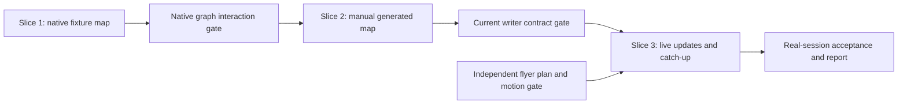

# Session Map Implementation Plan

> **For agentic workers:** REQUIRED SUB-SKILL: Use superpowers:subagent-driven-development (recommended) or superpowers:executing-plans to implement this plan task-by-task. Steps use checkbox (`- [ ]`) syntax for tracking. This document records future execution; the planning task does not authorize starting implementation.

**Goal:** Build a diagram-first native companion that follows a coding session from architecture planning through implementation and catch-up.

**Architecture:** App-owned source/digest/coordinator services update a bounded XML document through an isolated OMP RPC writer. Native graph/layout/views render it with local hover, walkthrough and live file activity. Catch-up reuses the document and the independent flyer component.

**Tech Stack:** Swift 6, macOS 15+, SwiftUI/AppKit, Foundation XMLParser, CryptoKit, Swift Charts, existing OmpKit, Swift Testing and native snapshot harness.

**Spec:** [Session Map design](../specs/2026-09-07-session-map-design.md). Read its complete contracts and states before this plan. Companion: [system flyers plan](2026-09-07-system-flyers.md).

## Global Constraints

- Swift 6 / macOS 15+, native SwiftUI/AppKit/Foundation, no new dependency.
- Header **Map**, code `SessionMap*`; catch-up is a mode. Diagram precedes supporting prose.
- Pane closed initially, never auto-opened; default 440 pt, minimum 320 pt, maximum half-window; drawer below 1180 pt; app minimum 760×560 pt.
- XML ≤64 KiB; digest 12 KiB UTF-8; planning excerpts 2 KiB/file and 4 KiB total inside that digest.
- Graph 24 nodes / 40 edges; flow 12 steps; plan 24 tasks; supporting blocks 8; graph floor scale 0.8.
- Writer role `smol`; checker Off by default; 90 s per call; maximum 3 calls and 1 writer retry/rewrite per generation.
- Pane-open completion debounce 10 s; pane-closed gate ≥1 finished turn and (≥3 turns OR ≥5 minutes unattended OR attention event).
- Use prefills/appends without sending or dropping attachments. Viewing, opening and dismissing never mark caught up.
- Existing transcript search, provider routing, recovery, composer behavior, rail navigation and hidden-harness notices retain their own responsibilities.
- `10x.xcodeproj` is generated. Add source/test files then run `ruby scripts/generate_xcodeproj.rb` with pinned `xcodeproj 1.27.0`; never hand-edit it.
- Fresh implementation worktree and draft PR from the then-current base; do not modify another session's checkout. Port 3000 is reserved. No merge/release/deploy is included.

## Execution order and ownership

Plan base is `7b23badf779cd8b6fc8849e6434c1930ef5afde0`. Before execution, fetch/review current main and [PR #29](https://github.com/NextStep-AI-inc/10x/pull/29) (harness notices) and [PR #28](https://github.com/NextStep-AI-inc/10x/pull/28) (settings). Shared-file integration is sequential. If a delegated task needs another owner's file, skip and flag that edit; do not revert or abort their work. Use implementation-role agents for bounded implementation only when that execution workflow is chosen; the primary session owns validation and integration.



| Owner / tasks | New files and responsibility | Existing edit fence |
| --- | --- | --- |
| Slice 1, tasks 1–2 | `App/SessionMap/SessionMapDocument.swift`, `SessionMapLimits.swift`, `SessionMapDocumentParser.swift`, `SessionMapDocumentValidator.swift`, `SessionMapIdentity.swift`; contract and identity | Generator output only |
| Slice 1, task 3 | `SessionMapLayout.swift`; bounded deterministic geometry | None |
| Slice 1, task 4 | `SessionMapGraphView.swift`, `SessionMapNodeView.swift`, `SessionMapWalkthroughView.swift`, `SessionMapPlanView.swift`, `SessionMapInteraction.swift`; shared focus and actions | None |
| Slice 1, tasks 5–6 | `SessionMapPaneView.swift`, `SessionMapPaneModel.swift`, `SessionMapSupportingBlockView.swift`, `SessionMapFixtures.swift`, `SessionMapFixtureScene.swift`; native fixture slice | `ActiveSessionView.swift`, `SessionHeaderView.swift`, `AppShellView.swift`, `MessageBlockView.swift`, `TenXApp.swift`, optional shared `App/Application/UIFixtureRoute.swift` |
| Slice 2, task 7 | `SessionMapSource.swift`, `SessionMapSourceAdapter.swift`, `SessionMapDigestBuilder.swift`, `SessionMapPlanningExcerptReader.swift` | Existing source/history APIs are consumed, not rewritten |
| Slice 2, task 8 | `SessionMapStore.swift`, `SessionMapPreferenceStore.swift`, `SessionMapModelResolver.swift`, `App/Settings/SessionMapSettingRows.swift` | `ComposerModelInfo.swift`, `ComposerCatalogService.swift`, `SettingsOwnership.swift`, `SettingsView.swift`, `AppDependencies.swift` |
| Slice 2, tasks 9–10 | `SessionMapRPC.swift`, `SessionMapGenerator.swift`, `SessionMapPrompt.swift`, `SessionMapChecker.swift` | `AppModel.swift`, fixture wiring, narrowly scoped OmpKit fixes only if a demonstrated blocker exists |
| Slice 3, tasks 11–13 | `SessionMapCoordinator.swift`, `SessionMapAttention.swift`, `SessionMapActivityOverlay.swift`, `SessionMapCatchUpFlyer.swift` | `SessionController.swift`, `AppModel.swift`, `TenXApp.swift`, `ActiveSessionView.swift`, transcript request/resolver/view, settings wiring |

Each new unit's tests go in `Tests/TenXAppTests/<unit>Tests.swift`; snapshot tests in `SessionMapSnapshotTests.swift`; references in `Tests/TenXAppTests/ReferenceImages/`. The table's unprefixed new names are under `App/SessionMap/`. Tests and generator are part of each owning task, not separate setup projects.

## Commands and evidence contract

Use a unique output directory per worktree and test attempt. The examples use `/tmp/10x-session-map-derived` for this branch only; select another unused path for another worktree.

```bash
ruby scripts/generate_xcodeproj.rb
xcodebuild test -project 10x.xcodeproj -scheme 10x -destination 'platform=macOS' \
  -derivedDataPath /tmp/10x-session-map-derived \
  -only-testing:'TenXAppTests/sessionMapParsesGraphAndSupportingBlocks()'
xcodebuild build -project 10x.xcodeproj -scheme 10x -configuration Release \
  -destination 'platform=macOS' -derivedDataPath /tmp/10x-session-map-derived
```

Replace only the quoted function selector with the exact function named in each task. The repo uses free Swift Testing `@Test` functions; file/class selectors may silently execute zero tests. Confirm `Test run with N tests ...` has N > 0. For the slice gate, run the complete app test target; run `swift test --package-path OmpKit` if OmpKit changes. The Release build is the compile/typecheck gate, not a substitute for tests.

Load `launching-local-builds`, `verifying-work`, `visual-ui`, and `writing-ui` when executing the native gates. Fixtures must run through the actual Release-built views, with a window title naming fixture and SHA, separate app data and a temporary project. Use a task-local `TENX_UI_FIXTURE` route limited to named synthetic fixtures (`map-planning`, `map-implementing`, `map-dense`, `map-empty`, `map-invalid`); no default production route or user-facing demo toggle. If the flyer plan creates `UIFixtureRoute.swift` first, extend it rather than forking another route. This file plus `TenXApp.swift` has one integration owner at a time.

Record reviewed screenshots and motion/interaction recordings under `docs/superpowers/evidence/<implementation-date>-session-map/`, with SHA, commands, test counts and fixture names. Keep credentials, real transcripts and private recovery material out. Do not promote snapshot `.actual.png` files until viewed against expected native output. A failed snapshot baseline is evidence to inspect, not an instruction to re-record everything.

## Slice 1: native graph before model wiring

### Task 1: Typed document, limits and fixture vocabulary

**Files:** Create `SessionMapDocument.swift`, `SessionMapLimits.swift`, `SessionMapDocumentParser.swift`, `SessionMapFixtures.swift`, `SessionMapDocumentTests.swift` in the paths above.

**Interfaces:** Keep these names stable through all tasks:

```swift
struct SessionMapDocument: Equatable, Sendable {
    let headline: String
    let phase: SessionMapPhase
    let summary: String?
    let graph: SessionMapGraph
    let flow: SessionMapFlow?
    let plan: SessionMapPlan?
    let blocks: [SessionMapBlock]
}
struct SessionMapGraph: Equatable, Sendable {
    let nodes: [SessionMapNode]
    let edges: [SessionMapEdge]
}
struct SessionMapNode: Equatable, Sendable, Identifiable {
    let id: String
    let label: String
    let kind: SessionMapNodeKind
    let file: String?
    let status: SessionMapNodeStatus
    let group: String?
    let ref: String?
    let note: String?
}
struct SessionMapEdge: Equatable, Sendable, Hashable {
    let from: String
    let to: String
    let kind: SessionMapEdgeKind
    let label: String?
}
```

Define enum cases exactly from the spec's contract table. `SessionMapFlow` has `title` and `[SessionMapFlowStep]` (`node`, optional `ref`, `text`); `SessionMapPlan` has `title` and `[SessionMapPlanTask]` (`status`, optional `node`/`ref`, `text`). `SessionMapBlock` is an indirect enum for section, row, text, stat, timeline, files, chart, checklist, callout and next, carrying the spec's named fields. Nested row restrictions belong to validation, not arbitrary recursive rendering.

`SessionMapValidationContext` carries `knownRefs: Set<String>`, `facts: [String: SessionMapFact]`, `previous: SessionMapDocument?`, and `projectURL: URL?`. `SessionMapFact` has canonical display `value: String` and optional `number: Double`. `SessionMapValidation` returns optional `document`, warning/fatal `[SessionMapDiagnostic]`; diagnostics have stable `code`, optional element ID and bounded detail. Parser interface: `SessionMapDocumentParser.parse(_ data: Data, context: SessionMapValidationContext) -> SessionMapValidation`.

- [ ] Add this synthetic fixture to `SessionMapFixtures.chainXML`, and `context` with refs `u1`, fact `finishedTurns = 1`, no previous document and a temporary project URL. Also provide `data(_ xml: String) -> Data` using `Data(xml.utf8)` and `document(_ xml: String) throws -> SessionMapDocument` that unwraps a successful parse for tests/fixture scenes.

```xml
<sessionmap headline="Request path" phase="planning">
  <summary>Two components carry the request.</summary>
  <map>
    <node id="view" label="Request view" kind="view" status="planned" ref="u1"/>
    <node id="service" label="Service" kind="service" status="proposed" ref="u1"/>
    <edge from="view" to="service" kind="flow" label="request"/>
  </map>
  <flow title="Request"><step node="view">Enter the request.</step><step node="service">Handle it.</step></flow>
  <plan title="Build"><task status="todo" node="view">Build the view.</task></plan>
  <stat fact="finishedTurns" label="Finished turns" value="1"/>
</sessionmap>
```

- [ ] Add and run the red parser test (all test files import `Foundation`, `Testing`, and `@testable import TenXApp`; add SwiftUI/AppKit for view/geometry tests).

```swift
@Test func sessionMapParsesGraphAndSupportingBlocks() throws {
    let result = SessionMapDocumentParser.parse(
        Data(SessionMapFixtures.chainXML.utf8), context: SessionMapFixtures.context)
    let document = try #require(result.document)
    #expect(document.graph.nodes.map(\.id) == ["view", "service"])
    #expect(document.graph.edges.count == 1)
    #expect(document.flow?.steps.count == 2)
    #expect(document.plan?.tasks.count == 1)
    #expect(document.blocks.count == 1)
    #expect(result.fatal.isEmpty)
}
```

- [ ] Implement the smallest parser delegate stack: append SAX character chunks without assuming one callback per text node; create typed values only at closing tags, with bounded input/depth checks. Store limits once and generate the prompt table from those constants. Configure `parser.shouldResolveExternalEntities = false` before parsing; reject declaration-bearing documents before building nodes. Return diagnostics rather than throwing raw XML into a view.
- [ ] Add fixtures `planningXML` (proposed architecture and open decisions), `implementingXML` (same IDs with justified status changes), `denseXML` (24 nodes/40 edges with long labels), `emptyXML` (summary and empty map), and `supportingXML` (all leaves including nested section/row). Use synthetic `u1`/tool refs only and register them in fixture contexts.
- [ ] Generate the project, run the named test with a nonzero count, then commit `feat(map): parse the native session document`.

### Task 2: Validate bounds, references, facts and identity updates

**Files:** Create `SessionMapDocumentValidator.swift`, `SessionMapIdentity.swift`, `SessionMapValidationTests.swift`; extend Task 1 parser and fixture tests. No renderer edits.

**Interfaces:** `SessionMapDocumentValidator.validate(_:context:) -> SessionMapValidation`; `SessionMapIdentity.reconcile(_ candidate: SessionMapDocument, previous: SessionMapDocument) -> SessionMapDocument`; `SessionMapIdentity.structureSignature(_:) -> String`. Keep diagnostics for reconciliation in the validator, including `identityChurn`, `danglingReference`, `unsupportedStatus`, `factMismatch`, and `limitExceeded`.

- [ ] Add `sessionMapRejectsEntitiesAndDuplicateIDs()`: build input by inserting a DOCTYPE/entity declaration and, separately, a duplicate `<node id="view">`; assert each parse has `document == nil`. Add `sessionMapDropsDanglingEdgesAndFalseFacts()` using this complete input:

```swift
@Test func sessionMapDropsDanglingEdgesAndFalseFacts() throws {
    let xml = """
    <sessionmap headline="Request" phase="planning"><summary>A request.</summary>
    <map><node id="view" label="View" kind="view" status="planned"/>
    <edge from="view" to="missing" kind="flow"/></map>
    <stat fact="finishedTurns" label="Turns" value="999"/></sessionmap>
    """
    let result = SessionMapDocumentParser.parse(Data(xml.utf8), context: SessionMapFixtures.context)
    let document = try #require(result.document)
    #expect(document.graph.edges.isEmpty)
    #expect(document.blocks.isEmpty)
    #expect(!result.warnings.isEmpty)
}
```

- [ ] Run both red tests with their exact function selectors. Implement per-field limits and drop/repair outcomes from the spec, including empty-map validity, unknown subtrees, row/depth limits, nonfinite chart numbers, relative-path containment, and over-cap filtering followed by edge/flow/plan cleanup. Test multibyte text at the 64 KiB input boundary.
- [ ] Implement unique identity reconciliation. First retain existing IDs. For unmatched nodes, match unique file+kind, else unique exact label+kind only if both lack file; rewrite all dependent references through that mapping. Never let two candidate IDs resolve to one prior ID. Warn when `3 * removedPriorIDCount > previousNodeCount` after reconciliation.

```swift
let edgeKeys = document.graph.edges.map { "\($0.from)|\($0.to)|\($0.kind.rawValue)" }.sorted()
let nodeKeys = document.graph.nodes.map { "\($0.id)|\($0.kind.rawValue)|\($0.group ?? "")" }.sorted()
let bytes = Data((nodeKeys + edgeKeys).joined(separator: "\n").utf8)
let signature = SHA256.hash(data: bytes).map { String(format: "%02x", $0) }.joined()
```

Use collision-safe length-prefixed fields or sorted Codable values for the production signature rather than treating `|` in a label/ID as a separator. The snippet demonstrates the normalized fields; labels/status do not determine topology.

- [ ] Add `sessionMapPreservesIDsAcrossReorderedXML()` and `sessionMapRewireChangesStructureSignature()`: reorder nodes and retain signature; change `flow` to `depends` or reverse endpoints while keeping counts and require a changed signature. Verify label collisions do not merge and disappearing IDs do not restore legitimately removed nodes.
- [ ] Add status evidence tests: editing a file cannot mark Done; prior supported Done survives an unrelated delta; newly unsupported Done keeps prior/Planned status and emits `unsupportedStatus`. Run focused tests and commit `feat(map): validate bounded maps and preserve node identity`.

### Task 3: Deterministic layered graph geometry

**Files:** Create `SessionMapLayout.swift`, `SessionMapLayoutTests.swift`; extend fixtures with cyclic/wide/disconnected cases.

**Interfaces:**

```swift
struct SessionMapLayoutResult: Equatable, Sendable {
    let frames: [String: CGRect]
    let edges: [SessionMapEdgeRoute]
    let size: CGSize
    let firstSeenOrder: [String]
}
// Route: edge, start/end, cubic control points or side-lane points,
// optional label frame, isBackEdge. All coordinates are finite.
// SessionMapLayout.layout(graph: SessionMapGraph, firstSeenOrder: [String],
//                       measuredHeights: [String: CGFloat]) -> SessionMapLayoutResult
```

- [ ] Write/run `sessionMapLayoutSeparatesNodesAndRetainsSiblingOrder()`. Parse `denseXML`, call layout twice, assert equality and every frame pair is nonintersecting. Then append one same-rank node to a smaller fixture and check relative order of survivors, not an impossible promise that dependency changes can never move ranks.

```swift
let layout = SessionMapLayout.layout(graph: document.graph, firstSeenOrder: [], measuredHeights: [:])
let frames = Array(layout.frames.values)
for i in frames.indices {
    for j in frames.indices where i < j { #expect(!frames[i].intersects(frames[j])) }
}
for frame in frames {
    #expect(frame.minX.isFinite && frame.minY.isFinite)
    #expect(frame.minX >= 0 && frame.maxX <= layout.size.width)
    #expect(frame.minY >= 0 && frame.maxY <= layout.size.height)
}
```

- [ ] Implement: retain surviving first-seen IDs, append new IDs in document order; sorted-ID DFS classifies back-edges in depends/flow; topological longest-path ranks ignore those back-edges. Stable rank order uses first-seen index. Chunk each rank into three-card rows; use the maximum measured height of each row plus 32 pt gap before placing the next. Position cards at `x = 16 + column * (124 + 16)`, with explicit top padding.
- [ ] Route normal cubics bottom-to-top; same-rank/back-edges use numbered outside lanes. Include those lanes in canvas width and ensure they cannot pass through card frames. Place edge labels at measured free positions or omit their visible label while retaining accessible text. Expose layout diagnostics before checker rendering.
- [ ] Add `sessionMapLayoutHandlesCyclesAndWrappedRanks()`: self-loop, two-node cycle, disconnected nodes, 7-node rank followed by one dependent node. Require positive finite bounds, no card overlap, stable routing and dependent Y below all wrapped prerequisite rows. Add fit behavior check `max(0.8, min(1, viewportWidth / canvasWidth))`, with pan bounds computed from scaled canvas size.
- [ ] Run focused tests; commit `feat(map): lay out bounded diagrams deterministically`.

### Task 4: Graph interaction, accessibility and walkthrough

**Files:** Create graph/node/walkthrough/plan/interaction files from the ownership table and `SessionMapInteractionTests.swift`.

**Interfaces:** `SessionMapFocus` has optional `selectedNodeID`, `hoveredNodeID`, `focusedNodeID`, and `flowStepIndex`; `SessionMapInteraction.highlightedNodeIDs(graph:focus:) -> Set<String>` uses hover/focus before pinned selection. `SessionMapAction` cases: `jump(ref: String)`, `openFile(path: String)`, `usePrompt(String)`. Graph view takes document, layout, a `Binding<SessionMapFocus>`, `SessionMapActivity` (active node IDs/unmapped descriptions), `SessionMapChanges` (added/changed/removed node IDs and edge keys), and `(SessionMapAction) -> Void`.

- [ ] Add/run the red direct-neighbor test:

```swift
@Test func sessionMapFocusHighlightsOnlyDirectConnections() throws {
    let document = try SessionMapFixtures.document(SessionMapFixtures.chainXML)
    let focus = SessionMapFocus(selectedNodeID: nil, hoveredNodeID: "view", focusedNodeID: nil, flowStepIndex: nil)
    #expect(SessionMapInteraction.highlightedNodeIDs(graph: document.graph, focus: focus) == ["view", "service"])
}
```

- [ ] Draw edges in a native Canvas behind actual node button/views; do not make the whole graph an inaccessible bitmap. Use the shared focus projection for node hover, keyboard focus and plan tasks. Keep notes and Jump/file actions attached to the selected node. Define empty `SessionMapActivity` / `SessionMapChanges` values in `SessionMapInteraction.swift` for this slice; the coordinator populates them later.
- [ ] Implement walkthrough with `stepIndex = min(max(0, requestedIndex), steps.count - 1)` only after an empty-steps early return. Buttons disable at endpoints. Pane updates reconcile selection by ID; no index-only selection across document replacement.
- [ ] Add `sessionMapWalkthroughKeepsFocusAfterStatusUpdate()` and `sessionMapRemovedFlowStepResetsSelection()`. Keyboard focus on the walkthrough owns arrows; move focus to composer and confirm arrows edit there. Add VoiceOver node labels containing label/status/group and a relationship list, not raw IDs. Reduce Motion disables pulses and animated jumps.
- [ ] Snapshot and inspect graph normal/hover/focused/walkthrough states in light/dark with fixture IDs; include disconnected and failure states. Commit `feat(map): add connected highlights and walkthrough controls`.

### Task 5: Supporting blocks and honest pane states

**Files:** Create pane, pane model, supporting block view and `SessionMapSnapshotTests.swift`; modify `App/Sessions/MessageBlockView.swift` for a compact text-size variant without changing the transcript default.

**Interfaces:** `SessionMapPaneState` cases `empty`, `needsGeneration`, `writing`, `ready`, `checking`, `stale`, `failed(message: String)`, `needsModel`; `SessionMapPaneModel` owns displayed document, state, focus, pane width and visibility (main actor observable). It accepts explicit action callbacks for regenerate(scope), caughtUp(), close(), openSettings(), and `SessionMapAction`. `SessionMapGenerationScope` cases `sinceCaughtUp`, `recentThreeTurns`, `wholeSession`.

- [ ] Add/run `sessionMapPanePlacesDiagramBeforeSupportingProse()` as a native snapshot of `supportingXML` at 440×760 with a 600-character summary. Require architecture near the top and support after it; inspect the actual output before promoting. Add `sessionMapFailedUpdateKeepsLastDocument()` as a model test that moves ready → writing → failed without discarding its document.
- [ ] Implement the fixed visual order in one shared pane:

```swift
VStack(alignment: .leading, spacing: 12) {
    header
    headline
    activityLine
    graph
    walkthrough
    plan
    summary
    supportingBlocks
    footer
    attribution
}
```

These are private computed view properties on `SessionMapPaneView`; graph/flow/plan early-return when absent. Footer and header remain reachable when document scrolls. Use the model's state table from the spec, showing last valid content during updates/check failures; never show placeholder success.

- [ ] Implement every supporting leaf: `ContentDocumentView` compact body 12 pt; row uses `ViewThatFits` and stacks when needed; facts-backed stats; native Swift Charts single series/direct labels and accessible values; timeline/ref buttons; existing file reference view; checklist marks; callout/Jump; next step/Use. Keep model-provided raw errors, IDs and schema terms out of visible copy. Add size through a parameter/environment used by text rendering, with default transcript typography preserved.
- [ ] Add snapshots `session-map-supporting`, `session-map-empty`, `session-map-stale`, `session-map-failed`, `session-map-checking`, `session-map-needs-model`, light/dark and 320/440 widths. Include a section containing a row and every leaf from the spec; verify no accidental recursive containers. Run focused snapshots and commit `feat(map): render supporting content and pane states`.

### Task 6: Native fixture slice in the real shell

**Files:** Create `SessionMapFixtureScene.swift`; modify `SessionMapPaneModel.swift` (add the presentation value type), `ActiveSessionView.swift`, `SessionHeaderView.swift`, `App/Shell/AppShellView.swift`, `TenXApp.swift`; create or extend `App/Application/UIFixtureRoute.swift`. Add `SessionMapPanePresentationTests.swift` and shell snapshots.

**Interfaces:** `SessionMapPanePresentation.resolve(windowWidth: CGFloat, requestedPaneWidth: CGFloat) -> SessionMapPanePresentation` yields `.docked(width:)` / `.drawer(width:)`; normal state resides above controller identity so pane visibility survives switches. Fixture route accepts only the named values in the commands/evidence section.

- [ ] Add/run `sessionMapUsesDrawerBelowDockThreshold()`:

```swift
#expect(SessionMapPanePresentation.resolve(windowWidth: 760, requestedPaneWidth: 440) == .drawer(width: 440))
#expect(SessionMapPanePresentation.resolve(windowWidth: 1180, requestedPaneWidth: 900) == .docked(width: 590))
#expect(SessionMapPanePresentation.resolve(windowWidth: 1440, requestedPaneWidth: 100) == .docked(width: 320))
```

- [ ] Integrate one transcript/composer column and one reusable pane. Header Map toggle controls visibility; default false. Preserve `TranscriptView.id(controller.id)`, recovery, attachments and composer flyouts. Add divider drag clamped to spec widths; drawer uses the same pane. Do not create a second transcript/controller to feed the map.
- [ ] Seed fixture scenes through existing preview-controller/dependency seams, with two synthetic sessions, preserved composer text and attachments. The normal app does not show fixture documents without the explicit environment route. Add provenance to the fixture window and isolate its preferences/store directory.
- [ ] Run the Release build and full app tests, then drive Map open/close, divider, session switches, hover, plan-to-node focus and walkthrough. Verify minimum 760×560 drawer, threshold 1180 and 1440×900 docked, light/dark, keyboard and VoiceOver. Screenshot the actual native graph including the dense/cyclic cases; document that coordinates are computed and intentionally need not match a hand-positioned browser drawing.
- [ ] Confirm graph dominates the pane, labels remain readable at fit floor, panning works, and supporting content does not move the architecture offscreen. Commit `feat(map): integrate the native fixture experience` plus reviewed evidence. **Slice 1 gate:** stop for its result/evidence report; do not hide a failed layout behind model work.

## Slice 2: manually generated documents

### Task 7: Canonical source, bounded digest and planning excerpts

**Files:** Create source/adapter/digest/excerpt reader files and `SessionMapDigestTests.swift`, `SessionMapSourceTests.swift`, `SessionMapPlanningExcerptTests.swift`.

**Interfaces:** `SessionMapSource` contains sessionKey, lineage, ordered `[SessionMapSourceEntry]`, canonical `finishedTurnIDs: [String]` and known refs. An entry has `id`, optional timestamp, kind (prompt/assistant/tool/attention/annotation), bounded display facts and a content fingerprint. `SessionMapCursor` contains lineage and optional entryID. `SessionMapDigest` contains text, hash, facts, knownRefs, cursor and source fingerprint manifest `[String: String]`. Adapter `make(items:sessionKey:lineage:) -> SessionMapSource`; builder `build(source:previousManifest:scope:planningExcerpts:) -> SessionMapDigest`.

- [ ] Add/run `sessionMapDigestDeduplicatesSplitMessagesAndToolResults()`: construct a base assistant message split around a tool using the existing message/lineage fixtures; source has one assistant identity and one tool identity. Count terminal assistant work once, excluding tool-use stop reasons and repeated terminal notifications. Add `sessionMapWarmAndColdSourceAgree()` using a synthetic JSONL active path through `SessionTimelineLoader` and equivalent live snapshots.
- [ ] Normalize to app-owned refs using baseMessageID/tool call ID, excluding hidden/private/thinking content and image bytes. If PR #29 has landed, consume its displayable timeline without harvesting its hidden descriptor bodies. Historical load never emits a new completion callback. If a live ephemeral ref cannot be reconciled with persisted history, invalidate its navigation link rather than jumping by approximate prose.
- [ ] Implement byte truncation and a prioritized digest that reserves its facts footer:

```swift
func utf8Prefix(_ text: String, maxBytes: Int) -> String {
    guard maxBytes > 0 else { return "" }
    var result = ""
    var used = 0
    for character in text {
        let size = String(character).utf8.count
        guard used + size <= maxBytes else { break }
        result.append(character)
        used += size
    }
    return result
}
```

Fingerprint entries before truncation. Delta includes appended **and changed existing entries**, so a tool result that updates an old call ID is not skipped by a positional cursor. Include bounded initial context/previous-map references as needed. Digest hashes include sorted facts and scope; identical semantic input must hash identically.

- [ ] Add/run `sessionMapDigestKeepsAttentionWithinByteBudget()`: 200 read entries, multibyte assistant text, a failed tool, pending approval and absent cost. Require ≤12,288 UTF-8 bytes, failure/approval refs retained, explicit omitted count, and absent cost omitted rather than zero. `sessionMapDigestIncludesChangedExistingTool()` changes a result under the same tool ID and requires a different hash and a delta record.
- [ ] Read planning excerpts only from observed markdown tools, prefer captured content, otherwise a bounded file read after canonical project containment and symlink checks. `SessionMapPlanningExcerpt` carries file, ref, text, hash; ≤2,048 bytes each/4,096 total. Test a successful written plan, a changed file, a missing file, a symlink outside the temporary project and an oversized multibyte file. Filesystem failures omit the excerpt with a diagnostic, never fail chat.
- [ ] Run focused tests and commit `feat(map): derive bounded session and planning context`.

### Task 8: Atomic records and app-local model settings

**Files:** Create store/preference/resolver/settings-row files; modify catalog/model/settings/dependencies files in the ownership table. Add `SessionMapStoreTests.swift`, `SessionMapPreferenceTests.swift`, `SessionMapModelResolverTests.swift`, `SessionMapSettingRowsTests.swift`.

**Interfaces:** `SessionMapRecord` is Codable, schema version 1; fields are XML, cacheKey, generatedThrough, sourceManifest, caughtUpAt/caughtUpCursor, caughtUpGraph (node/edge fingerprints, not a raw transcript), firstSeenOrder, updatedAt, writer/checker configuration, check outcome, and dismissedThrough cursor. `SessionMapStore` actor exposes `load(sessionKey:)`, `save(_:sessionKey:)`, `remove(sessionKey:)` with injectable directory; caller handles errors. Preference selection enum `.role(String)` / `.model(id: String, effort: String?)`; checker is optional. `SessionMapModelResolver.resolve(selection:catalog:roles:) -> SessionMapResolvedModel?` returns provider/modelID/effort/acceptsImages.

- [ ] Add/run `sessionMapPreferencesDefaultToSmolAndCheckerOff()`, `sessionMapStoreIsolatesSessionsAndKeepsLastGoodRecord()`, and `sessionMapModelRoleUsesQualifiedCatalogID()`. Test two same-named models from different providers, missing role, unsupported effort, corrupt record, atomic save failure, and repeat reload; temporary suites/directories only.
- [ ] Add `acceptsImages: Bool = false` to `ComposerModelInfo` preserving existing initializer call sites; parse `input` containing `image` in `ComposerCatalogService.parseModel`. Resolve roles from `OmpConfigService.list()`; strip only a recognized thinking suffix when the resulting provider/model matches the catalog. Do not split arbitrary model IDs on every colon or invent a fallback.

```swift
let acceptsImages = object["input"]?.arrayValue?.contains(.string("image")) == true
let key = SHA256.hash(data: Data(canonicalSessionKey.utf8))
    .map { String(format: "%02x", $0) }.joined()
let destination = directory.appendingPathComponent(key).appendingPathExtension("json")
try JSONEncoder().encode(record).write(to: destination, options: .atomic)
```

This code belongs to the existing catalog parse and new store respectively. Revalidate loaded XML against current limits; version mismatch/corruption returns a recoverable missing/stale state. No persisted raw digest or checker PNG. Migrate temporary controller keys atomically when the controller learns its path.

- [ ] Add a 10x-owned Session Map settings section with writer model/role, checker Off/image-capable model/role, and unattended generation toggle. Display resolved model and explain that an open map updates after completed turns. Add section search matching using its own row matcher; coordinate `SettingsOwnership` with #29/#28 rather than dropping their categories. Model selection here never changes the chat model.
- [ ] Snapshot settings Off/unavailable/resolved cases and verify keyboard/VoiceOver pickers. Test catalog image capability and unknown input field gracefully false. Commit `feat(map): persist map records and model preferences`.

### Task 9: Isolated writer, bounded repair and manual generation

**Files:** Create `SessionMapRPC.swift`, `SessionMapGenerator.swift`, `SessionMapPrompt.swift`; wire injected dependencies into `AppModel`/pane model; create `SessionMapRPCTests.swift`, `SessionMapGenerationTests.swift`, `Tests/TenXAppTests/Fixtures/session_map_fake_server.py`.

**Interfaces:** `SessionMapRPC` exposes `complete(prompt: String, images: [PromptImage], model: SessionMapResolvedModel) async throws -> String` through an injected closure/client factory. `SessionMapGenerationInput` contains sessionKey, lineage, revision, digest, prior record, scope and resolved configuration. Generator `generate(_:) async -> SessionMapGenerationResult` returns valid document/XML/diagnostics/coverage/check outcome or recoverable failure; it never writes another session's UI directly.

- [ ] Add/run `sessionMapRPCWaitsForTerminalOutputAndReapsChild()`: fake server acknowledges prompt immediately, sends partial assistant text, then final text plus terminal event; verify no partial map and no surviving child. Additional scripted cases: timeout, cancelled startup, nonterminal `agent_end`, malformed final XML, EOF and provider error. Copy fake-server protocol shape from existing composer/transport fixtures, not a new protocol abstraction.
- [ ] Configure the dedicated client from current APIs:

```swift
var configuration = RpcClientConfiguration()
configuration.executable = executableURL.path
configuration.cwd = projectURL
configuration.noSession = true
configuration.provider = model.provider
configuration.model = model.modelID
configuration.thinking = model.effort
configuration.extraArguments = ["--no-tools", "--no-extensions", "--no-skills", "--no-rules"]
configuration.startupTimeout = .seconds(30)
configuration.requestTimeout = .seconds(90)
```

Default resolvedArguments already supplies RPC mode and no-title. Set the existing process environment for this isolated child; never copy a chat process's session resume path or add provider extensions. Begin consuming its own events before sending `.prompt(message:images:streamingBehavior: nil)`. Race the complete lifecycle against a 90-second deadline, cancelling the reader and awaiting `client.shutdown()` on success, failure or cancellation. Request timeout alone is insufficient because prompt acknowledgement can precede terminal output.

- [ ] Build writer instructions from limits and a fixed data-only envelope, previous validated XML, delta/facts and coverage. Explicitly request full replacement with stable IDs and no coordinates; no tools and no session transcript output. Parse/validate on completion before touching record/UI. On fatal writer output, one repair with bounded diagnostics; failure uses last-good or facts-only fallback.
- [ ] Add/run `sessionMapGenerationUsesCacheAndOneRepair()`: scripted returns invalid → valid count 2; invalid → invalid count 2 plus fallback; valid count 1; unchanged cache count 0; forced regenerate count 1; same digest with changed model/effort/previous XML invalidates key. Add `sessionMapLateGenerationCannotOverwriteNewerCoverage()` using a suspended injected completion and revision bump, with no real sleeps.
- [ ] Wire Create map/Update/Regenerate to manual generation. Display last-good during work, preserve checkpoints, use selected scopes, expose Settings on missing model. Report write failures as retained in-memory/stale state with sanitized module/function context. Commit `feat(map): generate validated maps through isolated RPC`.

### Task 10: Optional native-image checker and contract corpus gate

**Files:** Create `SessionMapChecker.swift`, `SessionMapCheckerTests.swift`, `SessionMapContractTests.swift`; extend generator and synthetic fixtures. Put corpus runner in `scripts/session-map/contract-check.swift` only if tests cannot provide an opt-in current-model run; do not create two runners.

**Interfaces:** `SessionMapChecker.render(document:layout:width:) async throws -> Data` produces native graph PNG; `check(png:xml:digest:model:) async throws -> SessionMapVerdict` uses the same isolated RPC completion seam. Verdict is pass plus bounded typed issues; outcomes include off, skipped, passed, failed, rewrittenUnchecked, unavailable.

- [ ] Add/run `sessionMapCheckerIsOffAndIgnoresStatusOnlyUpdates()` and `sessionMapRepairAndCheckNeverExceedThreeCalls()`. Script valid → issues → valid (3 calls), invalid → valid → issues (3, no further rewrite), checker timeout (keep writer), rewritten invalid (keep first valid). Change edge endpoints at constant counts and require checking; status-only update requires no image/model call.
- [ ] Render the **actual graph views** at the current pane width using the existing native bitmap technique from `SnapshotHarness`, or SwiftUI ImageRenderer only if it faithfully renders those views. Keep display-dependent rendering on the main actor; move PNG encoding and model work off it. Use real graph bounds and the deterministic collision diagnostics before checking. Freeze live pulse/hover for the checker snapshot; it evaluates document layout, not a coincidental cursor state.

```xml
<verdict pass="false">
  <issue type="clipped" node="service">The label is clipped at the right edge.</issue>
</verdict>
```

Accept only the spec's issue types, at most 12 issues with 240-character descriptions. Ignore unknown fields; malformed verdict means checker unavailable and preserves a valid writer map. Pass notes to the one allowed writer rewrite only when both call and rewrite budgets remain. Record final-revision attribution honestly.

- [ ] Add an opt-in contract test (`TENX_SESSION_MAP_LIVE_CONTRACT=1`) disabled by default; it resolves the actual configured writer, runs at most one generation for each of four synthetic inputs (planning, incremental implementation preserving IDs, wide/cyclic architecture, failure/catch-up), and writes XML/diagnostics/timing/call counts to an explicit evidence directory. Do not use real private conversation logs or assert a specific provider model is installed. Include one full supporting-block fixture in deterministic parser/snapshot tests.
- [ ] Execute the Release build and full app suite, then one bounded current-writer corpus. Show before/after native maps for the incremental case and manually click Regenerate; verify the chat remains unaffected and call budgets hold. Checker live pass is optional only if no image-capable model is configured; record that specific gap and still verify its disabled path plus scripted contract.
- [ ] Review empirical cap/layout diagnostics once, tune only if the fixture/corpus shows the current contract blocks the agreed visual flow, update spec/limits together, and rerun affected cases. Do not turn this into an open-ended benchmark. Commit `feat(map): check native layouts within a bounded generation budget` plus evidence. **Slice 2 gate:** report observed latency/identity retention as this run's results, not historical probe claims.

## Slice 3: living map and catch-up

### Task 11: Attention, checkpoints and bounded scheduling

**Files:** Create `SessionMapAttention.swift`, `SessionMapCoordinator.swift`, `SessionMapAttentionTests.swift`, `SessionMapCoordinatorTests.swift`; modify controller/AppModel/TenXApp integration fence.

**Interfaces:** `SessionMapAttention` holds selected session key, active flag, unattended start, finished-turn count and attention-event flag per session. `SessionMapCoordinator` exposes `selectSession(_:)`, `setAppActive(_:at:)`, `setPanePresented(_:)`, `observe(source:event:)`, `request(scope:force:)`, `acknowledgeRenderedCoverage()`, `acknowledgeSubmission(coveredThrough:)`, `close(sessionKey:)`, `configurationChanged()`. Inject a clock/sleeper and generator closure. `SessionMapObservedEvent` cases sourceLoaded, completedTurn(id:), activity, submissionAccepted(capturedCursor:), sessionClosed.

- [ ] Add/run `sessionMapEligibilityNeedsFinishedWork()` with this pure rule and boundary checks at turns 0/1/2/3 and durations 299/300 s:

```swift
func isCatchUpEligible(finishedTurns: Int, awaySeconds: Double, hasAttentionEvent: Bool) -> Bool {
    finishedTurns >= 1 && (finishedTurns >= 3 || awaySeconds >= 300 || hasAttentionEvent)
}
```

- [ ] Add `sessionMapPaneDebouncesAndCoalescesTerminalEvents()` using an injected manual clock: terminal notifications for the same ID cause one request after 10 s; 9.9 s causes none; a second unique completion during debounce replaces input. The pure eligibility helper receives unattended finished-turn counts; wrap it with attention state so a continuously visible, pane-closed session spends nothing. Capture an unattended interval on return before clearing its timer. Test one threshold wakeup after two unattended turns and five minutes, and a preserved eligible flyer when returning. Pane closed/on/off policy follows the spec; a session switch with an open pane loads cache without a call. Per-session in-flight request plus one replaceable pending input; one active model call app-wide, manual before queued background. Use actor/main-actor state and revision checks, not a Task per transcript token.
- [ ] Add a dedicated controller observer closure or narrow source callback beside existing retention/account callbacks. Invoke only after `handleControl` installs the matching snapshot. Distinguish hydration, nonterminal events and duplicate boundaries; do not overwrite `onActivityChange` or consume `handle.client.events` again. Managed-controller teardown unregisters source state and cancels tasks without pinning idle controllers in memory. Reuse existing library refresh signals for cold paths.
- [ ] Hook scene activity in `TenXApp` and session selection in `AppModel`. Mark caught up only on rendered acknowledgement or confirmed prompt acceptance. Capture source boundary before send; hook the shared `send(...)` success/echo path so attachments, steer/follow-up and initial prompt work. Failed/unconfirmed sends keep the old checkpoint. Opening, viewing, refreshing, clicking Use and dismissal do not acknowledge.
- [ ] Add/run `sessionMapCaughtUpNeverAcknowledgesNewerWork()`, `sessionMapFailedSendPreservesCheckpoint()`, `sessionMapCloseCancelsPendingGeneration()`, `sessionMapConfigurationChangeRejectsLateOutput()`. Include branch rewind/session deletion and source changes under stable IDs. Persist graph baseline fingerprints on acknowledgement and source manifests on generation; derive added/changed/removed nodes/edges locally for catch-up.
- [ ] Run controller/navigation regressions plus focused tests; commit `feat(map): schedule session updates and track caught-up coverage`.

### Task 12: Model-free activity, transcript jumps and composer prefill

**Files:** Create `SessionMapActivityOverlay.swift`/tests; modify `TranscriptSearchRequest.swift`, `TranscriptSearchResolver.swift`, `TranscriptView.swift`, `SessionController.swift`, `ActiveSessionView.swift`; extend resolver/composer behavior tests.

**Interfaces:** Add `TranscriptEntryRequest(entryID: String, nonce: UUID)` and controller `focusEntry(_:)`. Add an entry-only overload to `TranscriptSearchResolver.resolve(entryID:in:) -> TranscriptSearchResolution?`; preserve existing search API/query highlighting and share the group/row resolution primitive. `SessionMapActivityOverlay.make(tools:graph:projectURL:) -> SessionMapActivity`. `SessionMapPromptInsertion.appending(_:to:) -> String` and controller focus counter passed through existing `ComposerView.focusRequest`.

- [ ] Add/run `sessionMapActivityMatchesOnlyExplicitFiles()`: two running edits with distinct file refs match two nodes; a shell command string containing a filename does not; no-file nodes do not light up. Complete one edit and require its marker disappears without turning its node Done. No generation/check calls on activity-only changes.

```swift
let card = ToolContentExtractor.card(
    name: tool.name, arguments: tool.arguments, result: tool.result, phase: tool.phase)
if case .file(let path, _) = card.reference {
    // Normalize against projectURL, then compare exact canonical paths.
    // Ambiguous/non-file primary strings remain an unmapped activity description.
    explicitPaths.append(path)
}
```

`explicitPaths` is local `[String]` in the overlay adapter; use multiple explicit diff/file refs when the tool body supplies them. Normalize separators/dot segments without basename-only matching or escaping the project. Activity text uses tool's truthful verb/outcome; no guessed “editing” for a read.

- [ ] Add/run `sessionMapEntryJumpExpandsGroupedToolWithoutSearchQuery()` and a message-split/reload case. Reuse the current `TranscriptView` focus sequence: resolve all rows, expand group/item, set `viewport.isFollowingLatest = false`, yield layout once, check nonce again, set anchor and scroll center. Entry focus has no fake excerpt or search query. Last user intent wins across overlapping search/map clicks and the Jump to latest button clears both requests.
- [ ] Implement and test prefill with draft/attachments preserved:

```swift
enum SessionMapPromptInsertion {
    static func appending(_ suggestion: String, to draft: String) -> String {
        guard !draft.isEmpty else { return suggestion }
        return draft + "\n\n" + suggestion
    }
}
@Test func sessionMapUsePreservesExistingDraft() {
    #expect(SessionMapPromptInsertion.appending("Review failures.", to: "Keep this.") == "Keep this.\n\nReview failures.")
}
```

Validate suggestion text with the contract before passing it here. Use mutates only draft and a focus-request counter, not attachments or send state. Route file actions through `TranscriptReferenceView`/existing file open service. Invalid or expired refs show an unavailable Jump instead of scrolling somewhere approximate.
- [ ] Build and drive actual Jump/Use/file actions with grouped tools, nonempty draft, attachments and search active; confirm no RPC prompt is emitted by Use. Run focused plus existing search/composer tests and commit `feat(map): connect live activity and safe session actions`.

### Task 13: Catch-up flyer producer and end-to-end gate

**Files:** Create `SessionMapCatchUpFlyer.swift` and tests; modify coordinator/AppModel/ActiveSessionView integration only. Consume completed `App/Flyers/FlyerCenter.swift` and `FlyerStackView.swift` from the independent flyer plan.

**Interfaces:** `SessionMapCatchUpFlyer.make(sessionKey:finishedTurns:awayDuration:headline:) -> Flyer`; stable scoped ID `session-map.catch-up`; actions `catch-up` and `dismiss`. Coordinator uses persisted dismissedThrough coverage to prevent immediate repost; new work can form a new revision.

- [ ] Require the independent flyer native motion gate before integrating this producer. Add/run `sessionMapCatchUpFlyerUsesLocalFactsBeforeWriterFinishes()` and `sessionMapDismissalSuppressesOnlyCoveredRevision()`: eligible input posts without a model; writer headline replaces same row; dismiss/reopen/restart retains suppression through that boundary; one new eligible completion can produce it again. Singular/plural and 39 min/1 h 5 min formatting get table-driven checks.
- [ ] Publish directly from the same eligibility/checkpoint projection, not transcript `.notice` rows or a second watcher. Catch up opens the pane/mode and hides the displayed revision, generating once if needed; Dismiss hides only that revision; Caught up/accepted send advances coverage and removes it. A model error leaves the local notice and a usable retry path.
- [ ] Run the full app tests and Release build once the full planned diff is present. From the isolated built app, use two synthetic/local sessions: plan architecture in A, switch to B and finish qualifying work in A, return, click the actual flyer, inspect changed nodes/edges, follow walkthrough, Jump, Use without sending, then acknowledge. Also leave Map open and complete a turn, showing one debounced update plus immediate file activity.
- [ ] Cover app inactive/active, pane closed background Off, cache reopen, cold session, session switch during an in-flight writer, failed/unconfirmed prompt, deleted/rewound session, model replacement, invalid output, and runtime recovery with flyers. Verify that no duplicate harness-notice summarization or flyer appeared and idle-session eviction still works.
- [ ] Attach screenshots/video and a compact evidence index with exact build SHA, test counts, provider/role used, call counts, observed timing and skipped matrix cells. Stop at the first unmet core-flow gate and report its blocker; adjacent hardening stays follow-up work. Commit `feat(map): surface catch-up through system flyers` plus evidence. Update draft PR body to the final diff; only move to ready after the build/test/native gates and then follow `reviewing-code`. Merge still requires separate authorization.

## Spec coverage and completion checklist

| Spec requirement | Implementation task / evidence |
| --- | --- |
| Diagram-first native surface and full lifecycle states | 1, 4–6; native fixture screenshots |
| XML tree, supporting leaves, bounded validation and stable IDs | 1–2, 5; parser/snapshot corpus |
| Layered layout, cycles, rank wrapping, pan/floor and collisions | 3, 6; geometry assertions and native dense graph |
| Hover/focus, plan links, walkthrough and accessibility | 4, 6, 12; keyboard/VoiceOver/live interaction |
| Model/role preferences, image capability, default checker Off | 8, 10; settings and catalog tests |
| Digest, facts, cold/warm parity, planning excerpts and omissions | 7; adversarial/synthetic input tests |
| Previous document, cache, atomic storage, fallback and bounded calls | 8–10; suspended fake RPC and current writer corpus |
| Attention, acknowledged coverage, background policy and stable revisions | 11; manual-clock tests and two-session run |
| Live file overlay, source navigation and safe Use | 12; actual UI actions and zero-prompt check |
| Catch-up first flyer, dismissal, no harness duplication | 13 and companion plan; native flyer recording |

- [ ] Each slice has a working native flow and evidence before dependent work.
- [ ] Every named test runs a nonzero count; Release compile and full app suite pass for the final diff.
- [ ] Current implementation matches the spec; tuned defaults update both documents and centralized limits.
- [ ] Evidence is synthetic/sanitized, stored at cited paths, with no recovered private logs or stale model claims.
- [ ] Report Verified / Not verified / For you to test, including exact blockers and skipped steps. Do not call the implementation complete based on this plan alone.
