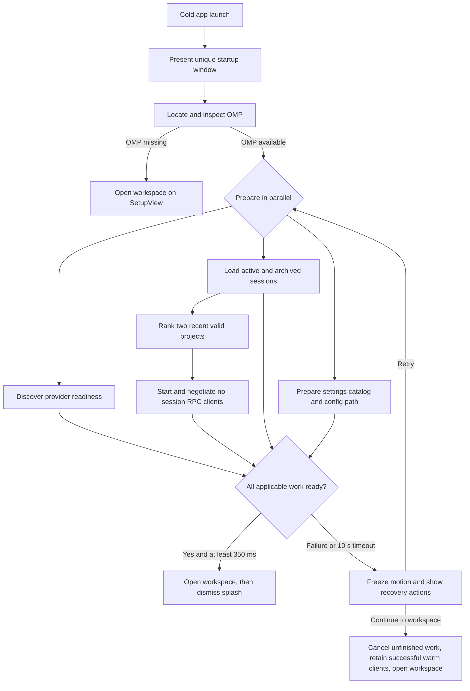
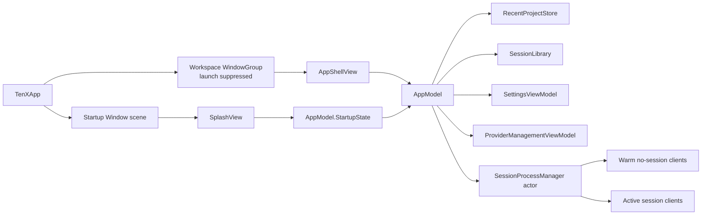

# Startup Splash and Warm Project Preload Design

**Status:** Approved for implementation planning

**Date:** 2026-08-25

**Platform:** 10x for macOS 15 and later

## Summary

10x will open cold launches with a compact, separate startup window while it prepares the workspace and starts OMP RPC clients for the two most recent valid projects. The workspace window stays suppressed until the work required for the user's first action is ready.

The splash uses the existing 10x graphic-modernist system rather than imitating an Adobe screen literally: a near-white 640 × 400 point window, restrained black typography, a compact preparation ledger, and a footer rule whose right edge becomes a centered sine wave. A cyan segment travels along the complete rule and wave while work is active. The 10x wordmark sits below the wave at the lower right.

The experience is work-driven. It has a 350 ms anti-flash floor, no fixed branding delay, and a 10 second watchdog. A stalled launch preserves completed work and offers `Retry` or `Continue to workspace` instead of silently discarding the preload state.

## Goals

- Make the workspace usable as soon as it appears, rather than moving startup work behind the first click.
- Warm one OMP RPC client for each of the two most recent valid projects.
- Keep startup progress legible without exposing project names, paths, or session titles.
- Preserve the current setup and provider-routing behavior.
- Reuse the existing `AppModel`, `SessionProcessManager`, design tokens, and wordmark.
- Guarantee that cancellation, timeout, eviction, and app termination cannot leave orphan OMP children.

## Non-goals

- Showing recent-project names, thumbnails, tips, release notes, or marketing content.
- Restoring the splash when a workspace window is reopened later in the same app process.
- Replacing the full-size OMP setup or provider setup experiences.
- Preloading provider usage data; usage refresh remains nonblocking.
- Supporting more than two warm projects, multiple warm clients for one project, or speculative background restarts.
- Introducing an AppKit panel or a second process-manager actor unless the scene-native design proves impossible during implementation.

## Approved experience

### Window contract

The splash is a unique, separate SwiftUI window at normal window level.

| Property | Decision |
| --- | --- |
| Content size | Exactly 640 × 400 points |
| Position | Centered on the active screen |
| Resizing | Fixed content size; no resize affordance |
| Chrome | Borderless visual treatment with the approved rounded edge and subtle shadow |
| Restoration | Disabled |
| Multiplicity | One splash window per app process |
| Workspace relationship | Workspace launch is suppressed until handoff; the splash never transforms into the workspace |

The splash appears only for the first cold launch in an app process. Closing and reopening a workspace window, or opening another workspace window, does not replay startup.

### Layout

The composition has one generous upper field and a footer separated by a continuous signal path.

| Region | Placement and content |
| --- | --- |
| Build label | Upper left, monospaced: `BUILD 0.1.0` for the current build. The value comes from `CFBundleShortVersionString` rather than a hard-coded string. Do not prefix it with `10x Desktop` or another product label. |
| Heading | Below the build label, left aligned: `Preparing your workspace` |
| Preparation ledger | Compact and right aligned in the lower half of the upper field. Four semantic rows retain stable positions as their statuses change. |
| Signal divider | A thin near-black rule across the window. Its final right-hand span becomes one smooth sine wavelength centered vertically on the rule's baseline. It enters and exits on that baseline, with medium amplitude and no pointed or mountain-like turns. |
| Live status | Lower left, beneath the divider: the current stage in cyan plus one short descriptive line in muted text. |
| Wordmark | Existing `BrandWordmark`, lower right beneath the wave. |

The approved signal is deliberately neither flat nor decorative illustration. It reads as one continuous system trace. The wave occupies roughly the final 160 points of the divider, targets a 16 point amplitude above and below the rule, and is horizontally centered within that end span. Both joins remain on the rule's baseline.

### Visual language

- Reuse `TenXPalette`, `TenXTypography`, and `BrandWordmark`.
- Use the existing near-white surface, near-black primary line/text, muted secondary text, cyan progress signal, and signal red for a stopped stage.
- Keep the upper field mostly empty. The ledger is the only informational structure besides the heading.
- Do not add gradients, illustrations, glass effects, project art, or fake terminal output.
- Keep all copy and line geometry crisp at Retina and non-Retina scale factors.

### Stage copy

The ledger uses these exact user-facing labels, in this order:

1. `Preparing runtime`
2. `Loading sessions`
3. `Loading settings`
4. `Preparing recent projects`

Each row has one status from `Queued`, `Loading`, `Ready`, or `Stopped`. `Stopped` is reserved for the blocking recovery state and uses signal red.

The footer describes the highest-priority active row in ledger order so concurrent work does not make the copy flicker. Its exact copy is:

| Stage | Footer detail |
| --- | --- |
| Preparing runtime | `Checking OMP and provider access` |
| Loading sessions | `Indexing active and archived sessions` |
| Loading settings | `Preparing your configuration` |
| Preparing recent projects | `Starting recent workspaces` |

Project names, paths, session names, provider names, and model names never appear in the splash.

### Motion

The signal path supports two coordinated effects while startup is active:

1. A short cyan segment loops along the complete path, including both the flat rule and sine section. This is indeterminate activity, not a claim of numeric progress.
2. The sine section breathes subtly by varying its amplitude within a narrow range. It does not phase-shift either endpoint away from the rule's baseline.

Both effects stop immediately when the startup enters recovery. If Reduce Motion is enabled, the path remains static and only the ledger statuses and footer copy communicate progress. There is no completion flourish: as soon as the readiness gate and 350 ms floor are both satisfied, the app hands off to the workspace.

## Readiness model

### Startup flow

### Stage meanings

`Preparing runtime` covers OMP resolution and inspection, construction of the OMP-backed services, and provider discovery needed to select the correct initial workspace route. Provider usage refresh starts separately and never gates the splash.

`Loading sessions` loads both active and archived session metadata and starts the existing session-change watcher. The workspace rail therefore does not appear empty and repopulate immediately after handoff.

`Loading settings` constructs the settings catalog/model and resolves the OMP config process path. It does not introduce speculative settings work beyond what the existing settings surface needs.

`Preparing recent projects` ranks recent project directories and starts up to two cwd-bound RPC clients with `--no-session`. The row becomes `Ready` only when every applicable client has completed RPC startup and protocol negotiation. With one eligible project, one client is required. With none, the row is immediately ready.

### Gate and timing

- Startup begins once. Repeated SwiftUI task evaluation must join or observe the same bootstrap operation.
- The splash is visible immediately and stays visible for at least 350 ms to avoid a flash.
- The successful handoff occurs as soon as every applicable stage is ready and the 350 ms floor has elapsed.
- There is no artificial maximum or branding delay.
- One 10 second watchdog covers the active bootstrap attempt. A stage failure may enter recovery earlier; the app never waits out the timer after a known terminal failure.
- The workspace window is opened before the splash is dismissed so the user never sees a gap with no app window.
- The chosen initial route remains the current behavior: OMP setup when missing, provider setup when no provider is authenticated, and new session when runtime and provider requirements are satisfied.

If OMP is missing, the app opens the existing full-size `SetupView` as soon as lookup finishes, subject only to the universal 350 ms anti-flash floor. It does not wait for the 10 second watchdog and does not place a `Locate OMP` flow inside the compact splash.

## Recent-project selection

`RecentProjectStore` produces at most two standardized directory URLs without presenting them in the splash.

Ranking is deterministic:

1. Projects explicitly selected in 10x are persisted and ranked by most recent explicit selection.
2. Remaining slots are filled from distinct session `cwd` values ordered by the session library's recent-activity ordering.
3. Paths already selected by an earlier rule are deduplicated after standardization.
4. Missing paths, non-directories, and paths that cannot be read as project directories are discarded.
5. The first two surviving directories are returned.

Explicit selection is recorded when `AppModel.chooseProject(_:)` accepts a project. The store is local application state; it does not write project data and does not transmit paths.

## Warm-process lifecycle

### Startup

For each selected project, `SessionProcessManager` creates one `RpcClient` with:

- the located OMP executable,
- the project directory as `cwd`, and
- no-session mode enabled so startup does not create an empty transcript.

The clients start concurrently. A client is warm only after the OMP ready frame and RPC negotiation complete. The actor keys warm clients by standardized project directory and remains the sole owner of warm, opening, and active child processes.

### Checkout

Checkout is atomic inside `SessionProcessManager`:

- **New session in the matching project:** remove the warm client from the pool, send `new_session`, then send `get_state` to obtain the real session path before registering the active handle.
- **Existing session in the matching project:** remove the warm client from the pool, send `switch_session` with the requested path, then register the active handle under that session path.
- **Different project, missing warm client, or a second concurrent checkout for the same project:** use the existing cold-spawn path.

Only one request can consume a warm client. A second concurrent session request must never share or steal the checked-out process.

Once checked out, a client is an ordinary active session process. Existing unexpected-exit recovery applies to it, and warm-pool expiry no longer does.

### Retention and eviction

- The highest-ranked warm client is the primary ready client.
- A second unclaimed warm client receives a five-minute grace period after workspace handoff. If it is still unused when the timer expires, the manager shuts it down.
- Memory-pressure warnings can evict any unclaimed warm client earlier. Before handoff, evicting a required warm client enters recovery because the two-project gate still applies. After handoff, eviction is silent. Active or checked-out clients are never evicted by this policy.
- A warm client that exits before handoff stops its stage and triggers recovery. A warm client that exits after handoff is removed from the pool; the next user action uses the normal cold-spawn path without showing startup recovery.
- Retry preserves successful warm clients and recreates only stopped or missing clients.
- `Continue to workspace` preserves successful warm clients but cancels and shuts down unfinished clients.
- App termination closes warm clients, active clients, and in-flight opens.

Every timeout, cancellation, failed negotiation, eviction, replacement, and quit path must await client shutdown or otherwise prove the child was reaped. No branch is allowed to abandon a spawned OMP process.

## Recovery behavior

Recovery uses the same 640 × 400 composition rather than replacing it with an alert.

- The heading remains `Preparing your workspace`.
- Completed rows stay `Ready`.
- Each failed or timed-out row becomes `Stopped` in signal red.
- The cyan signal and wave motion freeze.
- The footer changes to:
  - `Startup needs attention`
  - `Retry the stopped work or continue with what is ready.`
- The primary action is `Retry`.
- The secondary action is `Continue to workspace`.

`Retry` reruns only stopped or unfinished units. It does not reload successful session/settings work or replace healthy warm clients. A retry receives a fresh 10 second watchdog while preserving completed state.

`Continue to workspace` cancels unresolved splash-gated tasks, shuts down any partially started clients, keeps successful warm clients, opens the normal workspace, and dismisses the splash. Missing session, settings, or provider data then uses the workspace's existing nonblocking load/error path, so Continue cannot strand the app with permanently empty state. The label deliberately says `Continue to workspace`, not `Continue without preloading`, because completed warm work is retained.

## Architecture

### Scene and ownership diagram

### Component contracts

#### `TenXApp`

- Declares a unique startup `Window` and the existing workspace `WindowGroup` with default launch suppressed.
- Applies the splash's fixed size, centered placement, plain/hidden-chrome style, and disabled restoration.
- Starts the idempotent bootstrap from the startup scene.
- On the model's handoff signal, opens the workspace window first and then dismisses the startup window.
- Preserves the existing scene-phase provider refresh for the workspace.

#### `AppModel` and `StartupState`

- `AppModel` remains the single `@MainActor` application coordinator.
- A focused observable `StartupState` owned by `AppModel` holds stage states, current footer copy, bootstrap identity, timing state, recovery state, and the one-shot handoff signal.
- Bootstrap becomes idempotent and coordinates work without duplicating the existing application model.
- The existing installation, route, session, archived-session, settings, provider, and exit-watcher state remains authoritative after handoff.
- Injected clock/task boundaries make the 350 ms floor, 10 second watchdog, retry, cancellation, and handoff testable without wall-clock sleeps.

#### `RecentProjectStore`

- Persists explicit project selections.
- Merges explicit history with session cwd history, standardizes and deduplicates paths, filters invalid directories, and returns at most two ranked URLs.
- Has no presentation responsibility.

#### `SplashView` and signal view

- Render only values and actions supplied by `StartupState`.
- Own no startup tasks, process handles, timers, route decisions, or filesystem access.
- Use one dedicated signal shape/view so the black path and cyan traveling segment share identical geometry.
- Respect Reduce Motion and expose the ledger as the complete non-motion status source.

#### `SessionProcessManager`

- Remains the only owner of OMP session children.
- Adds warm-client creation, atomic checkout, selective retry support, expiry, memory-pressure eviction, and full teardown alongside its existing active-handle behavior.
- Distinguishes pre-handoff warm failures from post-handoff pool loss so only startup failures enter splash recovery.
- Preserves existing per-session idempotence and unexpected-exit semantics.

No second warm-pool actor is introduced. Splitting ownership would make cancellation and orphan prevention harder without adding product value.

## Concurrency and cancellation rules

- Runtime inspection must finish before OMP-backed services or warm clients are created.
- Provider discovery, session loading, and settings preparation run concurrently after installation is available.
- Recent-project warming may start the explicitly persisted candidates immediately, but session-derived candidates wait for session loading. The stage completes only after the final ranked set is known and warm.
- All child tasks belong to one bootstrap attempt. Recovery, Continue, OMP replacement, and app termination cancel that attempt through structured task ownership.
- Late results carry an attempt identifier and cannot overwrite state from a retry or a later OMP selection.
- Successful units are memoized for the attempt so selective retry does not repeat them.
- The process-manager actor serializes pool mutation and checkout; UI coordination remains on the main actor.

## Accessibility and privacy

- The hidden window title and visible heading both identify the window as `Preparing your workspace`.
- The ledger is one ordered accessibility group whose rows announce label and status.
- Stage changes are announced without moving VoiceOver focus from row to row.
- Recovery places initial keyboard and VoiceOver focus on `Retry`; `Continue to workspace` follows in focus order.
- All text meets the existing palette's contrast requirements and remains readable at increased system text sizes without clipping the fixed frame.
- Reduce Motion freezes both signal effects while retaining every status update in text.
- No project, path, session, provider, prompt, account, or model data is rendered in the splash or written to startup logs for display.

## Performance and resource tradeoff

A local development measurement on 2026-08-25 used OMP 18.0.4 at `/Users/tannerpham/.bun/bin/omp`. One cwd-bound `--no-session` RPC client reached ready state in approximately 710 ms and reported approximately 305.9 MB resident memory. Two clients therefore imply roughly 612 MB before app and provider-process overhead.

This measurement validates feasibility, not a fixed production budget. The accepted product tradeoff is a hard two-project warm gate in exchange for faster first use. Release-build verification must record real launch time, child count, process reuse, and memory. The five-minute secondary-client expiry and immediate memory-pressure eviction are required guardrails, not optional follow-up hardening.

## Verification contract

Implementation is not complete until the following evidence exists.

### Automated

- `StartupState` tests prove one bootstrap per app process, the 350 ms floor, the 10 second watchdog, one-shot handoff, and stale-attempt rejection.
- Startup tests prove selective retry, Continue cancellation, retention of successful warm clients, and immediate missing-OMP routing.
- Recent-project tests prove explicit-selection precedence, session-recency fallback, path standardization, deduplication, invalid/deleted-directory filtering, and zero/one/two-result behavior.
- Process-manager tests prove parallel warming, no-session configuration, new-session checkout, existing-session checkout, concurrent same-project fallback, failed-start reaping, five-minute secondary eviction, memory-pressure eviction, post-handoff warm loss, and close-all teardown.
- Snapshot tests cover the exact 640 × 400 loading and recovery compositions, including final copy and the centered sine geometry.
- Accessibility tests cover ledger labels/statuses, recovery focus order, and Reduce Motion's static signal state.
- Existing OmpKit and macOS app test suites remain green.

### Real-build behavior

- Build the Release app and cold launch it as a user; only the compact startup window appears before the workspace.
- Confirm the window is centered, fixed at 640 × 400, nonresizable, normal-level, and absent on workspace reopen in the same process.
- With two valid recent projects, confirm two real OMP clients complete negotiation before handoff and that selecting each project reuses its existing process ID rather than spawning a replacement.
- Confirm the first actionable workspace state is already populated with session metadata and the correct setup/provider/new-session route.
- Exercise a forced 10 second stall and verify frozen motion, retained ready rows, red stopped row, `Retry`, and `Continue to workspace`.
- Remove or hide OMP and confirm the app goes to the existing full-size `SetupView` without waiting for the watchdog.
- Enable Reduce Motion and VoiceOver and verify the textual experience remains complete without focus churn.
- Confirm the second unused warm process exits after five minutes and that simulated memory pressure removes unclaimed warm clients without affecting an active session.
- Quit during warming and confirm no OMP child remains.

## Accepted decisions

- Preparation ledger instead of artwork, tips, or recent-project cards.
- Separate compact window instead of an overlay or transforming workspace window.
- Scene-native SwiftUI architecture instead of an AppKit panel.
- Generic stage labels and private project selection instead of named projects.
- Two recent valid projects warmed in parallel and included in the readiness gate.
- Persisted explicit selections rank before session-derived cwd history.
- Work-driven duration with a 350 ms floor and 10 second recovery threshold.
- Selective retry and a truthful `Continue to workspace` escape hatch.
- Five-minute grace for the unused secondary warm client, with earlier memory-pressure eviction.
- Existing `AppModel` coordinates startup and existing `SessionProcessManager` owns every OMP child.
