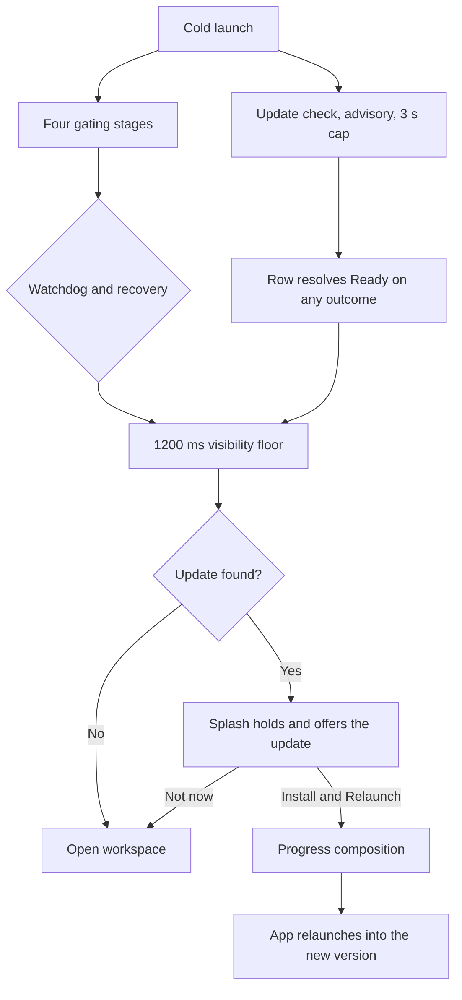

# Application Update System Design

**Status:** Approved for implementation planning

**Date:** 2026-08-26

**Platform:** 10x for macOS 15 and later

## Summary

10x will ship as a signed, notarized Mac app distributed from a public GitHub repository under the NextStep organization, and will update itself using Sparkle 2. Sparkle owns the mechanics that are dangerous to hand-roll: feed polling, version comparison, EdDSA verification, bundle replacement, and relaunch. It does not own a single pixel of interface. A custom `SPUUserDriver` routes every Sparkle callback into the existing startup splash window, so the update experience is the same 640 × 400 composition the user already sees at launch.

The update check runs as a fifth, advisory row in the startup ledger. It never gates handoff on network health and can never place the splash into recovery. When an update is found before handoff, the splash holds and offers it. When the user accepts, the same window switches to a progress composition in which the existing signal path becomes a determinate progress bar, and the update ledger reports each step.

## Goals

- Distribute 10x as a Developer ID signed, notarized app that launches without a Gatekeeper prompt.
- Put the repository under `NextStep-AI-inc` with tag-driven releases published by GitHub Actions.
- Let a running copy of 10x discover, download, verify, install, and relaunch into a newer version.
- Present the entire update experience in the startup splash rather than a stock Sparkle window.
- Allow the update flow to be re-entered from the workspace, returning the user to the same small window.
- Guarantee that an update never gates a cold launch on network availability.
- Guarantee that an update-initiated relaunch reaps every OMP child process.

## Non-goals

- Release notes rendered inside the splash. The GitHub release body is the changelog.
- Delta updates. Full archives only until download size measurably justifies otherwise.
- A nightly or beta channel. One stable channel; the appcast has a single feed.
- A DMG installer. The release zip is both the first-install artifact and the update artifact.
- Silent background updates with no prompt. Every install is user-initiated.
- Automatic scheduled checks while the app is running. Checks happen at launch and on request.
- Migrating the existing four gating startup stages or altering their copy.

## Amendments to the startup splash specification

This design amends [`2026-08-25-startup-splash-preload-design.md`](2026-08-25-startup-splash-preload-design.md) in three ways. Everything not listed here is unchanged and remains authoritative.

| Prior decision | Amendment |
| --- | --- |
| The ledger has exactly four rows | A fifth advisory row, `Checking for updates`, is appended |
| The splash is presented only for the first cold launch in an app process | The splash window may be reopened after handoff in update mode |
| The splash never shows release notes or version content | The splash shows the available version number and the current version number |

The prior document states a 350 ms anti-flash floor. The shipped value in [`StartupState.swift`](../../../App/Startup/StartupState.swift) is 1200 ms. This design cites 1200 ms as the real floor and does not change it.

## Repository and identity

The repository is a single public repository, `NextStep-AI-inc/10x`. Agent and Workspace use a private source repository paired with a public `-Releases` repository because their update feeds must be readable while their source is not. A public source repository makes its own Releases publicly downloadable, so the split has no purpose here and is not adopted. This is a deliberate departure from the organization's otherwise uniform private-source posture.

Because releases are cut on the same repository that runs the workflow, the workflow's built-in `GITHUB_TOKEN` is sufficient. No cross-repository release token is required.

[`scripts/generate_xcodeproj.rb`](../../../scripts/generate_xcodeproj.rb) changes as follows.

| Setting | Current | Required | Reason |
| --- | --- | --- | --- |
| `PRODUCT_BUNDLE_IDENTIFIER` | `com.tannerpham.tenx` | `com.nextstep.tenx` | Matches the signing team; free to change before the first shipped release and permanent after it |
| `DEVELOPMENT_TEAM` | unset | `345S42BKPY` | Developer ID signing |
| `CODE_SIGN_STYLE` | `Automatic` | `Manual` for Release | Reproducible CI signing |
| `CODE_SIGN_IDENTITY` | unset | `Developer ID Application` for Release | Distribution outside the App Store |
| `ENABLE_HARDENED_RUNTIME` | unset | `YES` | Notarization rejects the submission without it |
| `MARKETING_VERSION` | hardcoded `0.1.0` in Info.plist | build setting, referenced as `$(MARKETING_VERSION)` | The git tag drives the user-visible version |
| `CURRENT_PROJECT_VERSION` | hardcoded `1` in Info.plist | build setting, referenced as `$(CURRENT_PROJECT_VERSION)` | Sparkle compares `CFBundleVersion`; a constant `1` makes every update invisible to it |

Sparkle is added as an `XCRemoteSwiftPackageReference` pointing at `https://github.com/sparkle-project/Sparkle` with an up-to-next-major requirement from `2.6.0`. The installed `xcodeproj` gem is 1.27.0 and supports that class; this was verified before writing this document.

The app is not sandboxed (`ENABLE_APP_SANDBOX` is `NO`), which means Sparkle's simplest integration path applies and no XPC helper services need to be bundled.

## Release pipeline

A tag matching `v*` triggers `.github/workflows/release.yml` on a `macos-15` runner. The workflow is a thin wrapper: all six steps live in `scripts/release.sh` so the same code path can be run locally when signing or notarization needs debugging.

```
git tag v0.2.0 && git push --tags
        │
        ▼
  xcodebuild archive          MARKETING_VERSION and CURRENT_PROJECT_VERSION passed in
        │
  codesign                    Developer ID Application: NextStep AI Inc. (345S42BKPY)
        │                     hardened runtime enabled
        │
  notarytool submit --wait    Apple ID, app-specific password, team ID
        │
  stapler staple              writes the ticket INTO the .app bundle
        │
  ditto -c -k --keepParent    produces 10x-0.2.0.zip
        │
  sign_update                 EdDSA signature over the final zip
        │
  generate_appcast            emits appcast.xml with the signature and length
        │
  gh release create           attaches 10x-0.2.0.zip and appcast.xml
```

The ordering is load-bearing. Stapling rewrites the app bundle, so any signature or length computed before stapling is void. This is also why Xcode Cloud cannot run this pipeline: its only custom script hook is post-build, which fires before notarization, so the last two steps would have to be finished by hand.

### Secrets

The organization's existing desktop release workflow already performs macOS signing and notarization, and its secret names are reused rather than duplicated.

| Secret | Status |
| --- | --- |
| `APPLE_CSC_LINK` | Exists, base64 `.p12` |
| `APPLE_CSC_KEY_PASSWORD` | Exists |
| `APPLE_ID` | Exists |
| `APPLE_APP_SPECIFIC_PASSWORD` | Exists |
| `APPLE_TEAM_ID` | Exists |
| `SPARKLE_ED_PRIVATE_KEY` | New. Generated once with Sparkle's `generate_keys -x`, stored as a repository secret, never committed |

The five Apple secrets are referenced by `NextStep-AI-inc/NextStep-Workspace`. Whether they are organization-level or repository-level could not be determined, because listing organization secrets requires an admin scope this account does not hold. Confirming their scope, and adding them to this repository if they are repository-level, is a preflight step for the release phase and must happen before the first workflow run.

The EdDSA public key produced alongside the private key goes into `Info.plist` as `SUPublicEDKey`. It must be present in the very first published build, because a build that ships without it can never verify any future update and would require a manual reinstall.

### Versioning

`CFBundleShortVersionString` comes from the tag with the leading `v` stripped. `CFBundleVersion` comes from `git rev-list --count HEAD`, which is monotonic across the repository's history and is the value Sparkle compares. Both are passed to `xcodebuild` as build settings.

The workflow must check out with `fetch-depth: 0`. `actions/checkout` defaults to a shallow single-commit clone, which makes `git rev-list --count HEAD` return `1` on every run. Every release would then ship `CFBundleVersion` of `1`, and Sparkle would never recognise any build as newer than any other.

### Feed

```
https://github.com/NextStep-AI-inc/10x/releases/latest/download/appcast.xml
```

GitHub resolves `releases/latest` to the newest published, non-prerelease, non-draft release. Sparkle follows the redirect. If a nightly channel is ever added, it needs its own feed rather than this URL, because prereleases are excluded by definition.

The appcast is served from `latest/download/` but its enclosure URLs must point at the versioned path, so `generate_appcast` is run with `--download-url-prefix` set to `https://github.com/NextStep-AI-inc/10x/releases/download/vX.Y.Z/`. An appcast that lists only the newest release is sufficient, because Sparkle only needs the newest item to decide whether an update exists.

The workflow requires `permissions: contents: write` for the built-in `GITHUB_TOKEN` to create the release.

## Update framework

### Info.plist keys

| Key | Value | Reason |
| --- | --- | --- |
| `SUFeedURL` | The feed URL above | Sparkle's appcast location |
| `SUPublicEDKey` | Base64 EdDSA public key | Update verification |
| `SUEnableAutomaticChecks` | `NO` | The app drives every check itself. Leaving this unset makes Sparkle prompt the user for permission on second launch, which would appear as a stock dialog and violate the design |
| `SUAllowsAutomaticUpdates` | `NO` | Every install is user-initiated |

### Components

A new `App/Updates/` group holds three types. None of them touch AppKit windows or Sparkle's standard UI.

#### `UpdateController`

A `@MainActor` type owning the `SPUUpdater` instance, constructed with the host bundle, the application bundle, the custom user driver, and no delegate. It exposes two entry points: an advisory check used by the startup stage, and a user-initiated check used by the menu item. It is the only type that talks to Sparkle.

#### `UpdateState`

A `@MainActor @Observable` presentation model. It holds exactly one phase and the data that phase needs. It has no knowledge of Sparkle types.

| Phase | Carries |
| --- | --- |
| `idle` | Nothing |
| `checking` | Nothing |
| `upToDate` | Current version. Reached only from the menu |
| `available` | Available version, current version |
| `downloading` | Received bytes, expected bytes |
| `verifying` | Nothing |
| `installing` | Extraction fraction, which is zero until extraction reports progress |
| `relaunching` | Nothing |
| `failed` | One of the four fixed messages in the failure table |

#### `SplashUpdateDriver`

Conforms to `SPUUserDriver`. Its entire job is to translate Sparkle callbacks into `UpdateState` phases, and to translate splash button presses back into Sparkle's return values. Two of the protocol's methods are `async` and return the user's decision, which maps cleanly onto a button press resolving a continuation.

| Sparkle callback | Effect |
| --- | --- |
| `showUserInitiatedUpdateCheck(cancellation:)` | `checking` |
| `showUpdateFound(with:state:) async -> SPUUserUpdateChoice` | `available`; awaits the splash button and returns `.install` or `.dismiss` |
| `showUpdateNotFoundWithError(_:) async` | `idle` at launch. `upToDate` when the check came from the menu |
| `showDownloadInitiated(cancellation:)` | `downloading` with zero progress |
| `showDownloadDidReceiveExpectedContentLength(_:)` | Sets expected bytes |
| `showDownloadDidReceiveData(ofLength:)` | Accumulates received bytes, and enters `verifying` once they reach the expected length |
| `showDownloadDidStartExtractingUpdate()` | `installing` |
| `showExtractionReceivedProgress(_:)` | Updates the extraction fraction within `installing` |
| `showReadyToInstallAndRelaunch() async -> SPUUserUpdateChoice` | Returns `.install` immediately. The user already consented at the `available` step, and a second prompt would be a redundant gate |
| `showInstallingUpdate(withApplicationTerminated:retryTerminatingApplication:)` | `relaunching` |
| `showUpdateInstalledAndRelaunched(_:) async` | `idle` |
| `showUpdaterError(_:) async` | `failed` |
| `dismissUpdateInstallation()` | `idle`, and closes the splash window if the workspace is already open |
| `showUpdateReleaseNotes(with:)` | Ignored. Release notes are a non-goal |

Overall progress for the signal path is a weighted composite: downloading occupies 0.0 to 0.8, verifying 0.8 to 0.85, and installing 0.85 to 1.0. Download dominates because it dominates wall-clock time. `relaunching` holds the path at 1.0 until the process is replaced.

## Splash integration

### Launch flow



### Advisory stage semantics

The update check is added to `StartupStageID` as a fifth case so that it inherits ledger rendering, accessibility labels, and footer copy without a parallel row system. It is excluded from every gating loop by a new `StartupStageID.gatingCases` collection, which `beginRetry` and `enterRecovery` iterate in place of `allCases`. The ledger continues to render `allCases`.

The rules are absolute:

- The advisory stage never enters `Stopped`.
- It resolves to `Ready` on success, on an up-to-date result, on a network failure, on a DNS failure, and on timeout.
- It cannot trigger recovery, and recovery does not mark it stopped.
- It is capped at 3 seconds. If the four gating stages finish first and the check has not answered, the launch proceeds and the check is abandoned for that launch.
- A check that errors before producing a result shows nothing. The failure surface belongs to updates the user asked for or accepted, never to a launch.
- When OMP is missing, no check runs and the row resolves immediately. That launch is going straight to setup, and an update offer in front of it would be noise.

The 3 second cap overlaps work that is already running, so in the common case it adds no wall-clock time. The cap sits inside the existing 10 second watchdog and cannot extend it.

A check that has not answered by the cap is cancelled through the cancellation handler Sparkle supplies with the check, not merely ignored. Leaving it running would either strand a decision continuation with no window to resolve it, or pull the splash back over a workspace the user is already using. The update is offered on the next launch, or immediately through `Check for Updates…`.

### Presentation refactor

Three existing pieces take a variant rather than being forked.

| Piece | Change |
| --- | --- |
| `StartupStageRow` | `id` generalizes from `StartupStageID` to a string, and `title` becomes stored rather than derived, so update steps feed the same ledger. `StartupLedgerView` is untouched |
| `StartupSignalView` | Gains an optional `progress: Double?`. `nil` preserves today's indeterminate travelling segment. A value fills the rule and the sine wavelength proportionally from left to right |
| `SplashView` | Takes a `SplashPresentation` value instead of reading `StartupState` directly. `StartupState` and `UpdateState` each produce one |

`SplashPresentation` carries the build label, heading, accessibility label, ledger rows, signal progress and animation flag, footer title, footer tone, footer detail, and zero to two actions. This makes `SplashView` a pure function of its input, which is what allows both modes to be snapshot tested without a second view.

The signal path becoming the progress bar is deliberate. The composition already contains a full-width horizontal line with a travelling cyan segment. Adding a separate progress control would introduce a shape the app does not otherwise use.

### Copy

| State | Heading | Footer title | Footer detail | Actions |
| --- | --- | --- | --- | --- |
| Checking | Preparing your workspace | Checking for updates | Looking for a newer version | None |
| Update available | Update available | `10x 0.2.0` | You have 0.1.0. | Install and Relaunch, Not now |
| Up to date, from the menu only | No updates available | `10x 0.1.0` | This is the newest version. | Close |
| Downloading | Installing update | Downloading update | 18.2 MB of 61.8 MB | None |
| Verifying | Installing update | Verifying download | Checking the signature | None |
| Installing | Installing update | Installing update | Replacing the application | None |
| Relaunching | Installing update | Relaunching 10x | Reopening with the new version | None |
| Failed | Installing update | Update failed | See the failure table below | Try again, Not now |

Update ledger rows, in order: `Downloading update`, `Verifying download`, `Installing update`, `Relaunching 10x`.

The four update rows map onto Sparkle's callbacks without inventing a step that does not happen. Sparkle verifies the archive after the download completes and before extraction begins, so the boundaries are observable:

| Row | Becomes `Loading` | Becomes `Ready` |
| --- | --- | --- |
| Downloading update | `showDownloadInitiated` | Received bytes reach the expected content length |
| Verifying download | Received bytes reach the expected content length | `showDownloadDidStartExtractingUpdate` |
| Installing update | `showDownloadDidStartExtractingUpdate` | `showInstallingUpdate` |
| Relaunching 10x | `showInstallingUpdate` | The process is replaced, so this row never resolves on screen |

Failure copy is fixed, not formatted from an underlying error, because Sparkle's errors carry framework detail that has no place on a user surface.

| Cause | Footer detail |
| --- | --- |
| Signature or code signature verification failed | The download could not be verified. |
| Download failed or was interrupted | The download did not finish. Check your connection. |
| Installation failed | The update could not be installed. |
| Any other updater error | The update could not be completed. |

Byte counts use `ByteCountFormatter` with the file count style. The footer title colour follows the existing rule: cyan while working, signal red on failure, which is the same treatment startup recovery already uses.

`Not now` is used rather than `Continue to workspace` because the same button appears when the flow is entered from the workspace, where a workspace destination would be inaccurate.

### Accessibility and motion

- Reduce Motion keeps the determinate fill, because a proportional fill is information rather than motion. It suppresses the travelling loop and the amplitude breathing, exactly as it does today.
- The update ledger is announced as one ordered group with the same row semantics as the startup ledger.
- When the update offer appears, initial keyboard and VoiceOver focus goes to `Install and Relaunch`, with `Not now` next in focus order. This mirrors the existing recovery focus contract.
- The splash's accessibility label follows the heading, so VoiceOver announces `Update available` rather than `Preparing your workspace` in update mode.
- Version numbers are the only new content in the splash. No project name, path, session, provider, or account data is introduced.

## Re-entry from the workspace

The application menu gains `Check for Updates…`, in the standard macOS position. Selecting it reopens the startup window with `openWindow(id: AppWindowID.startup)` and drives it in update mode while the workspace stays open behind it.

Two existing defects block this and are in scope.

**Duplicate workspace window.** [`StartupSceneView.swift`](../../../App/Startup/StartupSceneView.swift) tracks `handledHandoffGeneration` in local `@State`. Reopening the window creates a fresh view whose counter starts at zero, so the existing `onChange(initial: true)` comparison against a non-zero `handoffGeneration` would fire and open a second workspace window. The latch moves into `StartupState` so it survives view recreation.

**Orphaned OMP children.** [`AppTerminationDelegate.swift`](../../../App/Application/AppTerminationDelegate.swift) runs `AppModel.shutdown()` on termination. Sparkle terminates the app itself during installation. If that path does not invoke the delegate, an update leaves warm and active OMP child processes running, which the startup splash specification forbids without qualification. `UpdateController` awaits `AppModel.shutdown()` before returning `.install` from `showReadyToInstallAndRelaunch()`, so the guarantee does not depend on Sparkle's termination path invoking the delegate.

## Failure and edge behavior

| Situation | Behavior |
| --- | --- |
| No network at launch | Advisory row resolves `Ready`, launch proceeds, nothing is shown |
| Feed reachable, no newer version | Advisory row resolves `Ready`, launch proceeds. From the menu, a brief up-to-date confirmation |
| Check errors during launch | Silent. The row resolves `Ready` and no failure is shown. The same error from the menu is shown |
| Update fails after the user accepted it | `failed` with `Try again` and `Not now`. Dismissing it releases the launch and opens the workspace, so a failed update can never strand the splash |
| Signature verification fails | `failed` with `The download could not be verified.` The partial download is discarded |
| Download interrupted | `failed` with a network message and a `Try again` action |
| App is in a read-only location | Sparkle raises an installation error, surfaced through `showUpdaterError`. No custom handling |
| App is in `/Applications` and owned by root | Sparkle's installer requests authorization. This is a system prompt and is expected |
| User quits during download | Termination cancels the download. No partial install is possible, because Sparkle installs only after full extraction |
| Update found after the 3 second cap | Cannot happen. The check is cancelled at the cap, so it produces no result |
| A second check is requested while one is running | The second request is ignored while `UpdateState` is not `idle` |

## Phases

| Phase | Deliverable |
| --- | --- |
| 0 | Public `NextStep-AI-inc/10x` created and pushed. Bundle identifier, team, hardened runtime, manual Release signing, and version build settings applied. EdDSA keypair generated, public key in `Info.plist`, private key stored as a repository secret |
| 1 | Sparkle linked through SPM. `UpdateController`, `UpdateState`, and `SplashUpdateDriver` implemented with no splash UI. Verified against a temporary local feed using Sparkle's `SUFeedURL` user-default override |
| 2 | `scripts/release.sh` and `.github/workflows/release.yml` written and proven by a local dry run that signs, notarizes, and staples. Apple secret scope confirmed. Nothing is published yet |
| 3 | Splash update UI: advisory stage, presentation refactor, update mode, determinate signal, menu item, and both re-entry defects fixed |
| 4 | Version `v0.1.0` published, then `v0.1.1`. A real `0.1.0` install upgrades itself end to end |

The first publish deliberately waits until phase 3 is complete. The update interface that a user sees during an upgrade belongs to the **installed** version, not the incoming one, so a `v0.1.0` published before the splash UI exists would upgrade to `v0.1.1` showing no update interface at all, and phase 4 would verify nothing.

## Verification contract

Implementation is not complete until the following evidence exists.

### Automated

- The advisory stage never reaches `Stopped` under success, up-to-date, network failure, and timeout, and recovery leaves its row untouched.
- `beginRetry` and `enterRecovery` operate only on gating stages.
- Handoff is held while an update offer is pending and proceeds on `Not now`.
- The handoff latch lives in `StartupState` and does not re-fire when the startup window is reopened after handoff.
- `SplashUpdateDriver` maps every callback in the table above to the expected `UpdateState` phase, driven directly against the driver without a running Sparkle instance.
- Byte and fraction accumulation produce the expected composite progress at the phase boundaries 0.8 and 0.85.
- Snapshot tests cover the 640 × 400 compositions for update available, downloading at a fixed fraction, and update failed.
- Accessibility tests cover update ledger labels, focus order on the update offer, and the Reduce Motion state retaining the determinate fill.
- Existing OmpKit and macOS app suites remain green.

### Real build

- A downloaded release zip opens on a machine that has never built 10x, with no Gatekeeper prompt. `spctl --assess --type execute` passes and `stapler validate` succeeds.
- A cold launch with the network disabled reaches the workspace with the advisory row `Ready` and no error surface.
- A cold launch with `v0.1.1` published and `v0.1.0` installed shows the update offer before the workspace opens.
- Accepting the offer shows the progress composition, the signal fills proportionally, and the app relaunches reporting the new version in the splash build label.
- No `omp` process remains after the update-initiated relaunch, confirmed with `pgrep`.
- `Check for Updates…` from the workspace reopens the splash in update mode, leaves exactly one workspace window open, and returns cleanly on `Not now`.
- Reduce Motion and VoiceOver together give a complete textual account of the update with no focus churn.

## Accepted decisions

- Sparkle 2 rather than a hand-rolled updater, because bundle replacement and relaunch are the parts that are dangerous to get wrong.
- A custom `SPUUserDriver` rather than Sparkle's standard UI, so the splash is the only update surface.
- One public repository rather than the organization's private source plus public releases split, because a public source repository already exposes its own releases.
- GitHub Actions rather than Xcode Cloud, because Xcode Cloud has no post-notarization script hook and cannot complete the appcast step.
- All pipeline logic in `scripts/release.sh`, with the workflow as a wrapper, so signing failures can be reproduced locally.
- The update check is advisory and can never gate a launch or cause recovery.
- The existing signal path becomes the progress indicator rather than introducing a progress control.
- The user consents once, at the offer. `showReadyToInstallAndRelaunch` does not prompt again.
- `AppModel.shutdown()` is awaited before consenting to install, so the OMP no-orphan guarantee does not depend on Sparkle's termination path.
