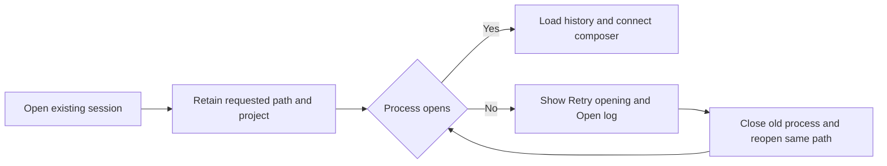

# Session continuity and recovery

The user approved implementing every actionable item from the active-session audit in roadmap order, with larger features in separate plans and PRs. This is the first slice, covering SAVE, OPEN, and ERROR. The historical audit is preserved in [PR #31](https://github.com/NextStep-AI-inc/10x/pull/31); this implementation starts from main at `e60234a332f6fdc34f771c92f0d3852411d7fe71`.

## Current behavior and remaining work

Main already launches persistent warm processes, gives fresh sessions an explicit project session directory, and rejects a missing session file instead of activating a placeholder. It also renders failures and preserves unconfirmed prompts. Those changes require live verification, not a second implementation.

Two source-proven gaps remain in this flow:

1. `SessionController.openExisting` knows the requested path and project but only assigns `sessionPath` after obtaining a handle. An earlier failure therefore appears to be a failed new session. `AppModel` removes the controller from managed sessions, and the recovery card cannot reopen the original session.
2. `SessionProcessManager.openNew` and `warm` overwrite configured extension arguments when adding `--session-dir`. The bundled provider-account extension is consequently absent from these processes.

## Design

Retain the requested existing path in `SessionController.sessionPath` once the previous session has detached and before beginning the new open. `sessionPath` identifies the session being opened or owned; `handle` remains the authority for whether a process is connected. Clear a previous path when starting a new session. This lets the existing managed-controller and restart paths retain, close, and reopen the intended session without another retry registry or controller type.

Expose a computed `canRetryOpening` for a failed controller that has a requested path but no handle. Reuse `RuntimeRecoveryView`, adding a defaulted action label so this state shows **Retry opening** and the explanation **The session could not open. Retry opening it or check the log.** Existing connected-session failures keep **Restart session**; failed new sessions keep **Review prompt**. Logs remain behind **Open log**. A retry reconnects only; it never automatically resends an unconfirmed prompt.

Append the project session-directory arguments to the configured `extraArguments` in both fresh-process paths. Existing-session open, persistence mode, provider/model/thinking selection, and interactive RPC mode retain their current contracts.

## Acceptance

- Both a warm fresh process and a cold new process receive configured extension arguments plus the project session directory.
- Existing-session startup failure retains the intended path, project, draft, and attachments. The controller remains reachable through normal session navigation.
- Retry actually creates a healthy process for that path, loads history, enables the composer, and accepts another prompt after the fixture becomes available.
- New-session startup failure still returns preserved input to the new-session composer. It must not reuse an old path.
- Prompt rejection and process exit retain their distinct recovery paths. Retrying a connection does not resend a prompt whose delivery is unconfirmed.
- An isolated Release build demonstrates first-action warm/cold new and existing sessions, disk persistence across relaunch, failed open, retry, rejected submission, and child exit. Record any blocked case precisely.

## Constraints

- macOS 15 or later; Swift 6.1; SwiftUI and the existing OmpKit package.
- No dependency changes, schema work, app deployment, or merge.
- Work only in this task's linked worktree. Do not touch other instances or port 3000.
- Never hand-edit `10x.xcodeproj`; if source files are added, regenerate with `ruby scripts/generate_xcodeproj.rb` using xcodeproj 1.27.0.
- Reuse the existing recovery card, typography, colors, and button style. No new user-facing diagnostic prefixes or em dashes.
- Preserve draft text and attachments; never automatically resend uncertain input.
- Broader audit areas remain tracked in the implementation roadmap and get separate changes.

## Verification

Use Swift Testing regression cases through the real controller/process-manager boundary, with the existing process fixture replacing only OMP. Check actual execution counts. Run the OmpKit suite and the app tests, and build Release. Exercise the real app through its visible controls with disposable projects and session data. Save screenshots, commands, counts, branch/SHA, runtime version, and limitations under `docs/superpowers/evidence/2026-09-07-session-continuity-recovery/`.
