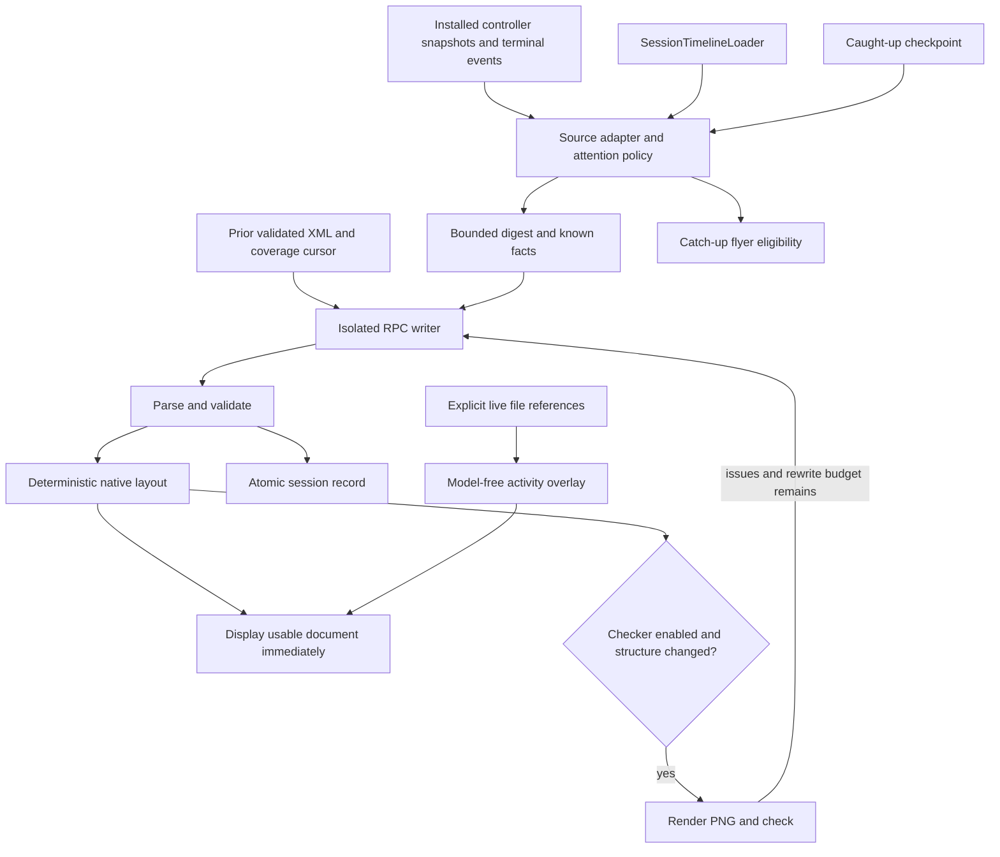

# Session Map design

Status: approved product direction, written for planning review. This change contains documents only. Implementation is a separate execution step.

## Purpose and decisions

**Map is a visual companion to a coding session throughout planning and implementation.** It shows the architecture being discussed, how parts connect, the current plan, what is being worked on, and what has been completed. Catch-up highlights changes in that same map. Short prose, timelines, files, stats, charts, checklists, callouts, and suggested next steps support the diagram.

The agreed direction is:

- User-controlled docked pane, closed initially, never opened automatically. The header control reads **Map**; code uses `SessionMap*`.
- Diagram-heavy architecture and flow, connected-node highlights on hover, plan-to-node highlights, guided walkthroughs, and live tool activity.
- The same identities survive the transition from proposed architecture to implementation. Catch-up is a mode, not a second summary product.
- An XML component tree parsed into native views. The first contract is deliberately bounded and must be exercised on realistic fixtures and writer outputs before its limits are considered settled.
- Writer configurable by model or OMP model role; default role `smol`. Checker configurable, **Off by default**.
- Automatic updates after finished assistant turns while the pane is open, and unattended/value gating while it is closed; manual generation remains available.
- **Use** places a suggested prompt in the composer and focuses it without submitting. Chillax is appropriate for the short pane headline.
- Reusable glass-like, one-line system flyers are a separate plan. Catch-up is their first producer. See the [flyer design](2026-09-07-system-flyers-design.md).

The numerical limits, geometry, persistence details, repair policy, and scheduling rules below make the accepted direction executable. They are implementation defaults, not separate claims of explicit approval for every number. No material product decision is awaiting an answer before planning can finish.

## Current repository boundary

Plan base: `7b23badf779cd8b6fc8849e6434c1930ef5afde0` on remote `main`.

| Existing surface | Reuse or narrow addition |
| --- | --- |
| `App/Sessions/ActiveSessionView.swift` | Transcript/composer column plus sibling pane; preserve recovery UI and attachment handling. |
| `App/Sessions/SessionHeaderView.swift` | Map toggle alongside the existing centered title and metadata. Respect the shell's trailing controls. |
| `SessionController.handleControl`, `install(snapshot:)` | Consume installed snapshots and fenced terminal events; do not attach a second reader to the session RPC stream. |
| `App/Application/AppModel.swift` | Own coordinator/store; register each managed controller, preserve retention callbacks and eviction. |
| `App/TenXApp.swift` | Forward active/inactive scene changes; existing provider refresh remains. |
| `SessionTimelineLoader.load(path:)` | Load a cold session's active branch, without starting its chat process. |
| `TranscriptSearchResolver`, `TranscriptView.focusSearchResult` | Share entry resolution, group expansion, viewport anchoring, and nonce cancellation with an entry-only request. Search currently requires a nonempty matching query; a fabricated query is not a map link. |
| `ToolContentExtractor.card(...)`, `TranscriptReference.file` | Tool summaries and explicit file references. `primary` is display text and is not always a path. |
| `ComposerCatalogService`, `ComposerModelInfo` | Current catalog, provider-qualified IDs and supported thinking levels; add image-input capability without changing picker behavior. The older `OmpModelCatalogService` no longer exists. |
| `OmpConfigService.list()` | Resolve configured `modelRoles`; do not write OMP configuration for map preferences. |
| `MessageBlockView.swift` (`ContentDocumentView`), `TranscriptReferenceView` | Compact prose variant and existing file/IDE actions. |
| `SnapshotHarness.swift`, `docs/testing.md` | Native snapshots and Swift Testing function selectors. |

The existing centered session **rail** map is navigation, not this document; do not replace `RailMapLayout` or extend its old plan. [Harness notices PR #29](https://github.com/NextStep-AI-inc/10x/pull/29) owns hidden-message collection, transcript `.notice` rows, summarization, and its settings. It is not merged at this plan base. Session Map must not copy those producers or route their notices through flyers. Reconcile shared `AppModel`, controller, settings, and shell edits when implementation starts. [OMP settings PR #28](https://github.com/NextStep-AI-inc/10x/pull/28) is another shared settings surface.

## Visual structure and interactions

```mermaid
flowchart LR
    conversation[Conversation and composer] --- pane[Map pane]
    pane --> graph[Architecture diagram]
    graph --> neighbors[Hover or focus: connections and neighbors]
    graph --> walkthrough[Previous / Next walkthrough step]
    pane --> plan[Plan linked to diagram nodes]
    pane --> support[Short supporting blocks]
    tools[Live file tool activity] --> graph
    missed[Catch-up mode] --> changes[Highlight changes since checkpoint]
    changes --> graph
```

Diagram appears before the plan and supporting blocks, directly after the headline and short live-activity line. A long summary cannot push the architecture below the fold. Display phase (Planning / Implementing / Mixed), update time, graph legend, walkthrough controls, then the plan. A graphless conversation can show summary/support without inventing an architecture.

The latest design reference used a default **440 pt** pane, resizable from **320 pt** to half the available window width. Below **1180 pt** window width, use a trailing drawer over the conversation, with the same renderer and state. The app's minimum window is **760 × 560 pt**. Drawer opening is still explicit. Preserve transcript scroll and composer draft across opening, closing, resizing, and session switches. Pane visibility stays across session switches until closed; node focus/walkthrough state is scoped to the displayed session.

- Hover or keyboard focus on a node highlights it, its incident edges, and direct neighbors; other graph marks dim, while text remains readable. A plan task with a node reference produces the same highlight.
- Click selects a node and exposes its note, status, **Jump**, and file action. **Jump** scrolls to the referenced transcript entry. The file action uses the existing IDE/Finder behavior. These are distinct actions; one click never both jumps and launches an application.
- A walkthrough has Previous/Next buttons, step count and a one-sentence explanation. Arrow keys advance only while the walkthrough is focused; they cannot steal composer editing keys. Ends stop, rather than wrapping unexpectedly. Changing documents preserves the selected node where possible and resets a removed step safely.
- **Map** toggle has a descriptive accessibility label and `Command-Shift-C` shortcut, subject to the implementation's native conflict check. Escape closes a focused pane/drawer and returns focus to the toggle; existing composer flyout dismissal still works.
- States use icon/line treatment plus text: Exists (dashed), Proposed, Planned, Active, Done (check), Failed (error mark). A live tool marker is separate from model-authored status. A completed edit does not prove the component is done.
- Respect Reduce Motion for pulses, transitions, panning and explicit transcript jumps. Provide a native accessible list of nodes and relationships with the same actions; color and pointer hover cannot be the only ways to understand the graph.
- Reuse `TenXTypography` and dynamic `TenXPalette` colors, including light/dark appearances. Headline uses `accent(size: 16)`; compact body targets 12 pt; interactive text uses the existing interactive cyan token.

## Architecture and update flow



Separate three boundaries; a timestamp alone cannot identify concurrent transcript entries:

1. **Attention:** last selected/active times, used to decide unattended duration. Merely being visible affects this timer only.
2. **Caught up:** `caughtUpAt` plus a stable covered-entry cursor and baseline graph fingerprints. Advances on **Caught up**, or a user prompt accepted by the session (including an acknowledged steer/follow-up). Opening, viewing, refreshing, dismissing a flyer, and **Use** never advance it.
3. **Generated through:** last input entry covered by the validated document, plus a manifest of source-entry fingerprints. Writer updates consume appended and changed entries plus the prior document, while catch-up highlights remain relative to the independent caught-up baseline. A tool result can change under an existing call ID before the cursor and must still enter the delta.

**Caught up** acknowledges only the rendered document's coverage, even if newer work arrived during generation. On a successful send, acknowledge the pre-submission captured boundary; never acknowledge work completed while awaiting its reply. Unconfirmed/failed delivery leaves the checkpoint unchanged until a real echo confirms acceptance. New sessions without a disk path use a temporary controller key, promoted once the stable session path arrives. Do not confuse this with the rail's read/unread state.

| Trigger | Generate | Acknowledge / flyer |
| --- | --- | --- |
| Explicit Map open or Catch up flyer action | Once if missing/stale; on-demand bypasses unattended gate | No checkpoint advance; hide that flyer's displayed revision. |
| Finished assistant turn for the session whose pane is open | Trailing **10 s** debounce, regardless of attention | No acknowledgement. |
| Pane closed, background enabled, unattended work pending | At least **1 finished turn** while unattended, and **3 such turns** OR **5 minutes unattended** OR failure/approval waiting/runtime stopped | Same gate makes a catch-up flyer eligible; do not require generation success. |
| Switch sessions with pane already open | Load stored document only; missing/stale offers **Update** | Switching alone spends nothing. A subsequent finished turn can trigger generation. |
| Regenerate | Force one request for selected scope: Since caught up / Recent 3 turns / Whole session (bounded) | Preserve checkpoint; explicit refresh may bypass cache. |
| Send acknowledged / Caught up | No generation caused by the acknowledgement itself | Advance the appropriate covered boundary; clear eligible catch-up notice and baseline changes. |
| Dismiss flyer | No call | Suppress through current eligible boundary; newer finished work can make a new revision eligible. |
| Background toggle off | Manual/pane-open operation continues | No unattended model calls; local catch-up flyer remains available. |

Capture a completed unattended interval before resetting its attention timer on return. Its eligible work stays available until acknowledged/dismissed; selecting the session cannot erase the notice just before displaying it. Re-evaluate on return and once at the five-minute boundary when a closed pane already has unattended finished work; use one cancellable threshold wakeup, not recurring polling. A pane-closed session continuously visible in an active app does not start unattended generation merely because three internal assistant turns occurred.

One in-flight generation per session, one replaceable pending input per session, and initially one model call at a time across the app. Prioritize an explicit request over queued background work. Coalesce duplicate terminal boundaries; `message_end`/`turn_end`/terminal `agent_end`/`prompt_result` can describe the same completed work. Nonterminal `agent_end` and historical hydration are not new completions. Schedule only after the corresponding snapshot is installed. Cancel obsolete tasks on session close, deletion, provider/executable replacement, feature teardown or shutdown. Validate session key, source lineage and request revision again after every await before updating store or UI.

Cold sessions are read on explicit opening and existing library change observations, not through a new polling loop over all archived sessions. A branch/rewind invalidates unmatched coverage and dangling references; offer a bounded rebuild without claiming that old-branch changes are current.

## XML contract v1

```xml
<sessionmap headline="The request pipeline is planned" phase="planning">
  <summary>The view sends a request through the controller.</summary>
  <map>
    <node id="view" label="Request view" kind="view" status="planned"
          file="App/RequestView.swift" ref="entry-1">Collects the request.</node>
    <node id="controller" label="Controller" kind="component" status="proposed"
          group="Request handling" ref="entry-1">Owns the request lifetime.</node>
    <edge from="view" to="controller" kind="flow" label="submit"/>
  </map>
  <flow title="Submit a request">
    <step node="view" ref="entry-1">Enter the request.</step>
    <step node="controller" ref="entry-1">Track the request until it completes.</step>
  </flow>
  <plan title="Implementation">
    <task status="todo" node="view" ref="entry-1">Build the request view.</task>
  </plan>
  <stat fact="finishedTurns" label="Finished turns" value="3"/>
  <next><step prompt="Show the request failure flow.">Review failure handling.</step></next>
</sessionmap>
```

The example is synthetic contract data, not a statement about shipped app components. Its `entry-1` and fact value must be present in the validation context.

| Part | Required content and v1 limits |
| --- | --- |
| Root | One `sessionmap`; headline ≤90 characters; phase `planning`, `implementing`, `mixed`; XML ≤64 KiB. |
| Summary | At most one; ≤600 characters, short inline Markdown. |
| Map | At most one; **24 nodes / 40 edges**. Empty is valid and hides the graph section. |
| Node | Unique nonempty `id` ≤64 characters; `label` ≤60; `kind`: component/file/module/service/store/view/actor/external/concept; status exists/proposed/planned/active/done/failed. Optional repo-relative `file`, `group` ≤40, `ref`, note ≤240. |
| Edge | Existing `from`/`to`; kind depends/calls/data/flow; label ≤60. Identity is the tuple `(from,to,kind)`; duplicate tuples are deduplicated. Direction runs from upstream/prerequisite to downstream/consumer. |
| Flow | At most one, title ≤90, ≤12 ordered steps, each with valid `node`, optional valid `ref`, text ≤240. |
| Plan | At most one, title ≤90, ≤24 tasks with status todo/active/done/blocked, optional node/ref, text ≤240. |
| Supporting blocks | At most 8 additional root blocks. `section(title)` → `row` → leaf is maximum nesting; row contains 2–3 text/stat/chart leaves and no nested rows. |
| Text / stat | Text ≤1,200 characters. Stat label ≤60, value ≤24; `fact` resolves to a deterministic digest fact and value must agree. Tones neutral/good/warn/bad. |
| Timeline / files | ≤12 events (`time`, optional `ref`, `tone`, text ≤240); ≤12 files (`path`, `change`: edited/created/read, note ≤240). |
| Chart | bar or line, one series, ≤12 finite numeric points; each point has label and a digest `fact` key whose value agrees. No fabricated statistics. |
| Checklist / callout / next | ≤10 checklist items (`done` boolean); callout title ≤90, tone, optional ref, text ≤400; ≤5 next steps, visible text ≤240, prompt ≤1,200. |

Keep these caps in `SessionMapLimits`, not duplicated in prompt, parser and view. `fact` linkage is a contract refinement to make numerical displays verifiable; omit an unsupported statistic instead of displaying a model-invented count. Facts are optional when unavailable (especially cost/token data); unknown is not zero. Untrusted links use the existing safe reference handling; no model-authored HTML, JavaScript, arbitrary view names, executable actions, or filesystem reads.

### Validation and identity

Use Foundation `XMLParser` with external-entity resolution disabled; reject DTD/entity declarations, oversize input and excessive nesting. XML is data. Instructions inside the digest, excerpts or prior XML never gain control of the writer/checker.

- Fatal: malformed XML, wrong/missing root, missing headline, duplicate node IDs, or no usable summary/node/support. Supply exact bounded parser/validation diagnostics for one repair attempt; if still unusable, keep the prior valid document marked stale or display a facts-only fallback when none exists.
- Warnings: unknown elements/attributes, overlong text, invalid optional fields, nonfinite/mismatched quantities, missing refs, over-cap items, dangling edges, orphan nodes. Drop the offending field/subtree or truncate bounded text; retain unrelated valid content. Drop dangling edges after node filtering; orphan nodes remain visible with a diagnostic. Invalid node kind/status drops that node. Diagnostics stay in developer evidence, not raw XML/error dumps in the UI.
- Preserve prior IDs. Reconcile a changed ID only with a unique match on normalized file plus kind, or unique exact label plus kind if neither side has a file; rewrite edges, flow and plan references together. Never fuzzy-merge ambiguous labels. Warn when more than one third of prior IDs disappear after reconciliation. Keep legitimate removals; do not silently restore components the conversation removed.
- A newly claimed Done/Failed or a status transition needs supporting source evidence; a tool edit alone justifies activity, not completion. Keep the prior supported status (or Planned for a new unsupported completion claim) and report a warning. Retain the original supporting ref of an unchanged status even when it precedes the latest delta.
- Graph structure signature hashes normalized node IDs/kinds/groups and edge tuples/directions, not counts alone. Rewiring an edge without changing counts still triggers the optional checker. Status/note-only updates do not.

### Native layout

One bounded, deterministic layered layout; no new graph dependency, webview, Mermaid runtime, or model-authored coordinates. Rank by longest path over `depends` and `flow` edges. Traverse IDs deterministically to classify cycle edges, exclude only those edges from ranking, and draw them as back-edges. `calls` and `data` remain visible without imposing ranks.

Keep persistent first-seen order within each rank. New siblings append; existing siblings never reorder solely because XML order changed. Changed dependencies may legitimately move ranks. Wrap ranks into rows of at most 3 nodes. Initial geometry: 124 × 64 pt cards, 16 pt horizontal gap, 32 pt row gap, 16 pt canvas padding; labels/notes use a measured height expansion for large text. Compute the next rank's Y position after every wrapped row of the previous rank.

Forward paths are cubic from bottom-center to top-center. Same-rank and back-edges take deterministic side lanes outside card bounds; allocate distinct lanes for parallel returns. Groups are tags, not rectangles. Fit to width to a floor scale of **0.8**; below that preserve text size and enable panning. Check bounds, node intersections and edge-label/card collisions before any model checker. Reposition or hide only colliding edge labels (full label remains accessible); do not claim a layout is correct merely because an image model approves it. Slice 1 verifies geometry on branching, disconnected, cyclic, wide-rank and cap-size fixtures.

## Digest, model calls and storage

Build a deterministic digest from displayable session content: user prompts, completed assistant text (≤600 characters per excerpt), tool name/explicit primary object/outcome, errors and exit codes, pending approvals, subagents, compaction and runtime-stop facts. Tag each with an app-owned stable source ref. Exclude private/thinking blocks, hidden harness message bodies, image payloads and secrets from logs. Never turn the map's own outputs into new session input.

Deduplicate split message render segments by `renderLineageKey.baseMessageID`, retaining enough metadata to resolve their refs after reload. Tools use their stable call IDs. Count finished turns at canonical boundaries, not individual `isFinal` segments or tool results. Live and cold adapters must produce equivalent input and references for the same active history; a reload that changes generated render IDs must not churn graph identity.

Digest budget **12 KiB UTF-8**, including a reserved facts footer. Bound planning excerpts to **2 KiB per file / 4 KiB total**, within the same budget. Use text already supplied by successful markdown write/edit/read tools first. If a written plan needs a local read, read only an explicitly observed `.md` path inside the session project, reject symlink escape, cap bytes before decoding, and tag the excerpt with its source ref and file hash. Do not crawl the repository. Under pressure: remove routine reads, shorten excerpts, then collapse earliest turns with an explicit omitted-turn count. Preserve recent attention facts and the facts footer. Retain the full known-ref set outside the bounded prompt for validation/navigation.

Writer input is fixed instructions + limits/catalog + validated prior XML + bounded delta + known facts and checkpoint context. It returns a **full replacement**, preserving stable IDs. Initial generation uses bounded active-session history; subsequent updates use the generated-through delta. A cache key includes document/contract version, session lineage, canonical digest hash, prior document hash, scope, and resolved writer model/effort. Catch-up highlighting can change without a new writer call.

Use a dedicated short-lived `RpcClient` configured for no session, no tools/extensions/skills/rules/title, explicit resolved model/effort and the session project. Reuse `RpcClientConfiguration`, environment setup and transport; do not reuse the chat's client, transcript stream, model state, or catalog child. The title generator and harness notices have print-mode callers; no refactor of them belongs in this plan. The historical print-mode hang/probe timings are not current verification. Validate the isolated RPC channel with the current executable in Slice 2.

Each call has a **90 s** deadline including startup and final output. A prompt acknowledgement is not a completed generation: wait for the corresponding terminal response and collect final assistant text. Cancellation/timeout must shut down and reap the child even if it ignores abort. At most **3 model calls** and **1 writer retry/rewrite** per generation: valid write → optional check → optional rewrite, or invalid write → repair → optional check with no remaining rewrite. Never start a fourth call or a second checker loop. Failed repair keeps last-good/fallback data. Checker failure cannot discard an already valid map.

The checker is skipped when Off, capability is missing, or structure is unchanged. When enabled, it receives the actual native graph rendering at the pane width, XML and digest, and returns a bounded `<verdict pass="true|false">` with issue types clipped/empty/unsupported-claim/wrong-tone/layout. It evaluates the rendered region only; do not claim it checked offscreen blocks. The app can present a valid writer result before checking finishes. A checker issue can cause the one permitted rewrite, which is parsed, validated and laid out again; no second check. Attribution must say when the final revision was not checked.

Preferences are app-local: writer model/role (default `smol`), checker Off or image-capable model/role, and unattended generation (initially enabled when the writer resolves). Show resolved provider/model/effort and background spending behavior in Settings. Missing role, unsupported effort or unavailable provider gives **Choose a model in Settings**; never choose a more expensive fallback. Role suffix parsing must respect catalog IDs and recognized effort suffixes. A model/role change invalidates queued work and its cache configuration. No new dependency or remote service is required.

Store one atomic JSON record per canonical session key below the app's Application Support `SessionMap` directory: schema version, XML, cache key, generated-through cursor and source fingerprint manifest, caught-up cursor/time and graph baseline, first-seen order, source lineage, timestamps, resolved writer/checker IDs, check outcome, and dismissal coverage. JSON is the local envelope; XML remains the writer/UI contract. Hash session paths for filenames. Do not persist raw transcripts/digests or PNGs by default. Corrupt/version-incompatible records become a bounded rebuild; a failed disk write keeps in-memory data and logs a sanitized error. Generation never overwrites newer coverage with an older result.

Live overlay maps only explicit normalized file references from running tools to matching node files. Multiple matching tools can highlight multiple nodes. Completion removes the live marker; the stored status stays until a validated update. Unmapped work has a truthful line, e.g. **Running tests** or **Editing App/RequestView.swift**. Model-free activity updates cannot trigger writer/checker calls or scroll the viewport.

## States and acceptance

| State | Presentation |
| --- | --- |
| No work | **Nothing new**; no empty chart scaffolding. |
| Missing map with usable source | **Create map** action. |
| Writing with no stored map | **Updating map…** and a local graph skeleton. |
| Writing/checking with stored map | Keep the diagram; small **Updating map…** / **Checking layout…** status. |
| Stale | Last valid diagram, **Update** action, coverage time. |
| Failed without prior map | Facts-only content plus short reason and **Try again**. |
| Failed with prior map | Retain it, mark stale, and offer **Try again**. |
| Unsupported writer | **Choose a model in Settings** action; local facts/flyer still work. |

Implementation has three independently verifiable slices, detailed in the [implementation plan](../plans/2026-09-07-session-map.md):

1. **Native map:** typed XML, validation, stable layout, renderer, hover/focus, walkthrough, supporting blocks, realistic fixtures and native snapshots. No model call is required to prove the core experience.
2. **Generated map:** source/digest/store/preferences, isolated writer, optional checker and explicit manual generation. Run a bounded opt-in contract corpus with the actually available writer; report ID retention, diagnostics, latency and call counts without treating them as universal performance claims.
3. **Living map and catch-up:** terminal-event scheduling, attention/checkpoints, live overlay, entry navigation, composer prefill and the first flyer producer. Integrate the independent flyer component after its motion gate passes.

Every slice uses Swift 6, macOS 15+, native SwiftUI/AppKit/Foundation and existing dependencies. New Swift/test files require `ruby scripts/generate_xcodeproj.rb` with pinned `xcodeproj 1.27.0`; never edit the generated project by hand. The stale generator paragraph in `docs/testing.md` does not override `AGENTS.md`.

Release-build acceptance includes 760×560 drawer, 1180 threshold, 1440×900 docked, pane widths 320/440/half-window, light/dark, Reduce Motion, VoiceOver, keyboard-only interactions, realistic long labels, empty/failed/oversize XML, session switch mid-call, branch/reload refs, deleted sessions and provider replacement. Verify actual clicks on Map, Jump, file links, walkthrough and Use with a preserved nonempty composer draft. **Use** appends the suggestion separated by a blank line when the draft already contains text, preserving attachments; an empty draft becomes the suggestion. It never sends.

Out of scope: editing graphs directly, arbitrary web UI, unlimited diagrams, automatic repository exploration, changes to chat generation, migrating runtime recovery/context/usage/harness notices, model benchmarks as product promises, merge/release/deployment. Planning itself does not verify native rendering or model behavior.
