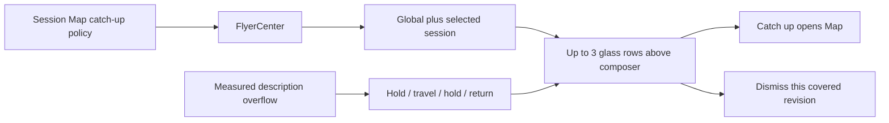

# System flyers design

Status: spec approved by Tanner; implementation planning authorized. This is the independent UI subsystem used by the [Session Map](2026-09-07-session-map-design.md).

## Intended behavior

System messages appear as small translucent bars floating above the composer in its own column. Each flyer occupies one line. Its description scrolls to reveal overflow, holds at the far end, then travels back to the start. The first producer is a catch-up notice for missed session work. The component is reusable for future usage/context warnings; those producers are not part of this work.

Explicit choices: glass-like translucency, no tool-card corner frame, one line, overflow scrolling that returns, online references, and **real visual animation verification**. Exact geometry and motion constants below are testable starting defaults.

## Component and integration contract

`Flyer` is an equatable/sendable value: namespaced string ID, scope (global or canonical session path), tone (information/attention/error), title, detail, value actions (ID/title), dismissible flag, optional expiry date. `FlyerCenter` is a main-actor observable store on `AppModel`. Posting the same scoped ID replaces in place without moving its original position; it does not create duplicate rows. Removal, expiry and session closure remove applicable values. Values are not persisted and are re-derived from their producer's state.

Render global plus the current session's flyers, newest nearest the composer, at most **3** visible. Overflow stays in insertion order and becomes visible as newer items leave. The first catch-up flyer never expires automatically; optional expiry is for future informational producers. Tone is a small mark plus accessible label, not a frame. Actions are explicit native buttons. Domain behavior is a supplied `(flyerID, actionID)` handler; the center does not invoke models or know map internals.

Use `.ultraThinMaterial`, a hairline using the existing separator token, **6 pt** radius, **6 pt** tone mark, **8 pt** row gap, **10 pt** horizontal padding, and existing typography/ghost action styling. Typical height is **32 pt**, allowed to increase for text accessibility settings while remaining one line. Preserve text contrast over busy content in both appearances. With Reduce Transparency use the app's opaque elevated surface. No new shadow family or card corners.

`ActiveSessionView` hosts the stack as an overlay over the bottom of the transcript, aligned to the **780 pt** composer maximum and its **42 pt** side padding. Add measured bottom clearance inside `TranscriptView` and move **Jump to latest** above the stack. Composer growth, runtime recovery, command browser, attachments and pending questions must remain usable. When recovery is present, the overlay anchors above that recovery/composer area; it cannot cover its actions. The overlay consumes pointer events only over actual rows. This is local presentation, not new `TranscriptItem.notice` records.

Keep title and actions stationary. Description alone uses the remaining measured width. At tight widths, choose a shorter complete catch-up title (**3 turns finished**) instead of squeezing action targets or wrapping; full title/detail remain available to accessibility. Never animate a title/action to make the description fit. At the minimum app width the action and description must both be usable; drawer mode avoids a permanently squeezed conversation column.

The runtime-recovery surface stays as implemented. [Harness notices #29](https://github.com/NextStep-AI-inc/10x/pull/29) owns transcript notices for hidden harness messages and its summarizer/settings; it is a separate producer/surface and must not be copied into this center. No usage/context warning producer or catch-all event bus is introduced.

## Motion references and exact starting behavior

Primary references were rechecked on 2026-09-07 (local date):

- [MarqueeLabel source](https://github.com/cbpowell/MarqueeLabel/blob/master/Sources/MarqueeLabel.swift): `leftRight` travels left and returns; its implementation has endpoint delays, conditional edge fades, pausing and a fit check. This is UIKit reference behavior, not a macOS dependency to install.
- [SwiftUIKit/Marquee](https://github.com/SwiftUIKit/Marquee): exposes `marqueeAutoreverses`, `marqueeWhenNotFit`, direction and duration controls for SwiftUI. It corroborates the overflow-only reversible pattern; this plan does not claim its defaults are 10x's timings or add it as a dependency.

No claim is made that the macOS Music app uses these exact timings or that tvOS focused-label APIs are available on macOS. The sources establish a pattern. The **1.2 s**, **40 pt/s**, and **10 pt** values are 10x implementation defaults that require native observation.

Let `d = max(0, measuredTextWidth - viewportWidth)`, `h = 1.2 s`, `v = 40 pt/s`, `travel = d / v`, `cycle = 2h + 2travel`. Use logical leading/trailing direction for RTL; the following positions describe LTR:

| Elapsed time within one cycle | Offset |
| --- | --- |
| `0 … h` | `0` (hold at start) |
| `h … h + travel` | `-v × (t - h)` |
| `h + travel … 2h + travel` | `-d` (hold at end) |
| `2h + travel … cycle` | `-d + v × (t - 2h - travel)` |

At cycle wrap the offset is already zero. No teleport/reset frame, duplicate text loop, spring overshoot or text moving behind action buttons. When text fits (including zero-width/invalid measurement), render stationary with no timer. Fades cover **10 pt** only on edges currently hiding content; first and last characters are fully exposed at their respective holds.

Drive a pure offset function with elapsed monotonic time; `TimelineView` schedules rendering, not a chain of delayed tasks or cumulative position mutations. Hover or keyboard focus pauses in place and resumes from that same position. Pausing/inactive windows/hidden rows stop elapsed time and animation ticks. Text, font, direction or viewport changes reset the measurement and cycle to its start without interpolating an obsolete offset. An identical flyer repost does not reset an in-progress cycle.

Reduce Motion disables marquee/pulse/slide animation. Use a static single line with tail ellipsis, full detail via native help, an accessible full-text label and a keyboard-accessible **Show details** action. A stationary full-detail popover uses the existing local popover treatment. The screen reader sees one message, not repeated copies or per-frame announcements.

## First producer: catch-up

The map coordinator owns eligibility: at least **1 unattended finished turn** plus **3 such turns**, **5 minutes unattended**, or an attention event. Capture the unattended interval before resetting attention on return so the notice remains available. The flyer itself needs no model. Title is **3 turns finished while you were away** (singular form for one); detail starts with a correctly formatted away duration, then includes a validated map headline if available. Actions are **Catch up** and **Dismiss**. Catch up opens the Map in catch-up mode and hides the displayed flyer; Dismiss suppresses only that covered revision. Neither acknowledges unseen work. **Caught up** or an accepted prompt advances coverage and clears it. A new eligible boundary after dismissal can show a fresh notice.

Keep the same scoped ID while updating the headline so it does not jump in the stack. Persist suppression coverage with the map checkpoint, not with transient view state. Errors, approval prompts and recovery keep their existing interactive surfaces; this information flyer does not replace them.

## Verification and implementation boundary

The [implementation plan](../plans/2026-09-07-system-flyers.md) builds the center, pure motion, native row/stack and shell integration with a synthetic catch-up fixture. The real catch-up producer attaches in Session Map Slice 3; this independent component plan performs no model calls.

Unit keyframes and snapshots are necessary but **do not verify motion**. From the actual branch's isolated Release app, record and watch at least **two complete cycles** of a long description. Capture start hold, mid-travel, far hold, return and wrap; record a hover pause/resume and live resize/content replacement. The recording must show the native glass row with transcript behind it and actual buttons alongside it. A browser mockup or still screenshot cannot pass this gate.

Cover fitting/equal-width/long/RTL descriptions, one/two/three/overflow flyers, session/global replacement and dismissal, inactive app, light/dark, Reduce Motion, Reduce Transparency, VoiceOver, minimum **760×560**, docked Map at **1440×900**, command browser, recovery and a growing composer. Verify the newest transcript entry and Jump to latest are not obscured; clicking Catch up and Dismiss uses the actual UI. Check that no animation task persists after removal. Use a private temporary project and isolated app data; never alter another session's worktree or running app.

Swift 6 / macOS 15+, native SwiftUI/AppKit/Foundation, no new dependency. Add Swift files under `App/` and tests under `Tests/`; regenerate with pinned `xcodeproj 1.27.0`. Do not hand-edit the generated Xcode project. Keep shipped snapshot fixtures synthetic and store native motion evidence with the implementation SHA. If recording/observation is unavailable, report the visual motion gate as blocked; do not relabel unit tests as visual verification.
