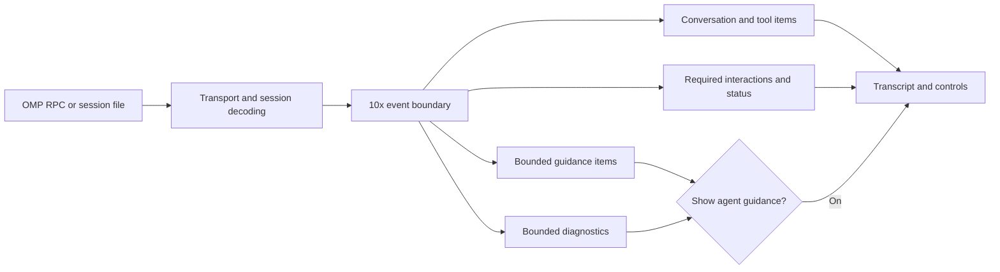

# OMP event boundary — design

2026-09-28

## Intent

10x should remain usable when OMP adds an event, changes a payload, or emits a large piece of agent guidance. Ordinary conversation and required interactions must keep working. The transcript should show useful work by default, with one optional switch for compact background guidance. This addresses the advisor output and developer instruction noise without requiring 10x to reproduce every OMP feature.

This is a design for the existing OMP-backed app, not a new harness or an implementation plan. OMP continues to own agent execution, tools, and session files. 10x owns the boundary between OMP output and product presentation.

## Current behavior and the gap

- `OmpKit` decodes RPC framing and forwards unrecognized event types as generic events. Malformed structural frames and chunk corruption fail the child session. That is the correct transport boundary.
- `TranscriptEventProcessor` sends frames to `TranscriptReducer` and forwards some control frames to `SessionController`. The reducer ignores unknown passive event types. `TranscriptHistoryMapper` separately reconstructs saved sessions.
- `TranscriptMessage.isDisplayable` hides developer-role and `display: false` custom messages, while `display: true` advisor messages are rendered. Advisor notes have a special extractor and large custom text is capped, but the advisor can still occupy visible transcript space.
- The existing **Hidden harness messages** setting can create summarized notices for hidden messages. It does not control advisor visibility. It also exposes a threshold and summary-model choice, which do not fit the proposed single visibility switch.
- `ExtensionUIRouter.parse` returns `nil` for unknown or malformed extension UI requests. `SessionController` currently drops these after the reserved provider-account channel check; an interactive request can then wait without a visible response.
- Tool cards can retain raw JSON values, and the generic data tree can expand deeply. A known frame with an unexpected large payload can still stress presentation.

The earlier [harness-message notices design](2026-09-07-harness-message-notices-design.md) describes the implemented notice pipeline. This design supersedes its *visibility behavior* when implemented. It does not change current behavior by itself.

## Chosen shape

The boundary is an App-level adapter, placed after `OmpKit` framing and before `TranscriptItem` or extension controls are published. It classifies each complete event, validates the fields used by the UI, and emits a small product-owned representation. Both the live event path and saved-session mapper use the same message classification and wrapping rules. This can be implemented by extracting shared classification from the existing reducers; it does not require a new process or a replacement for OMP.

`OmpKit` still owns byte limits, framing, request correlation, and process failure. The App boundary owns semantic validation, item identity, size budgets, visibility, and recoverable fallbacks. No transcript view should receive an unbounded OMP string, array, tree, or media blob directly.

## One visibility switch

The app setting is **Show agent guidance**, off by default. Supporting text: “Show compact advisor notes, internal instructions, and extra activity in the transcript.” This is a 10x preference, not an OMP configuration change.

| Input | Switch off | Switch on |
| --- | --- | --- |
| User and assistant messages, tool progress/results, required approval/input, errors | Show their normal wrapped UI | Same |
| Advisor custom messages | Hide from transcript | Compact **Advisor note** item; extract `details.notes` first, then a bounded plain-text fallback |
| Agent-attributed developer instructions and hidden custom messages | Hide from transcript | Compact **Agent guidance** item with type, size, and bounded preview |
| User-attributed developer content created from a file mention | Show a compact **Referenced file** indicator, never the injected file body | Same; the switch does not hide a user-chosen attachment |
| Unknown passive events and malformed noninteractive events | Record bounded diagnostics | Compact **Additional activity** item, with a safe type label and preview |

Switching the setting updates the open transcript immediately from a bounded, session-scoped index of normalized guidance and diagnostics. It never reruns OMP or changes what the model sees. Persisted sessions can rebuild the index from their session file; live-only items retain bounded previews and counts. If a session exceeds the index budget, show one “Earlier guidance omitted” count when the switch is on rather than retaining raw payloads indefinitely.

The existing `HarnessNoticePreferenceStore.isEnabled` value should migrate to this switch so users who opted into notices keep seeing background content. The current threshold and summary-model controls should leave the main settings UI: a single switch must have predictable visibility. Existing summary storage can remain for compatibility, but the boundary's first slice uses deterministic labels and excerpts, with no new model call per event. The implementation plan should specify safe removal of unused notice plumbing after the new path is proven.

## Wrapping contract

Every presented item has a stable identity, source category, bounded preview, and a way to reach its fuller persisted content when one exists. The boundary does not infer new actions from unknown payloads.

| Input | Product wrapper |
| --- | --- |
| User/assistant message | Existing content-block presentation, validated and budgeted per block; streaming updates replace the same item |
| Tool start/update/end and result | Product tool card keyed by `toolCallId`; explicit tool-specific composition from shared surfaces, with a bounded fallback if extraction fails |
| Retry, fallback, compaction, and model changes | Existing small status/annotation presentation |
| Subagent lifecycle/progress | One worker row under its parent delegation when the parent is known; otherwise a standalone compact card, keyed by stable worker identity |
| Advisor or hidden guidance | Compact guidance item behind the switch; never a full raw message row |
| Unknown passive event | Diagnostic record with type, byte count, and bounded sanitized preview; optional compact transcript item behind the switch |
| Known extension UI request | Existing typed confirm/select/input/editor/open URL interaction; actionable requests ignore the visibility switch |

For a preview, cap text by UTF-8 bytes and line count, array children, nesting depth, and total rendered nodes. An expansion must be explicit and lazy; it must enforce its own budget. Raw payload access, when available, should be a separate inspection action sourced from the persisted session or a capped diagnostic buffer. Presentation must not stringify an entire large payload just to compute its preview.

### Tool presentation rules

Keep the existing two-corner `CornerCard` frame and `ToolCardRegistry`'s explicit canonical names and aliases. The [rich chat tool surfaces design](2026-08-26-rich-chat-tool-surfaces-design.md) remains the coverage list for all canonical tools; the hierarchy and bounds here supersede its presentation details where they differ. The boundary produces a bounded semantic `ToolCardContent`; views compose the content and never interpret raw `JSONValue` trees. A known tool with missing or unexpected fields falls back to a labeled card with a safe target, phase, and bounded preview. An unknown tool uses the same fallback with its sanitized tool name. Neither case drops the call, expands raw JSON by default, or ends the session.

Each collapsed header carries one verb, one primary object, one useful outcome or count, and phase/duration. Expanded content does not repeat that header as a separate task block. Loading, empty, interrupted, and failed states keep the same card identity. A failed card shows a concise error and any usable partial result.

| Tool family | Expanded wrapper |
| --- | --- |
| `read`, `write` | Shared source surface with line gutter and progressive reveal. Header shows the real file-type icon and filename. A slim strip attached to the source shows a folder icon, directory path, and file actions; a divided footer holds the line count and further reveal. The verb and outcome distinguish reading from creation or replacement. |
| `edit`, `apply_patch`, `ast_edit` | Per-file diff surface using the same file header and attached path strip. Header shows the primary edited file and addition/removal counts. For multiple files, each file has its own selectable row and diff; never merge several file paths into one unlabeled patch. |
| `bash`, `eval`, `debug` | Command or input in the header, then a console or progress surface with exit/failure state, bounded output, copy, and wrap/scroll controls. |
| `grep`, `ast_grep`, `glob`, `lsp`, `web_search` | Grouped results by file, symbol, or source. Show the query and count in the header; show bounded matching lines or snippets in each group, with explicit further reveal. |
| Delegating `task` calls and subagent events | Assignment and worker count in the parent header. The body repeats one compact worker row per child: worker name, current activity or final result summary, and an Open session action when a session path exists. Activity history, model/usage metadata, and full result remain in the worker session or deliberate detail inspection. |
| `hub`, `vibe_*` coordination calls | Show the operation and worker target in a compact status card. Attach worker rows only when the event supplies a matching parent tool call ID; do not infer ownership from names or timing. |
| `browser`, `computer`, `inspect_image` | Bounded page, capture, or media preview next to title, URL/application, and a direct open/view action. No large screenshot data enters the transcript row. |
| `ask` and extension UI requests | Use their typed interactive controls. A required answer or approval is never hidden by the guidance switch or reduced to a generic tool card. |
| Other explicit tools, MCP tools, and unknown tools | Preserve their semantic title and primary target where extraction succeeds; use bounded document, collection, media, progress, or structured detail surfaces as appropriate. If extraction cannot establish meaning, show a bounded labeled fallback with a deliberate inspect action. |

The Delegate row is deliberately sparse. Status appears once in the parent header for a single worker; the worker row shows only identity and current activity. With multiple workers, each row owns its own activity and state. `parentToolCallID` links a worker to its delegation; an unmatched worker remains visible as a standalone card rather than being discarded.

File surfaces use the app's existing `FileTypeIcon` and file-reference behavior. The filename stays in the card header, while the directory path and actions sit inside the same neutral surface as the monospaced source or diff, separated by a thin divider. This keeps metadata attached to its content and avoids loose labels between the header and code. Actions expose only what is available: opening a missing file is disabled, and copying a bounded preview is labeled as a preview when full content is unavailable.

## Failure policy

| Failure | Boundary response |
| --- | --- |
| Unknown passive RPC event or saved-session entry | Continue the session; record type, size, and sanitized diagnostic; show only with the switch |
| Known passive event missing a field needed for display | Record a diagnostic and continue. Skip an isolated item; if it is a terminal update for an existing tool or subagent card, close that card with a display error so it cannot spin forever |
| Known interactive request with invalid fields but a valid request ID | Send one `extension_ui_response` with `{ "cancelled": true }`, which the current OMP dialog handlers accept; show a concise visible notice that the request could not be displayed |
| Unknown extension UI method with a valid request ID | Send the same cancellation envelope once as a best effort and show a concise visible notice. A future method may ignore that shape, so a still-busy session needs a bounded recovery path |
| Interactive request missing a usable ID | Treat it as a structural protocol failure in `OmpKit`; keep the app alive, stop that child session, and offer a recoverable restart rather than guess a response target |
| Malformed JSON, corrupt chunks, or frame-size violation | Preserve `OmpKit`'s transport failure, stop only that child session, and surface a recoverable session error |

The reserved provider-account extension channel is handled before generic extension UI fallback. A malformed request on that channel must be reported to its existing channel handler, not displayed as a user prompt. Cancellation responses must be correlated to the original process and request ID, including during restarts.

Diagnostics contain no full file contents, secrets, tool arguments, or model-facing instruction bodies by default. They carry a safe event type, sizes, session-local correlation ID, and a short redacted preview only when needed. The switch controls transcript visibility, not diagnostic capture or error reporting.

## Complexity

| Slice | Relative effort | Main risk |
| --- | --- | --- |
| Shared guidance classification and one switch | Medium | Matching live and restored identities without duplicate items |
| Passive-event diagnostics and bounded tool content | High | Existing `ToolBody` variants can carry raw JSON, text, or media into a view |
| File, work, external-tool, and Delegate wrapper refinement | Medium | Streaming updates, multi-file edits, and worker ownership becoming visually inconsistent |
| Extension UI fallback and recovery | High | Replying to the correct child and request without hiding a blocked interaction |

This is smaller than replacing OMP with a new harness, but it crosses the transcript, history, settings, and interaction paths. The first slice is the proof point before taking on the higher-risk extension UI work.

## Scope and rollout

1. Introduce shared message classification and bounded guidance wrappers for advisor, developer, and hidden custom messages. Reuse the current notice preference as the single visibility switch. Confirm live and restored transcripts agree.
2. Add generic passive-event diagnostics and bounded fallback tool presentation. Preserve explicit tool-name coverage while revising file, work, external-tool, and Delegate wrappers to the hierarchy above.
3. Handle unsupported and malformed extension UI requests explicitly, while preserving the provider-account channel and current typed interactions.

The first working slice is a real OMP session containing an advisor message and a developer/hidden custom message: normal conversation is visible, guidance is absent with the switch off, and compact entries appear immediately when switched on. This proves the user's main pain before extending coverage to every event family.

## Verification for implementation

- Replay captured advisor, developer, hidden custom, unknown, malformed, and oversized frames through the live path and saved-session mapper; assert equivalent item classification and stable IDs.
- Drive a built app through the switch during an active session and after reopening it. Confirm advisor and guidance appear/disappear without changing model execution or losing transcript scroll position.
- Exercise a real confirm/select/input/editor request, an unsupported request with an ID, and a malformed request. Confirm each gets a response or a recoverable visible error, with no indefinitely pending interaction.
- Open a large tool result in the built app. Confirm bounded initial rendering and explicit, bounded expansion.
- Drive real Read, Write, Edit, Run, Search, and Delegate calls in a built app. Confirm file icons and paths, per-file diffs, command state, grouped matches, and worker ownership match the wrappers above through running, complete, and failed states.
- Replay a known tool with missing fields, an unknown tool, an orphan worker, and a multi-file edit. Confirm each remains visible in a bounded, correctly grouped card without interrupting the session.

No new harness, upstream OMP dependency, schema change, or three-mode passthrough setting is part of this design.
